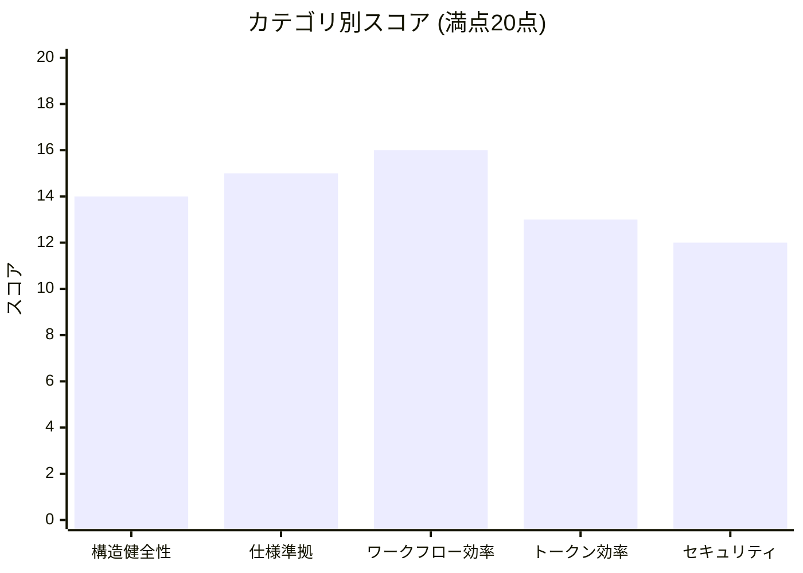
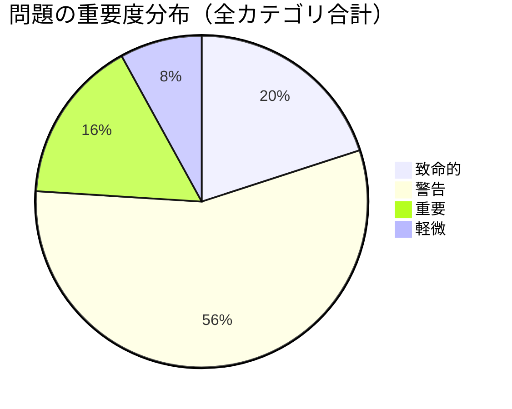
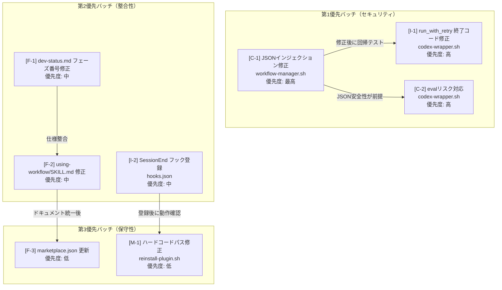

# プラグイン監査レポート - 2026-02-19

**バージョン**: 0.8.0
**総合スコア**: 70/100 (WARN)

## スコアサマリー

| カテゴリ | スコア | 状態 |
|----------|-------|------|
| 1. 構造健全性 | 14/20 | WARN |
| 2. Claude Code仕様準拠 | 15/20 | WARN |
| 3. ワークフロー効率 | 16/20 | PASS |
| 4. トークン効率 | 13/20 | WARN |
| 5. セキュリティ | 12/20 | WARN |

---

## 1. 構造健全性 (14/20)

### 良好
- 必須ディレクトリ（skills/, agents/, hooks/, scripts/, commands/）が全て存在する
- `.claude-plugin/plugin.json` に name/version/author/license フィールドが適切に定義されている
- `hooks/hooks.json` が有効なJSONで、SessionStart/PreToolUse/PostToolUse フック定義が整合している
- `workflow-lib.sh` が共通ライブラリとして正しく分離されている
- `reinstall-plugin.sh` に自己参照防止ガードが実装されている
- `plugin-health-check.sh` 診断スクリプトが整備されている

### 警告
- `reinstall-plugin.sh` が `hooks.json` の SessionEnd に未登録（空配列 `[]`）
- `.claude-plugin/marketplace.json` のバージョンが `0.2.0` で `plugin.json` の `0.8.0` と乖離。説明文も「6フェーズ」のまま（現在は9フェーズ）
- `reinstall-plugin.sh:21` にユーザー固有のハードコードパスが存在: `SOURCE_DIR="/Users/t.asai/code/fractal-dev-workflow"`

### 致命的
- `using-workflow/SKILL.md:41-49` に存在しないスキル名が記載: `plan-review`, `code-review`, `operations`（正しくは `codex-review`, `completion`）

---

## 2. Claude Code仕様準拠 (15/20)

### 良好
- 全SKILL.mdファイルにYAMLフロントマター（name, description）が存在する
- 全エージェント定義にmodel/permissionフロントマターが存在する
- `hooks/hooks.json` のスキーマが正しい
- 全コマンドにdescriptionフロントマターが存在する
- `codex-delegate.md` の model: haiku は軽量タスク向けとして適切

### 警告
- `agents/chrome-debugger.md` に `tools:` フロントマターが未定義（他のエージェントは適切にツール制限を定義している）
- `commands/plugin-audit.md` の allowed-tools に `Task` が含まれているが、明示的許可の要否確認が必要
- `using-workflow/SKILL.md` のPhase名不整合: Phase 3 「設計 (Design)」vs 仕様「契約設計」、Phase 8 「テスト (Testing)」vs 仕様「検証」

### 致命的
- `commands/dev-status.md:8` に「phases 4 and 6」と記載されているが、正しくは「phases 4 and 7」（Phase 6 = Chromeデバッグ、Phase 7 = コードレビュー）。実際の `check-approval.sh` 実装と矛盾

---

## 3. ワークフロー効率 (16/20)

### 良好
- 9フェーズの遷移ロジックが `dev-workflow/SKILL.md` に明確に定義されている
- Phase遷移が `workflow-manager.sh` の `set_phase()` でコードレベルで強制されている
- Codex利用不可時のqaエージェントフォールバックが `codex-delegate.md` に明示されている
- サブエージェント役割分担（investigator, coder, qa, codex-delegate）が明確で重複がない
- Phase Banner Protocolが一貫したUXを提供している
- `failure-memory` スキルが反復失敗からの学習を可能にしている

### 警告
- `planning/SKILL.md` の役割境界が `dev-workflow/SKILL.md` Phase 3 との関係で不明確
- `check-approval.sh` がstateファイル直接操作に対するガードを持たない（`set_phase()` で緩和済み）
- `update-docs/SKILL.md` の機能が `completion/SKILL.md` のドキュメント更新セクションと重複する可能性がある
- Integrationセクションの必須エージェント一覧に `chrome-debugger` が欠落

---

## 4. トークン効率 (13/20)

### 良好
- `plugin-audit/SKILL.md` が240行とコンパクト（references/ディレクトリへの分離が機能）
- `investigation/SKILL.md`（362行）、`codex-review/SKILL.md`（310行）は適切なサイズ
- 参照アーキテクチャ（`-> [skill_name] スキル参照`）で重複記述を防止
- 用語定義が `dev-workflow/SKILL.md` に一元化されている

### 警告
- `dev-workflow/SKILL.md` が **1,244行** と著しく長大で、ロード時に大量のトークンを消費する
  - Phase 5 詳細（504-614行）が `implementation/SKILL.md` と重複
  - Phase 9 詳細（738-784行）が `completion/SKILL.md` と重複
- `design/SKILL.md`（749行）と `implementation/SKILL.md`（605行）も大きい
- `context-preservation/SKILL.md`（525行）が dev-workflow のCommit Context Preservationセクションと内容重複
- `.claude/settings.local.json` に59件のBash許可エントリ（陳腐化した `__NEW_LINE_*` パターン含む）

### 致命的
- `workflow-manager.sh:149-177` の `create_workflow()` がユーザー入力をエスケープなしでheredocに埋め込んでいる（JSON破損により後続のjq処理が全て失敗する）

---

## 5. セキュリティ (12/20)

### 良好
- `workflow-lib.sh` の `get_workflow_dir()` がworktreeルートハッシュで状態分離を実現
- `reinstall-plugin.sh` に自己参照防止ガード（33-38行）が実装されている
- `codex-wrapper.sh` に `SECRET_PATTERNS` によるシークレットフィルタが実装されている
- `workflow-manager.sh` の `validate_workflow_id()` が `^wf-[0-9]{8}-[0-9]{3}$` 形式を強制
- フックスクリプトが `jq --arg` で適切なJSONエスケープを実施

### 致命的

**[C-1] JSONインジェクション - `workflow-manager.sh:create_workflow()` (154-175行)**
`taskDescription` をエスケープなしでheredocに埋め込んでいる。引用符を含む説明で無効なJSONが生成され、後続の `jq` 処理が全て失敗する。

**[C-2] evalリスク - `codex-wrapper.sh` (288, 299, 310, 321行)**
`eval "set -- $args"` で `printf '%q'` エスケープを使用。ただし `--model`/`--reasoning` の引数値はエスケープされずに環境変数として export される。

### 重要

**[I-1] 終了コード消失 - `codex-wrapper.sh:88-89`**
`run_with_retry()` がバックグラウンドプロセスの終了コードを無視し、常に0を返す。Codex失敗時も呼び出し元は成功と判断してしまう。

**[I-2] `reinstall-plugin.sh` が SessionEnd フックに未登録**
ファイルは存在するが実行されない。

**[I-3] RANDOMベースのワークフローID - `workflow-manager.sh:151`**
1日あたり1000通りしかなく、衝突リスクがある。

**[I-4] `check-docs.sh:96` での自動git commit**
PreToolUseフック内でユーザーの同意なしに `git commit` を実行する。予期しない副作用の原因となる。

### 軽微

**[M-1] `reinstall-plugin.sh:21` のハードコードパス**
**[M-2] `settings.local.json` の過剰なBash許可**（59件中、多数が陳腐化）

---

## 仕様との乖離

| 項目 | 仕様 (dev-workflow/SKILL.md) | 実際 | 状態 |
|------|------------------------------|------|------|
| Phase 3 名称 | 「契約設計」 | using-workflow: 「設計 (Design)」 | NG |
| Phase 8 名称 | 「検証」 | using-workflow: 「テスト (Testing)」 | NG |
| dev-status 承認Phase | Phase 4 と 7 | dev-status.md: 「phases 4 and 6」 | NG |
| SessionEnd フック | reinstall-plugin.sh 登録 | hooks.json: `"SessionEnd": []` | NG |
| marketplace.json バージョン | 0.8.0 | 0.2.0 | NG |
| marketplace.json フェーズ数 | 9フェーズ | 「6フェーズワークフロー」 | NG |
| using-workflow スキル名 | codex-review, completion | plan-review, operations（存在しない） | NG |

---

## 必須修正 (7件)

1. **JSONインジェクション修正** - `workflow-manager.sh:create_workflow()` - `jq -n --arg` で安全に埋め込む
2. **SessionEndフック登録** - `hooks/hooks.json` - `reinstall-plugin.sh` を登録
3. **dev-status.md フェーズ番号修正** - 「phases 4 and 6」を「phases 4 and 7」に修正
4. **using-workflow/SKILL.md 修正** - スキル名とPhase名を仕様に合わせる
5. **run_with_retry() 終了コード修正** - `codex-wrapper.sh:88-89` - 実際の終了コードを取得して返す
6. **marketplace.json 更新** - バージョンを0.8.0に、説明文を9フェーズに更新
7. **ハードコードパス修正** - `reinstall-plugin.sh:21` - 環境変数フォールバックを使用

## 推奨修正 (3件)

8. **chrome-debugger.md** - tools: フロントマターを追加
9. **settings.local.json** - 陳腐化したBash許可エントリを整理
10. **workflow-manager.sh** - RANDOMベースのID生成を改善

## テスト追加 (2件)

11. `test-workflow-approval.sh` にエッジケーステスト追加（JSONインジェクション回帰、重複ID、不正IDフォーマット）
12. 新規 `test-hook-scripts.sh` 作成（check-approval.sh と session-init.sh のテスト）
