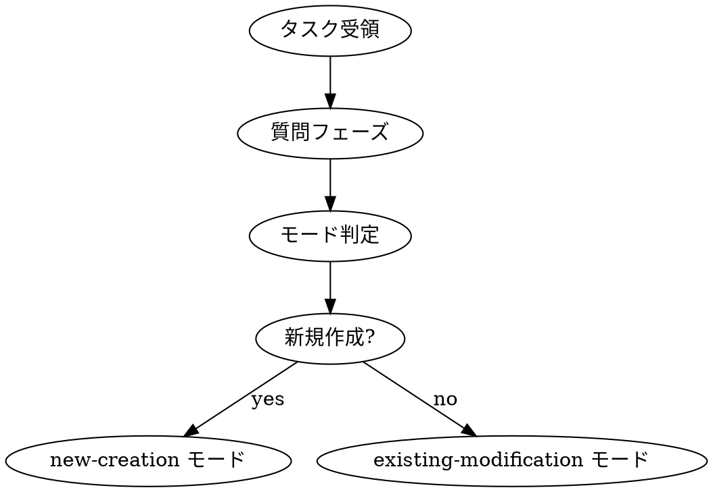

# 契約設計: dev-workflow改善（v2）

## 1. モード定義

### 1.1 新規作成モード (new-creation)

タスクがゼロから新しい機能を作る場合。設計の詳細度を最大化。

#### Phase 1: 質問 + 要件定義
**成果物:**
- MVP境界（やること/やらないこと）明記
- 受け入れ条件（Given/When/Then形式）
- 非機能要件（性能、セキュリティ、可用性）
- KPI/成功条件

**チェックリスト:**
- [ ] questioning スキルで曖昧さを排除
- [ ] ユースケース網羅
- [ ] スコープ外が明確

**自動遷移:** Phase 2へ

---

#### Phase 2: 調査 + ドメイン整理
**成果物:**
- 既存実装の棚卸し（ファイル内容を実際に Read）
- 用語統一表
- ビジネスルール一覧
- 共通化可能なコンポーネント候補

**チェックリスト:**
- [ ] investigator サブエージェントで実行
- [ ] 関連ファイルを実際に読んだ
- [ ] 再利用可能コード特定

**自動遷移:** Phase 3へ

---

#### Phase 3: 契約設計（★新規作成では詳細度MAX）
**成果物:**
- **画面モック（HTML形式）** ← 新規作成で必須
- **API仕様（OpenAPI形式、完全定義）** ← 新規作成で必須
- **DBスキーマ/マイグレーション**
- **コンポーネント設計:**
  - Props型定義
  - 状態管理方針
  - ディレクトリ構成
- エラーコード一覧
- テスト設計（境界値、外部依存、同時実行）
- タスク分解（ファイル単位）
- worktree計画

**チェックリスト:**
- [ ] HTMLモック作成（主要画面すべて）
- [ ] API仕様完全定義（全エンドポイント、全フィールド）
- [ ] コンポーネント設計（props, 状態, ディレクトリ）
- [ ] タスク分解完了（TaskCreate実行準備完了）
- [ ] worktree計画（並列実装準備完了）

**承認必須:** ★ユーザー承認後 Phase 4へ

---

#### Phase 4: Codex計画レビュー
**成果物:**
- 既存実装照合レビュー結果
- 要件カバレッジレビュー結果

**チェックリスト:**
- [ ] codex-delegate 起動
- [ ] レビュー観点2つ完了
- [ ] 指摘事項修正

**承認必須:** ★Codex承認 → ★ユーザー承認後 Phase 5へ

---

#### Phase 5: 実装（worktree + 並列化）
**成果物:**
- 動作するコード
- TDDで作成されたテスト
- 共通コンポーネント（必要に応じて）

**チェックリスト:**
- [ ] worktree作成（並列タスク用）
- [ ] サブエージェント並列実装（Sonnet 4.5）
- [ ] 全テスト Pass
- [ ] 縦スライスで実装

**自動遷移:** Phase 6へ

---

#### Phase 6: Codexコードレビュー
**成果物:**
- コード品質レビュー結果
- テストカバレッジ確認結果
- セキュリティチェック結果

**チェックリスト:**
- [ ] codex-delegate 起動
- [ ] コード品質/テスト/セキュリティ確認
- [ ] 指摘事項修正

**承認必須:** ★Codex承認 → ★ユーザー承認後 Phase 7へ

---

#### Phase 7: 検証
**成果物:**
- テスト結果レポート（Unit/Integration/E2E）
- セキュリティチェック結果

**チェックリスト:**
- [ ] テストピラミッド実行
- [ ] 回帰テスト追加

**自動遷移:** Phase 8へ

---

#### Phase 8: 運用設計
**成果物:**
- マイグレーション手順
- ロールバック手順書
- Feature Flag設定（必要時）
- アラート設定

**チェックリスト:**
- [ ] 運用手順確認
- [ ] PR作成 or マージ

**完了:** ワークフロー終了

---

### 1.2 既存修正モード (existing-modification)

既存機能のバグ修正、小規模改善、リファクタリング。影響調査を重視。

#### Phase 1: 質問 + 要件定義
**成果物:**
- 修正内容の明確化
- 影響範囲の特定
- 受け入れ条件

**チェックリスト:**
- [ ] questioning スキルで曖昧さ排除
- [ ] 既存挙動との差分明確化

**自動遷移:** Phase 2へ

---

#### Phase 2: 調査 + 影響分析（★既存修正で強化）
**成果物:**
- **変更対象ファイルの完全読み込み** ← 既存修正で必須
- **依存関係分析（呼び出し元/呼び出し先）** ← 既存修正で必須
- **影響範囲マップ** ← 既存修正で必須
- **既存テストの棚卸し**
- 用語統一表
- ビジネスルール確認

**チェックリスト:**
- [ ] investigator サブエージェントで実行
- [ ] 変更対象ファイル完全読み込み
- [ ] 依存関係グラフ作成
- [ ] 影響範囲マップ作成（どのアプリ/機能に影響するか）
- [ ] 既存テストの動作確認

**自動遷移:** Phase 3へ

---

#### Phase 3: 契約設計（★既存修正では最小限）
**成果物:**
- API仕様変更（ある場合のみ）
- DBスキーマ変更（ある場合のみ）
- **整合性チェックリスト** ← 既存修正で必須
  - 既存APIとの互換性
  - 既存DBスキーマとの整合性
  - 既存テストとの整合性
- タスク分解（ファイル単位）

**チェックリスト:**
- [ ] 既存APIとの互換性確認
- [ ] 既存スキーマとの整合性確認
- [ ] 破壊的変更の有無確認
- [ ] タスク分解完了

**承認ポイント（軽量）:**
- 破壊的変更がある場合のみユーザー承認
- それ以外は自動遷移 Phase 4へ

---

#### Phase 4: Codex計画レビュー
**成果物:**
- 既存実装照合レビュー結果
- 影響範囲レビュー結果

**チェックリスト:**
- [ ] codex-delegate 起動（利用可能な場合）
- [ ] 既存実装との整合性確認
- [ ] 影響範囲の妥当性確認

**承認ポイント（軽量）:**
- Codex利用不可 or 指摘なし → 自動遷移
- 重大な指摘あり → ユーザー承認

---

#### Phase 5: 実装（既存コード尊重）
**成果物:**
- 修正コード
- 既存テストの更新
- 回帰テスト追加

**チェックリスト:**
- [ ] 既存コードパターンに従う
- [ ] 既存テスト更新
- [ ] 回帰テスト追加（バグ修正の場合必須）
- [ ] 全テスト Pass

**自動遷移:** Phase 6へ

---

#### Phase 6: Codexコードレビュー
**成果物:**
- コード品質レビュー結果

**チェックリスト:**
- [ ] codex-delegate 起動（利用可能な場合）
- [ ] 既存コードとの整合性確認

**承認ポイント（軽量）:**
- Codex利用不可 or 指摘なし → 自動遷移
- 重大な指摘あり → ユーザー承認

---

#### Phase 7: 検証（★既存修正で回帰テスト重視）
**成果物:**
- テスト結果レポート
- **回帰テストレポート** ← 既存修正で必須

**チェックリスト:**
- [ ] 既存テストすべて Pass
- [ ] 回帰テストレポート作成
- [ ] 影響範囲のテスト実施

**自動遷移:** Phase 8へ

---

#### Phase 8: 運用設計（★既存修正では最小限）
**成果物:**
- マイグレーション手順（DB変更時のみ）
- ロールバック手順書（重要な変更のみ）

**チェックリスト:**
- [ ] 必要な運用手順のみ作成
- [ ] PR作成 or マージ

**完了:** ワークフロー終了

---

## 2. モード判定ロジック

### 2.1 判定基準

```
新規作成モード (new-creation):
- 新しい機能の追加
- 新しいページ/画面の作成
- 新しいAPIエンドポイントの追加
- 新しいDBテーブルの追加

既存修正モード (existing-modification):
- バグ修正
- 既存機能の改善
- 既存APIの変更
- 既存UIの調整
- リファクタリング
- 既存DBスキーマの変更
```

### 2.2 判定フロー



### 2.3 ユーザーへの質問テンプレート

```
AskUserQuestion:
  question: "このタスクは新規作成と既存修正のどちらですか？"
  options:
    - label: "新規作成"
      description: "新しい機能、ページ、API、DBテーブルを作成する"
    - label: "既存修正"
      description: "既存の機能、バグ修正、改善、リファクタリング"
```

**判定が難しい場合の追加質問:**

```
AskUserQuestion:
  question: "このタスクに含まれるのはどれですか？（複数選択可）"
  options:
    - label: "新しい画面/ページ"
      description: "→ new-creation モード"
    - label: "新しいAPIエンドポイント"
      description: "→ new-creation モード"
    - label: "新しいDBテーブル"
      description: "→ new-creation モード"
    - label: "既存画面の修正"
      description: "→ existing-modification モード"
    - label: "既存APIの変更"
      description: "→ existing-modification モード"
    - label: "バグ修正"
      description: "→ existing-modification モード"
```

---

## 3. フェーズ遷移ロジック

### 3.1 自動遷移ポイント

| Phase | 遷移条件 | 次Phase |
|-------|---------|---------|
| 1 | 完了条件すべて満たす | Phase 2（自動） |
| 2 | 完了条件すべて満たす | Phase 3（自動） |
| 3 | 完了条件満たす + モード判定 | Phase 4（条件付き自動） |
| 4 | Codex指摘なし or 軽微 | Phase 5（条件付き自動） |
| 5 | 完了条件すべて満たす | Phase 6（自動） |
| 6 | Codex指摘なし or 軽微 | Phase 7（条件付き自動） |
| 7 | 完了条件すべて満たす | Phase 8（自動） |
| 8 | 完了条件すべて満たす | 完了 |

### 3.2 承認必須ポイント

#### Phase 3完了時（契約設計）
**承認条件:**
- **new-creation モード**: 必ずユーザー承認
- **existing-modification モード**: 破壊的変更ありの場合のみユーザー承認

**承認内容:**
- API仕様の妥当性
- DBスキーマの妥当性
- コンポーネント設計の妥当性（new-creation）
- 整合性チェックリスト確認（existing-modification）

---

#### Phase 4完了時（Codex計画レビュー）
**承認条件:**
- Codex利用可能 かつ 重大な指摘あり → ユーザー承認
- Codex利用不可 or 指摘なし → 自動遷移

**承認内容:**
- Codexの指摘事項への対応方針

---

#### Phase 6完了時（Codexコードレビュー）
**承認条件:**
- Codex利用可能 かつ 重大な指摘あり → ユーザー承認
- Codex利用不可 or 指摘なし → 自動遷移

**承認内容:**
- Codexの指摘事項への対応方針

---

### 3.3 遷移フローチャート

```
Phase 1 完了 → Phase 2 開始（自動）
Phase 2 完了 → Phase 3 開始（自動）

Phase 3 完了 → 承認チェック:
  - new-creation モード → ★ユーザー承認必須
  - existing-modification + 破壊的変更あり → ★ユーザー承認必須
  - existing-modification + 破壊的変更なし → 自動遷移

Phase 3 承認後 → Phase 4 開始（codex-delegate 起動）

Phase 4 完了 → 承認チェック:
  - Codex重大指摘あり → ★ユーザー承認必須
  - Codex指摘なし or 利用不可 → 自動遷移

Phase 4 承認後 → Phase 5 開始

Phase 5 完了 → Phase 6 開始（codex-delegate 起動）

Phase 6 完了 → 承認チェック:
  - Codex重大指摘あり → ★ユーザー承認必須
  - Codex指摘なし or 利用不可 → 自動遷移

Phase 6 承認後 → Phase 7 開始（自動）

Phase 7 完了 → Phase 8 開始（自動）

Phase 8 完了 → ワークフロー完了
```

---

## 4. 状態管理スキーマ

### 4.1 ワークフロー状態JSON

保存先: `~/.claude/fractal-workflow/{workflow-id}.json`

```json
{
  "workflowId": "wf-20260215-001",
  "taskDescription": "タスクの説明",
  "mode": "new-creation | existing-modification",
  "status": "active | completed | cancelled",
  "currentPhase": 3,
  "phases": {
    "1": {
      "name": "質問 + 要件定義",
      "status": "completed",
      "startedAt": "2026-02-15T10:00:00Z",
      "completedAt": "2026-02-15T10:30:00Z",
      "artifacts": {
        "requirements": "docs/requirements-wf-001.md"
      }
    },
    "2": {
      "name": "調査 + ドメイン整理",
      "status": "completed",
      "startedAt": "2026-02-15T10:30:00Z",
      "completedAt": "2026-02-15T11:00:00Z",
      "artifacts": {
        "investigation": "docs/investigation-wf-001.md"
      }
    },
    "3": {
      "name": "契約設計",
      "status": "in_progress",
      "startedAt": "2026-02-15T11:00:00Z",
      "artifacts": {
        "design": "docs/design-wf-001.md",
        "htmlMocks": "docs/mocks/*.html",
        "apiSpec": "docs/api-spec-wf-001.yaml"
      },
      "approvalRequired": true,
      "approvalStatus": "pending"
    },
    "4": {"status": "pending"},
    "5": {"status": "pending"},
    "6": {"status": "pending"},
    "7": {"status": "pending"},
    "8": {"status": "pending"}
  },
  "approvals": [],
  "metadata": {
    "createdAt": "2026-02-15T10:00:00Z",
    "updatedAt": "2026-02-15T11:30:00Z"
  }
}
```

### 4.2 承認状態管理

```json
{
  "approvals": [
    {
      "phase": 3,
      "approvalType": "user",
      "requestedAt": "2026-02-15T12:00:00Z",
      "status": "pending | approved | rejected",
      "approvedAt": null,
      "approvedBy": null,
      "notes": ""
    },
    {
      "phase": 4,
      "approvalType": "codex",
      "requestedAt": "2026-02-15T13:00:00Z",
      "status": "approved",
      "approvedAt": "2026-02-15T13:10:00Z",
      "approvedBy": "codex-5.3",
      "notes": "指摘事項なし"
    }
  ]
}
```

---

## 5. スキル改修計画

### 5.1 dev-workflow スキルの変更

#### 追加項目

**モード判定セクション（Phase 1開始時）:**

```markdown
## Mode Selection (Phase 1 開始時)

### Step 1: モード判定質問
タスク受領後、まず以下の質問でモードを判定する:

AskUserQuestion:
  question: "このタスクは新規作成と既存修正のどちらですか？"
  options:
    - label: "新規作成（新しい機能/ページ/API）"
    - label: "既存修正（バグ修正/改善/リファクタリング）"

### Step 2: モード保存
回答を workflow state の `mode` フィールドに保存:
- "新規作成" → mode: "new-creation"
- "既存修正" → mode: "existing-modification"

### Step 3: モード別ワークフロー分岐
以降のフェーズでモードに応じた実行内容を適用。
```

---

**Phase 3（契約設計）のモード別詳細:**

```markdown
## Phase 3: 契約設計（モード別）

### new-creation モード
**必須成果物:**
- [ ] HTMLモック（主要画面すべて）
- [ ] API仕様（OpenAPI形式、完全定義）
- [ ] コンポーネント設計（props型、状態管理、ディレクトリ構成）
- [ ] DBスキーマ/マイグレーション
- [ ] テスト設計
- [ ] タスク分解 + worktree計画

**承認:** ★ユーザー承認必須

---

### existing-modification モード
**必須成果物:**
- [ ] 整合性チェックリスト（既存APIとの互換性、既存スキーマとの整合性）
- [ ] API仕様変更（ある場合のみ）
- [ ] DBスキーマ変更（ある場合のみ）
- [ ] タスク分解

**承認:**
- 破壊的変更あり → ★ユーザー承認必須
- 破壊的変更なし → 自動遷移
```

---

**Phase遷移条件の更新:**

```markdown
## Phase Transition Rules

### Phase 3 → Phase 4
**条件:**
- mode == "new-creation" → ★ユーザー承認必須
- mode == "existing-modification" AND has_breaking_changes == true → ★ユーザー承認必須
- mode == "existing-modification" AND has_breaking_changes == false → 自動遷移

### Phase 4 → Phase 5
**条件:**
- codex_available AND codex_critical_issues == true → ★ユーザー承認必須
- codex_available AND codex_critical_issues == false → 自動遷移
- codex_unavailable → 自動遷移

### Phase 6 → Phase 7
**条件:**
- codex_available AND codex_critical_issues == true → ★ユーザー承認必須
- codex_available AND codex_critical_issues == false → 自動遷移
- codex_unavailable → 自動遷移
```

---

### 5.2 questioning スキルの変更

#### 追加項目

**モード判定質問を最優先で実行:**

```markdown
## Step 0: Mode Selection Question (FIRST)

タスクを受けたら、最初にモード判定を行う:

AskUserQuestion:
  question: "このタスクは新規作成と既存修正のどちらですか？"
  options:
    - label: "新規作成（新しい機能/ページ/API）"
      description: "ゼロから設計。HTMLモック、完全なAPI仕様が必要"
    - label: "既存修正（バグ修正/改善/リファクタリング）"
      description: "既存コード調査重視。影響範囲分析が必要"

回答を保存し、以降の質問内容に反映する。
```

---

### 5.3 design スキルの変更

#### 追加項目

**モード別の設計詳細度:**

```markdown
## Design Scope by Mode

### new-creation モード
**詳細度: MAX**
- HTMLモック必須
- API仕様完全定義必須
- コンポーネント設計（props型、状態管理、ディレクトリ構成）必須

### existing-modification モード
**詳細度: MIN（必要な部分のみ）**
- HTMLモック不要（既存画面の変更箇所のみ記述）
- API仕様は変更部分のみ
- 整合性チェックリスト必須
```

---

**HTMLモックテンプレート（new-creation用）:**

```markdown
## HTML Mock Template (new-creation)

### docs/mocks/{feature}-{screen}.html

```html
<!DOCTYPE html>
<html lang="ja">
<head>
  <meta charset="UTF-8">
  <title>{機能名} - {画面名}</title>
  <style>
    /* 最小限のスタイル（レイアウト確認用） */
    body { font-family: sans-serif; margin: 20px; }
    .container { max-width: 1200px; }
    .form-group { margin-bottom: 16px; }
    button { padding: 8px 16px; }
  </style>
</head>
<body>
  <div class="container">
    <h1>{画面タイトル}</h1>

    <!-- 主要コンポーネントの配置 -->
    <form>
      <div class="form-group">
        <label for="field1">フィールド1</label>
        <input type="text" id="field1" name="field1">
      </div>

      <button type="submit">保存</button>
    </form>
  </div>
</body>
</html>
```
```

---

**整合性チェックリストテンプレート（existing-modification用）:**

```markdown
## Consistency Checklist (existing-modification)

### API整合性
- [ ] 既存APIとの互換性（破壊的変更の有無）
- [ ] 既存リクエスト形式との整合性
- [ ] 既存レスポンス形式との整合性
- [ ] エラーコードの一貫性

### DBスキーマ整合性
- [ ] 既存テーブルへの影響
- [ ] 外部キー制約の整合性
- [ ] インデックスの整合性
- [ ] マイグレーションの後方互換性

### テスト整合性
- [ ] 既存テストが引き続き動作するか
- [ ] 既存テストの更新箇所
- [ ] 新規テストの追加箇所

### 破壊的変更の有無
- [ ] Yes → ユーザー承認必須
- [ ] No → 自動遷移可能
```

---

### 5.4 investigation スキルの変更

#### 追加項目

**モード別の調査観点:**

```markdown
## Investigation Scope by Mode

### new-creation モード
**調査観点:**
- 既存実装の棚卸し（再利用可能コード）
- 用語統一
- ビジネスルール
- 共通化可能なコンポーネント候補

### existing-modification モード（★強化）
**調査観点:**
- **変更対象ファイルの完全読み込み（必須）**
- **依存関係分析（呼び出し元/呼び出し先）（必須）**
- **影響範囲マップ（必須）**
- 既存テストの棚卸し
- 用語統一
- ビジネスルール確認
```

---

**影響範囲マップテンプレート（existing-modification用）:**

```markdown
## Impact Map (existing-modification)

### 変更対象ファイル
| ファイル | 変更内容 | 理由 |
|---------|---------|------|
| src/api/contacts.ts | 関数Aの修正 | バグ修正 |

### 依存関係グラフ
```
[変更対象]
src/api/contacts.ts (関数A)
  ↑ 呼び出し元
  ├── src/pages/contacts.tsx
  ├── src/components/ContactForm.tsx
  └── apps/sales/pages/index.tsx
  ↓ 呼び出し先
  ├── src/db/contacts.ts
  └── src/utils/validation.ts
```

### 影響範囲
| アプリ/機能 | 影響度 | 理由 |
|-----------|-------|------|
| sales アプリ | 高 | contacts.tsx で使用 |
| nursing アプリ | 低 | 使用していない |
| calls アプリ | 中 | ContactForm 経由で使用 |

### 既存テスト
| テストファイル | 影響 | 対応 |
|-------------|------|------|
| contacts.test.ts | あり | 更新必須 |
| ContactForm.test.tsx | あり | 確認必要 |
```
```

---

### 5.5 新規スキル（必要な場合）

現時点では新規スキルは不要。既存スキルの改修で対応可能。

---

## 6. エージェント改修計画

既存エージェント（architect, tech-lead, implementer, investigator, qa, coder, codex-delegate, doc-reviewer）はそのまま使用。

改修不要。

---

## 7. コマンド改修計画

### 7.1 /dev コマンド

#### 追加内容

コマンド起動時にモード判定質問を実行:

```markdown
# /dev コマンド

## 実行フロー

1. タスク説明を受領
2. **モード判定質問（questioning スキル）**
3. モードを workflow state に保存
4. Phase 1 開始
```

#### 変更箇所

`commands/dev.md` に以下を追記:

```markdown
## Mode Selection

タスク受領後、questioning スキルを使用してモード判定を行う:
- new-creation: 新規作成
- existing-modification: 既存修正

モードは workflow state の `mode` フィールドに保存され、
各フェーズで参照される。
```

---

### 7.2 /dev status コマンド

#### 追加内容

状態表示にモード情報を追加:

```markdown
# /dev status コマンド

## 表示内容

Workflow ID: wf-20260215-001
Mode: new-creation          ← 追加
Status: active
Current Phase: 3 (契約設計)
Phase 3 Approval: pending   ← 追加

Progress:
[✓] Phase 1: 質問 + 要件定義
[✓] Phase 2: 調査 + ドメイン整理
[●] Phase 3: 契約設計 (approval required) ← 追加
[ ] Phase 4: Codex計画レビュー
[ ] Phase 5: 実装
[ ] Phase 6: Codexコードレビュー
[ ] Phase 7: 検証
[ ] Phase 8: 運用設計
```

---

### 7.3 /dev resume コマンド

改修不要（既存のワークフロー状態復元で対応可能）

---

## 8. 実装タスク一覧

### Phase 1: スキル改修
1. dev-workflow スキル改修
   - モード判定セクション追加
   - Phase 3のモード別詳細追加
   - Phase遷移条件更新
2. questioning スキル改修
   - モード判定質問追加
3. design スキル改修
   - モード別設計詳細度追加
   - HTMLモックテンプレート追加
   - 整合性チェックリスト追加
4. investigation スキル改修
   - モード別調査観点追加
   - 影響範囲マップテンプレート追加

### Phase 2: コマンド改修
1. /dev コマンド改修
   - モード判定フロー追加
2. /dev status コマンド改修
   - モード表示追加
   - 承認状態表示追加

### Phase 3: 状態管理
1. ワークフロー状態JSONスキーマ拡張
   - `mode` フィールド追加
   - `approvals` フィールド追加
   - phase別 `approvalRequired`, `approvalStatus` 追加

### Phase 4: テスト
1. new-creation モードのテストケース作成
2. existing-modification モードのテストケース作成
3. 承認フローのテストケース作成

### Phase 5: ドキュメント
1. README更新（モード説明追加）
2. 使用例追加（モード別）

---

## 9. 後方互換性

### 既存ワークフローへの影響

**影響なし:**
- 既存のワークフローファイル（スキル/エージェント/コマンド）は引き続き動作
- モード判定は新規タスクのみで実行
- モード未指定の場合は `new-creation` として扱う（安全側に倒す）

**マイグレーション不要:**
- 既存の状態ファイルは `mode` フィールドが追加されるのみ
- 既存フィールドは変更なし

---

## 10. 承認フロー図

```
[Phase 3 完了]
     ↓
[モード判定]
     ↓
new-creation? ─Yes→ [ユーザー承認必須] → [承認] → Phase 4
     ↓ No
existing-modification?
     ↓
[破壊的変更チェック]
     ↓
破壊的変更あり? ─Yes→ [ユーザー承認必須] → [承認] → Phase 4
     ↓ No
[自動遷移] → Phase 4


[Phase 4 完了]
     ↓
[Codex利用可能?]
     ↓ Yes
[Codex重大指摘あり?]
     ↓ Yes
[ユーザー承認必須] → [承認] → Phase 5
     ↓ No
[自動遷移] → Phase 5

[Codex利用不可]
     ↓
[自動遷移] → Phase 5


[Phase 6 完了]
     ↓
（Phase 4と同じフロー）
```

---

## 11. 設計の意図

### モード分岐の狙い

1. **新規作成 (new-creation)**
   - ユーザーの「頭の中」を完全に形にする
   - 実装者が迷わないレベルまで詳細化
   - HTMLモック/完全なAPI仕様で「動くイメージ」を共有

2. **既存修正 (existing-modification)**
   - 既存コードとの整合性を最優先
   - 影響範囲を徹底的に調査
   - 回帰を防ぐための調査/テスト強化

### 承認ポイントの狙い

1. **Phase 3（契約設計）承認**
   - 実装前の最後の砦
   - 新規作成は必ず承認（大きな手戻り防止）
   - 既存修正は破壊的変更のみ承認（効率化）

2. **Phase 4/6（Codexレビュー）承認**
   - Codexの指摘が重大な場合のみ承認
   - 軽微な指摘は自動遷移（効率化）
   - Codex利用不可時は自動遷移（ワークフロー停止防止）

### 自動遷移の狙い

- ユーザーの手間を減らす
- ワークフロー停滞を防ぐ
- 重要な判断のみユーザーに委ねる

---

## 12. 実装優先順位

### Phase 1（最優先）
1. dev-workflow スキル改修（モード判定、Phase 3モード別）
2. ワークフロー状態JSON拡張（`mode`, `approvals`）
3. /dev コマンド改修（モード判定フロー）

### Phase 2（次優先）
1. questioning スキル改修（モード判定質問）
2. design スキル改修（モード別詳細度）
3. investigation スキル改修（影響範囲マップ）

### Phase 3（その後）
1. /dev status コマンド改修（モード/承認表示）
2. テストケース作成
3. ドキュメント更新

---

## 13. 次のステップ

1. **この設計文書をユーザーに提示し、承認を得る**
2. 承認後、Phase 1の実装タスクを開始
3. 各Phaseごとにテストとレビューを実施
4. すべてのPhase完了後、統合テストとドキュメント更新
