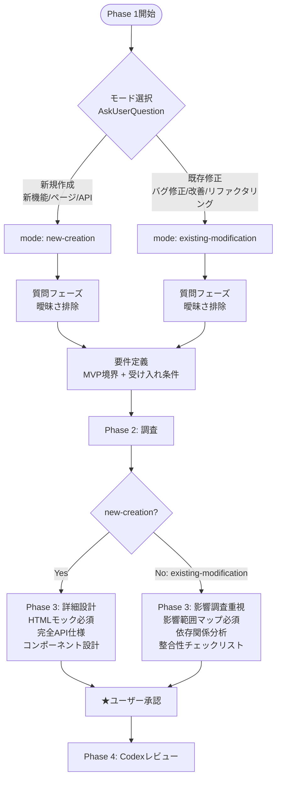
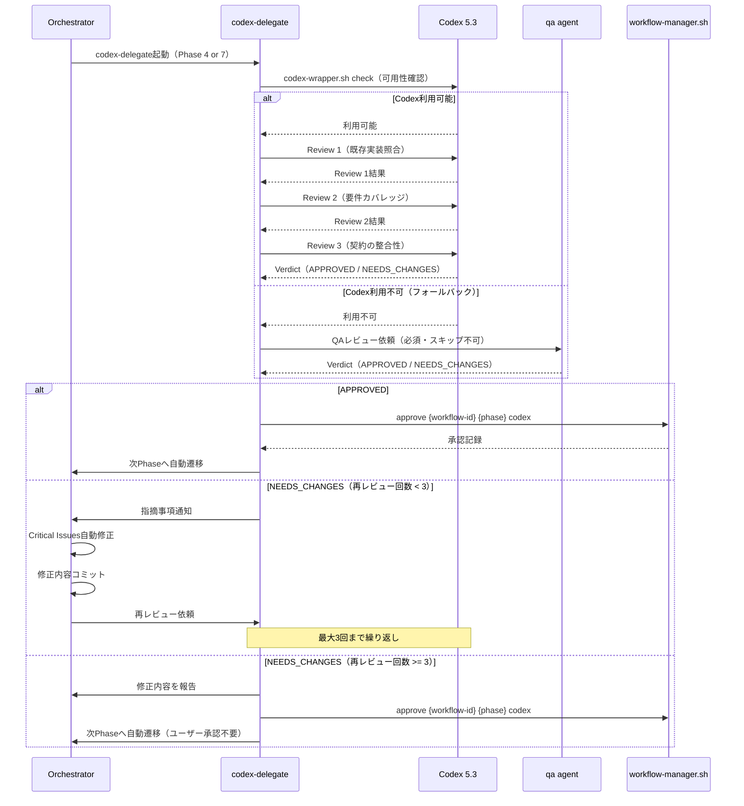
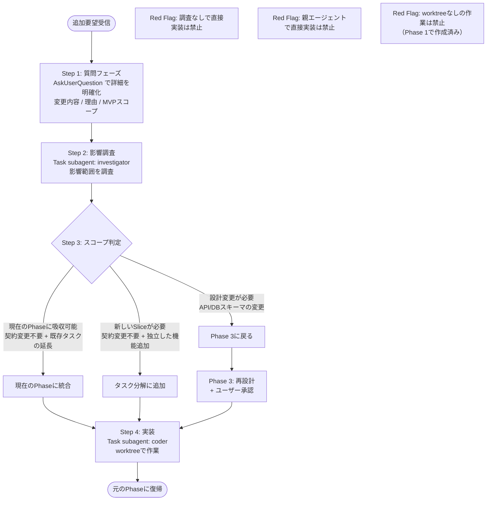
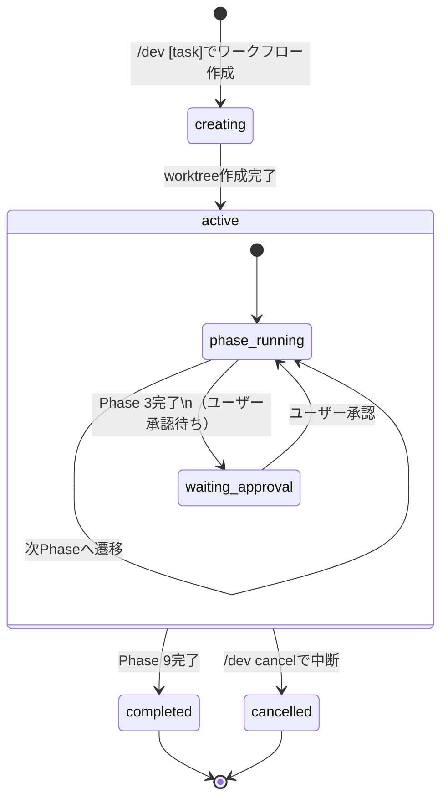
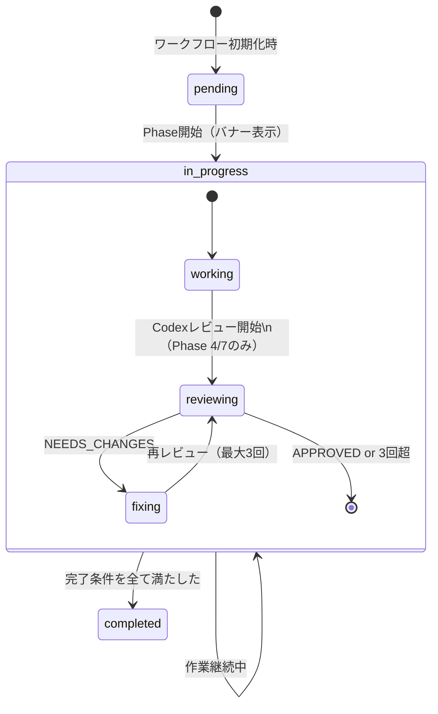
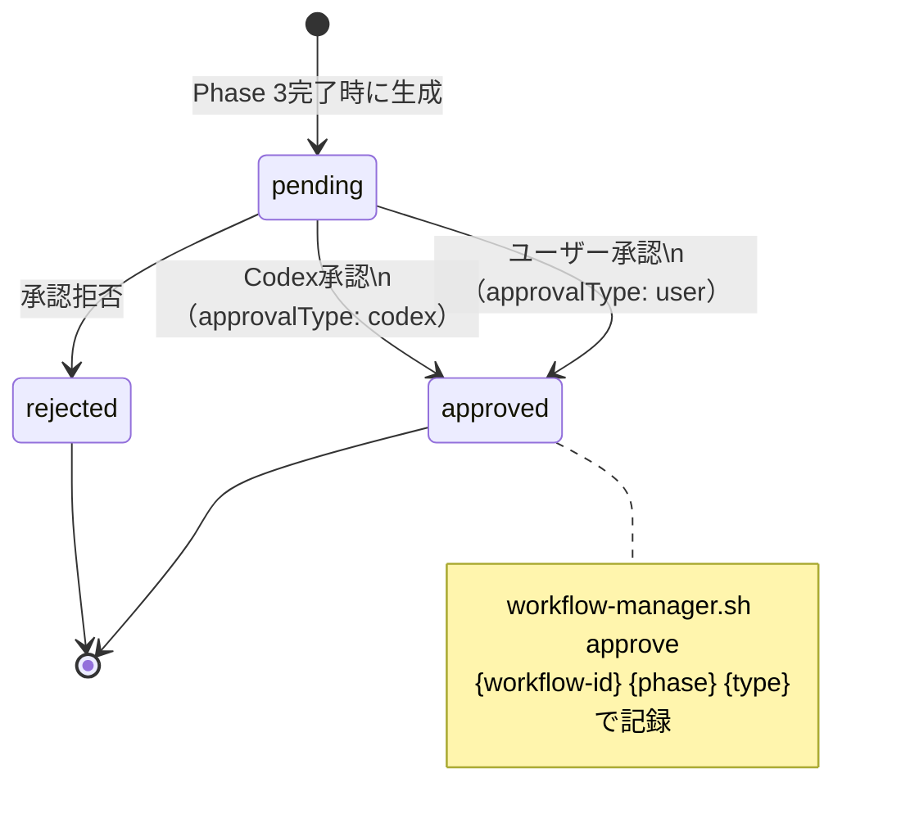
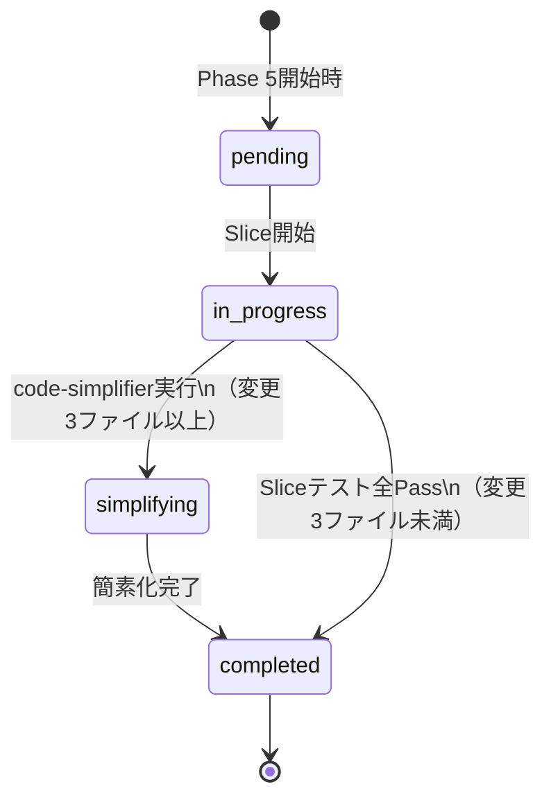

# fractal-dev-workflow フロー図

9フェーズワークフローの遷移ロジック、レビューフロー、エージェント構成を視覚化したリファレンスドキュメントです。

## 全体フロー図

9フェーズの遷移と条件を示します。Phase 3→4のみユーザー承認が必須で、それ以外はすべて自動遷移です。Phase 4とPhase 7ではCodexレビューが必須であり、Codex利用不可時はqaエージェントにフォールバックします。

```mermaid
flowchart TD
    START([タスク受領]) --> WT[worktree作成\nworkflow/{workflowId}]
    WT --> P1[Phase 1: 質問 + 要件定義]
    P1 -->|自動| P2[Phase 2: 調査 + ドメイン整理]
    P2 -->|自動| P3[Phase 3: 契約設計]
    P3 -->|★ユーザー承認必須| P4[Phase 4: Codex計画レビュー]

    P4 -->|自動遷移| P4_FIX{NEEDS_CHANGES?}
    P4_FIX -->|Yes, 3回まで| P4_AUTO[自動修正]
    P4_AUTO --> P4
    P4_FIX -->|No / 3回超| P5[Phase 5: 実装]

    P5 -->|自動| P6[Phase 6: Chromeデバッグ]
    P6 -->|自動: codex-delegate起動必須| P7[Phase 7: Codexコードレビュー]

    P7 -->|自動遷移| P7_FIX{NEEDS_CHANGES?}
    P7_FIX -->|Yes, 3回まで| P7_AUTO[自動修正]
    P7_AUTO --> P7
    P7_FIX -->|No / 3回超| P8[Phase 8: 検証]

    P8 -->|自動| P9[Phase 9: 運用設計]
    P9 --> END([完了])

    P4 -.->|Codex利用不可| QA4[qa agent フォールバック]
    QA4 --> P4_FIX
    P7 -.->|Codex利用不可| QA7[qa agent フォールバック]
    QA7 --> P7_FIX
```

### Phase間遷移ルール

| 遷移 | 条件 | 備考 |
|------|------|------|
| Phase 1 → 2 | 自動 | 要件定義完了後 |
| Phase 2 → 3 | 自動 | 調査完了条件を満たした後 |
| Phase 3 → 4 | ★ユーザー承認必須 | 計画提示→承認後にcodex-delegate起動 |
| Phase 4 → 5 | 自動 | Codexレビュー完了後（NEEDS_CHANGESも3回で自動遷移） |
| Phase 5 → 6 | 自動 | 実装完了後 |
| Phase 6 → 7 | 自動 | Chromeデバッグ完了後、codex-delegate起動必須 |
| Phase 7 → 8 | 自動 | Codexレビュー完了後 |
| Phase 8 → 9 | 自動 | 検証完了後 |
| Phase 9 → 完了 | 自動 | 運用設計完了後 |

---

## モード分岐図

Phase 1の最初のステップでモードを判定します。選択したモードはワークフロー状態の`mode`フィールドに保存され、Phase 3の設計内容と成果物に影響します。



### モード別の重点項目

| 項目 | new-creation | existing-modification |
|------|-------------|----------------------|
| Phase 3 重点 | 詳細設計 | 影響調査 |
| HTMLモック | 必須 | 不要 |
| API仕様 | 完全定義（OpenAPI） | 変更分のみ |
| DBスキーマ | 完全設計 | 変更分のみ |
| 破壊的変更判定 | なし | 必須 |
| Chrome調査（Phase 2） | 不要 | オプション |

---

## Phase 4/7 Codexレビューフロー

Phase 4（計画レビュー）とPhase 7（コードレビュー）は同一のレビューループ構造を持ちます。NEEDS_CHANGES判定時は自動修正→再レビューを最大3回実行し、その後ユーザー承認なしで次フェーズへ自動遷移します。



### Verdictの定義

| Verdict | 意味 | 対応 |
|---------|------|------|
| APPROVED | すべての観点でレビュー通過 | 次Phaseへ自動遷移 |
| NEEDS_CHANGES | 修正が必要な指摘あり | 自動修正→再レビュー（最大3回） |
| Critical Issue | セキュリティ脆弱性・データ損失・本番障害リスク | 即時修正必須 |

---

## 追加要望対応フロー

ワークフロー実行中に追加要望が発生した場合、必ず質問・影響調査・スコープ判定の手順を踏みます。フローをスキップした直接実装は禁止です。



### スコープ判定基準

| 判定 | 条件 | 対応 |
|------|------|------|
| 現在Phaseに吸収 | 契約変更不要、既存タスクの延長 | 現在タスクに統合 |
| 新Sliceが必要 | 契約変更不要、独立した機能追加 | タスク分解に追加 |
| 設計変更必要 | API/DBスキーマの変更が必要 | Phase 3に戻る |

---

## Phase別エージェント役割表

各フェーズの担当エージェント、使用スキル、推奨モデルを整理します。

| Phase | 名称 | 担当エージェント | スキル | 推奨モデル | 承認 |
|-------|------|-----------------|-------|-----------|------|
| 1 | 質問 + 要件定義 | Architect | questioning, requirements | Sonnet | 自動 |
| 2 | 調査 + ドメイン整理 | investigator | investigation | Sonnet | 自動 |
| 3 | 契約設計 | Architect | design | Opus（複雑な判断時）/ Sonnet | **ユーザー承認必須** |
| 4 | Codex計画レビュー | codex-delegate（→ qaフォールバック） | codex-review | Codex 5.3 xhigh | 自動 |
| 5 | 実装 | TechLead → Coder（並列）+ code-simplifier | implementation | Sonnet | 自動 |
| 6 | Chromeデバッグ | chrome-debugger サブエージェント | chrome-debug | Sonnet | 自動 |
| 7 | Codexコードレビュー | codex-delegate（→ qaフォールバック） | codex-review | Codex 5.3 xhigh | 自動 |
| 8 | 検証 | qa（読み取り専用・編集禁止） | verification | Sonnet | 自動 |
| 9 | 運用設計 | Architect | completion | Sonnet | 自動 |

### エージェント使い分け

| エージェント | 役割 | 制約 |
|-------------|------|------|
| Architect | 要件定義・設計・運用設計 | - |
| investigator | 既存実装調査・ドメイン整理 | path:line根拠必須、憶測禁止 |
| codex-delegate | Codexレビュー実行 | スキップ不可 |
| qa | レビューフォールバック・検証 | 編集禁止（指摘のみ） |
| TechLead | タスク分解・並列実装指示 | - |
| Coder | TDD実装 | worktree内で作業（Phase 1で作成済み） |
| code-simplifier | コード簡素化 | 変更3ファイル以上で実行 |
| chrome-debugger | Chrome MCP操作・UI検証 | 並列禁止、ポート3100固定 |

---

## 状態遷移図

workflow-manager.shが管理するワークフローの状態とPhase状態を示します。

### ワークフロー全体の状態



### Phase単体の状態



### Approval（承認）の状態



### Phase 5 Slice の状態



### ワークフロー状態JSONの主要フィールド

| フィールド | 型 | 値 | 説明 |
|-----------|----|----|------|
| `status` | string | `active` / `completed` / `cancelled` | ワークフロー全体の状態 |
| `mode` | string | `new-creation` / `existing-modification` | Phase 1で設定 |
| `currentPhase` | number | 1-9 | 現在実行中のPhase番号 |
| `phases.N.status` | string | `pending` / `in_progress` / `completed` | 各Phaseの状態 |
| `approvals[].approvalType` | string | `user` / `codex` | 承認者の種別 |
| `approvals[].status` | string | `pending` / `approved` / `rejected` | 承認状態 |
| `codexReviews.N.has_critical_issues` | boolean | true / false | Critical Issue有無 |

---

## 参照ドキュメント

- 詳細な実行手順: `skills/dev-workflow/SKILL.md`
- 各スキル詳細: `skills/*/SKILL.md`
- エージェント定義: `agents/*.md`
- 用語定義（Source of Truth）: `skills/dev-workflow/SKILL.md` の Terminologyセクション
