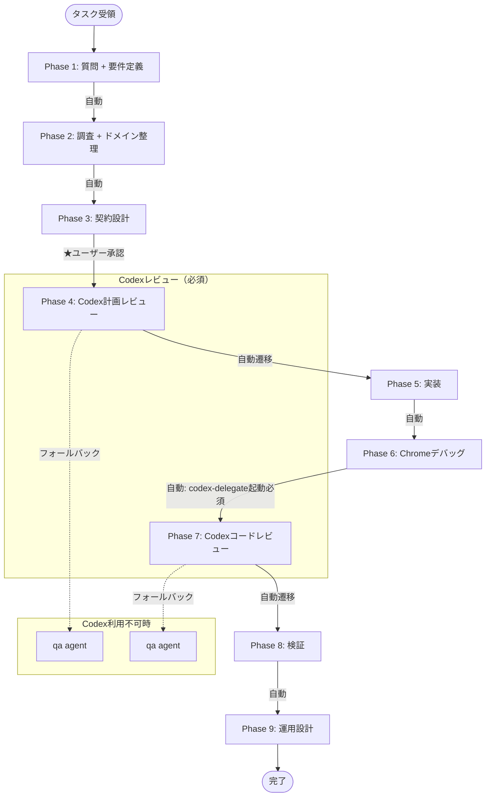
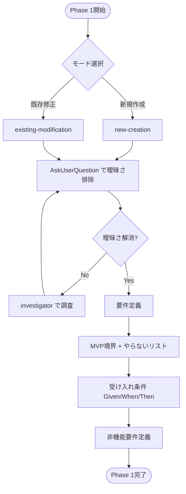
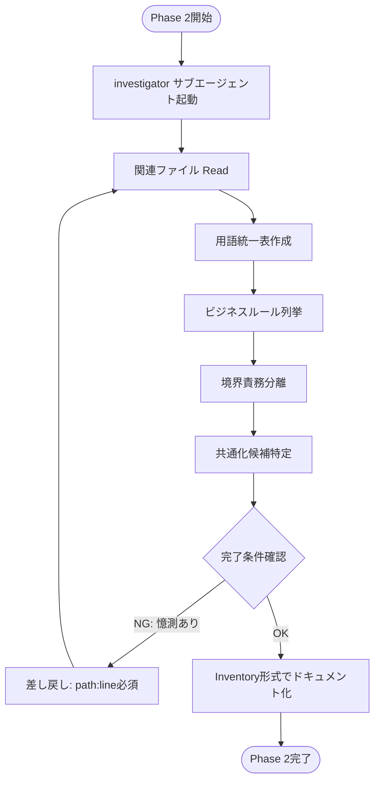
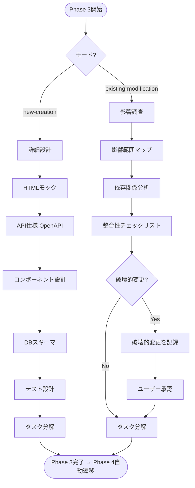
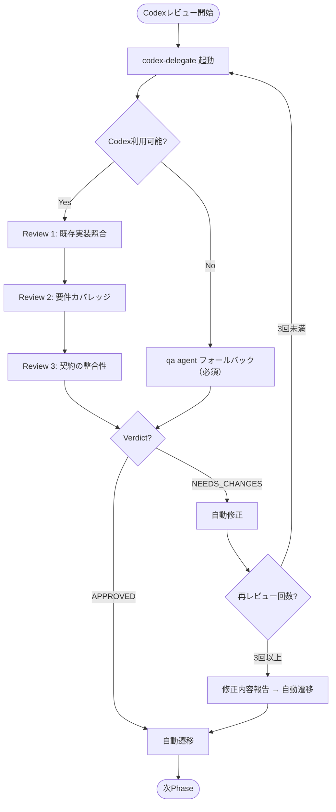
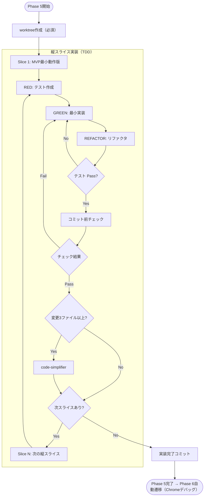
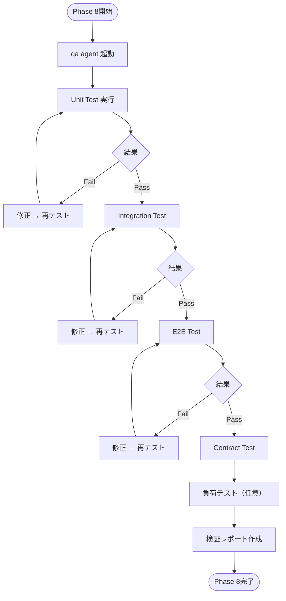
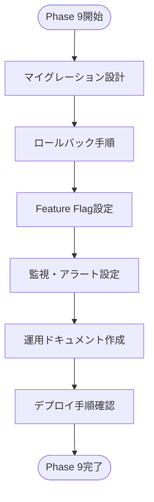
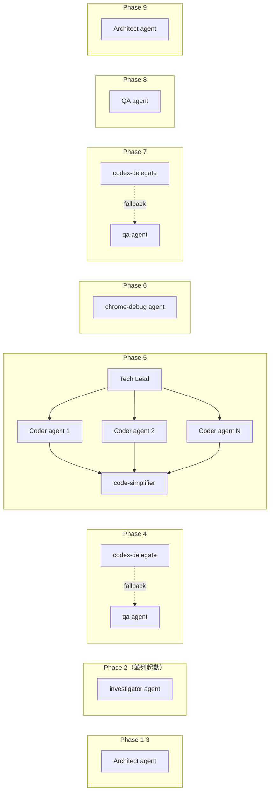
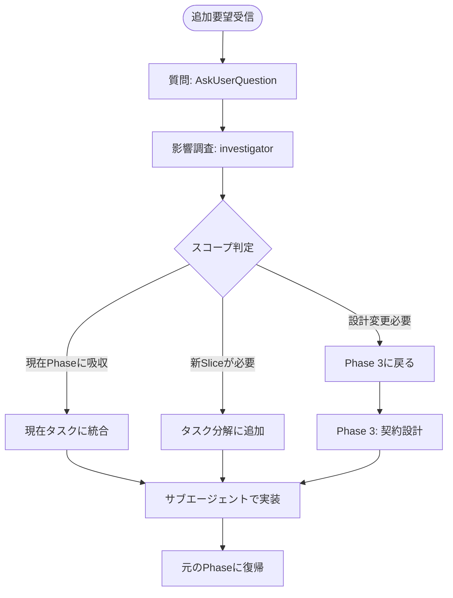

# fractal-dev-workflow フロー図

このドキュメントでは、fractal-dev-workflowプラグインの9フェーズワークフローを視覚化します。各フェーズの流れ、遷移条件、サブエージェント構成を理解するためのリファレンスとして利用してください。

## 全体フロー

9フェーズの全体の流れと遷移条件を示します。Phase 4とPhase 7では**Codexレビューが必須**であり、Codex利用不可時はqaエージェントにフォールバックします。

### フェーズ間遷移ルール

| 遷移 | 条件 | 備考 |
|------|------|------|
| Phase 1 → 2 | 自動 | 要件定義完了後 |
| Phase 2 → 3 | 自動 | 調査完了条件を満たした場合 |
| Phase 3 → 4 | ★ユーザー承認必須 | 計画をユーザーに提示し承認後にCodexレビュー |
| Phase 4 → 5 | 自動 | Codexレビュー承認後（NEEDS_CHANGESの場合も3回後自動遷移） |
| Phase 5 → 6 | 自動 | 実装完了後、Chromeデバッグ実施 |
| Phase 6 → 7 | 自動 | Chromeデバッグ完了後、Codexレビュー必須 |
| Phase 7 → 8 | 自動 | Codexレビュー承認後 |
| Phase 8 → 9 | 自動 | 検証完了後 |
| Phase 9 → 完了 | 自動 | 運用設計完了後 |

---

## Phase 1: 質問 + 要件定義

曖昧さを徹底的に排除し、MVP境界を明確化します。モード選択によって後続フェーズの実行内容が決定されます。

### Phase 1の主要アクティビティ

1. **モード選択**: 新規作成 or 既存修正を判定
2. **質問フェーズ**: AskUserQuestionで2-4個のオプションを提示し曖昧さ排除
3. **要件定義**: MVP境界、成功条件、ユースケース、受け入れ条件を記述
4. **非機能要件**: 性能、セキュリティ、可用性要件を定義

### 成果物

- MVP境界（やること/やらないこと）
- 受け入れ条件（Given/When/Then形式）
- 非機能要件（性能、セキュリティ等）

---

## Phase 2: 調査 + ドメイン整理

サブエージェント（investigator）を使用して既存実装を調査し、用語統一とビジネスルール抽出を行います。親エージェントのコンテキストを汚さないため、必ずサブエージェント駆動で実行します。

### Phase 2の完了条件検証

- **Inventory形式**: Key Exports/Status/Summary列が必須
- **証拠の最小要件**: `path:line` + コマンド + 結果
- **差し戻し条件**: 「ファイル名から推測」「構造から推測」は却下（憶測禁止）

### 成果物

- 用語統一表
- ビジネスルール一覧
- 境界責務分離マップ
- 共通化候補リスト
- Inventory形式の調査結果

---

## Phase 3: 契約設計

モードに応じて実行内容が分岐します。新規作成モードでは詳細設計を行い、既存修正モードでは影響調査を重視します。

### new-creationモードの設計項目

1. **HTMLモック**: 主要画面のワイヤーフレーム
2. **API仕様**: OpenAPI形式で完全定義
3. **コンポーネント設計**: 再利用可能なUI/ロジック分離
4. **DBスキーマ**: テーブル定義、インデックス、制約
5. **テスト設計**: テストケースの事前設計
6. **タスク分解**: 縦スライス単位での実装タスク

### existing-modificationモードの調査項目

1. **影響範囲マップ**: 変更による影響ファイル/機能の特定
2. **依存関係分析**: 呼び出し元/呼び出し先の洗い出し
3. **整合性チェックリスト**: 既存仕様との整合性確認項目
4. **破壊的変更判定**: API削除、必須フィールド追加、型変更等を検出
5. **タスク分解**: 修正タスクの分解

### 成果物

- **new-creation**: HTMLモック、API仕様、DBスキーマ、コンポーネント設計、タスクリスト
- **existing-modification**: 影響範囲マップ、整合性チェックリスト、タスクリスト

---

## Phase 4/7: Codexレビュー

Phase 4（計画レビュー）とPhase 7（コードレビュー）では、Codex 5.3 xhighによる批判的レビューを実行します。NEEDS_CHANGES判定時は自動修正→再レビューのループを最大3回実行し、その後自動遷移します。

### Codexレビューのステップ

| レビュー項目 | 内容 |
|-------------|------|
| Review 1: 既存実装照合 | 既存コードとの一貫性確認 |
| Review 2: 要件カバレッジ | すべての要件が計画/実装でカバーされているか |
| Review 3: 契約の整合性 | API/DBスキーマ/エラー形式の整合性 |

### Verdict判定

- **APPROVED**: 自動で次フェーズに遷移
- **NEEDS_CHANGES**: 自動修正→再レビュー（最大3回）
- **Critical Issue**: セキュリティ脆弱性、データ損失リスク、本番障害リスクがある場合

### フォールバック

Codex利用不可時はqaエージェントで代替レビューを実行します（必須）。

---

## Phase 5: 実装

worktreeを作成し、縦スライス単位でTDDサイクル（RED→GREEN→REFACTOR）を回します。各スライス完了後にcode-simplifierを実行して複雑度を削減します。実装完了後はPhase 6（Chromeデバッグ）に自動遷移します。

### TDDサイクル

1. **RED**: 失敗するテストを書く（テストファイルを先に作成）
2. **GREEN**: 最小限のコードでテストをパスさせる（過剰実装しない）
3. **REFACTOR**: 重複排除、可読性向上（テストは常にパス）

### コミット前チェック（自動実行必須）

各コミット前に以下を自動実行:
- `pnpm test`: テスト実行
- `pnpm lint`: リント実行
- `pnpm typecheck`: 型チェック実行（TypeScriptの場合）

**1つでもFail**: コミット禁止

### code-simplifier統合

- **実行条件**: 変更ファイル3以上 or 変更50行以上
- **実行タイミング**: 各スライス完了後
- **スキップ可能**: 条件未満の場合

### 成果物

- 動作するコード
- テストコード（最低限のカバレッジ: 主要関数80%以上）
- 再利用可能なコンポーネント

---

## Phase 8: 検証

テストピラミッドに基づいてUnit→Integration→E2E→Contract→負荷の順でテストを実行します。qaエージェントがテスト実行と結果レポートを担当します。

### テストピラミッド

| テストレベル | 数量 | 目的 |
|-------------|------|------|
| Unit Test | 多 | 関数/メソッド単位の動作検証 |
| Integration Test | 中 | モジュール間連携の検証 |
| E2E Test | 少 | ユーザーシナリオの検証 |
| Contract Test | 少 | API契約の検証 |
| 負荷テスト | 任意 | 性能要件の検証 |

### 最低限のテストカバレッジ

- 主要関数の80%以上
- 正常系各1ケース
- 主要異常系各1ケース

### 成果物

- テスト実行結果
- 検証レポート
- カバレッジレポート

---

## Phase 9: 運用設計

デプロイ、ロールバック、監視、Feature Flagの設計を行います。本番環境での安全な運用を保証するための最終フェーズです。

### Phase 9の主要アクティビティ

1. **マイグレーション設計**: DBスキーマ変更の手順
2. **ロールバック手順**: 障害時の切り戻し手順
3. **Feature Flag**: 段階的リリースのためのフラグ設定
4. **監視・アラート**: エラー率、レスポンスタイム等のアラート設定
5. **運用ドキュメント**: 運用担当者向けの手順書

### 成果物

- マイグレーション/ロールバック手順
- Feature Flag設定
- 監視・アラート設定
- 運用ドキュメント

---

## サブエージェント構成

各フェーズで使用されるサブエージェントとその役割を示します。独立したタスクはサブエージェントで並列実行することでトークン消費を削減します。

### サブエージェントの役割

| エージェント | 使用Phase | 役割 | モデル推奨 |
|-------------|----------|------|-----------|
| Architect | Phase 1, 3, 9 | 要件定義、設計、運用設計 | Opus（複雑な判断時）/ Sonnet |
| investigator | Phase 2 | 既存実装調査、ドメイン整理 | Sonnet 4.5 |
| codex-delegate | Phase 4, 7 | Codexレビュー実行 | Codex 5.3 xhigh |
| qa | Phase 4, 7, 8 | レビューフォールバック、検証 | Sonnet |
| Tech Lead | Phase 5 | タスク分配、進捗管理 | Sonnet |
| Coder | Phase 5 | TDD実装 | Sonnet 4.5 |
| code-simplifier | Phase 5 | コード簡素化 | Sonnet |
| chrome-debug | Phase 6 | Chromeデバッグ実行 | Sonnet |

### 並列実行の原則

- 独立したタスクは`run_in_background=true`で並列実行
- サブエージェントごとに独立したコンテキストで作業
- 結果のみを親エージェントに返す（トークン消費削減）

---

## 追加要望対応フロー

ワークフロー実行中に追加要望が入った場合の対応フローです。影響調査を行い、スコープ判定によって適切に統合または分離します。

### スコープ判定基準

| 判定 | 条件 | 対応 |
|------|------|------|
| 現在Phaseに吸収 | 契約変更不要、既存タスクの延長 | 現在タスクに統合 |
| 新Sliceが必要 | 契約変更不要、独立した機能追加 | タスク分解に追加 |
| 設計変更必要 | API/DBスキーマの変更が必要 | Phase 3に戻る |

---

## まとめ

このフロー図は、fractal-dev-workflowの実行フローを視覚化したものです。以下の原則を常に意識してください:

### 重要原則

1. **質問で曖昧さを徹底排除**（Phase 1）
2. **そもそもやることを減らす**（MVP境界の明確化）
3. **契約を先に固める**（Phase 3）
4. **縦に切って最短で動かす**（Phase 5）
5. **サブエージェント駆動**（コンテキスト汚染防止）
6. **Codexレビュー必須**（Phase 4, 7）
7. **TDD厳守**（テストなしのコードはコミット禁止）

### 参照ドキュメント

- 詳細な実装手順: `skills/*/SKILL.md`
- エージェント定義: `agents/*.md`
- 用語定義（Source of Truth）: `skills/dev-workflow/SKILL.md` Terminologyセクション
