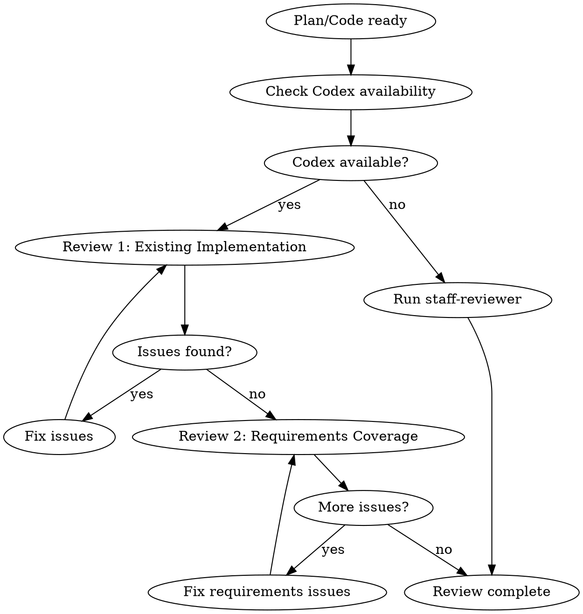

# Codex Critical Review Phase

## Overview

Codex CLI (codex-5.3, reasoning: xhigh) を使用して計画とコードの批判的レビューを実施する。
**2つの観点**で順次レビューを行い、外部の視点で品質を保証。

**Core principle:** PREFER Codex for all critical reviews. Fresh context catches more issues.

## The Iron Law

```
PREFER EXTERNAL CRITICAL REVIEW FOR ALL PLANS AND CODE
TWO-PERSPECTIVE REVIEW: EXISTING IMPLEMENTATION + REQUIREMENTS COVERAGE
```

Codex is preferred but not required. Use staff-reviewer as fallback.

## Codex Configuration

| Setting | Value | Description |
|---------|-------|-------------|
| Model | codex-5.3 | Latest Codex model for code analysis |
| Reasoning | xhigh | Maximum reasoning depth for thorough review |

## The Process



## Two-Perspective Plan Review

### Review 1: Existing Implementation Review (既存実装照合)

Verify plan against existing codebase:

```bash
scripts/codex-wrapper.sh review-spec "$PROJECT_DIR" "$(cat plan.md)"
```

**Focus:**
- [ ] 「新規作成」が本当に新規か（既存ファイルと矛盾していないか）
- [ ] すべての変更に具体的なコード参照（path:line）があるか
- [ ] 既存の共通コンポーネント/ユーティリティを再実装していないか
- [ ] 既存コードと異なる設定（AIモデル、API設定等）を使用していないか

### Review 2: Requirements Coverage Review (要件カバレッジ)

Verify all requirements are covered:

```bash
scripts/codex-wrapper.sh review-requirements "$PROJECT_DIR" "$(cat plan.md)" "$(cat requirements.md)"
```

**Focus:**
- [ ] すべての要件が計画に含まれているか
- [ ] 要件の解釈が曖昧なまま計画に反映されていないか
- [ ] 各要件に対応するテストが計画されているか
- [ ] 要件にない機能が計画に含まれていないか（スコープクリープ）

## Code Review (per task, max 2 iterations)

```bash
scripts/codex-wrapper.sh review "$PROJECT_DIR" uncommitted
```

## Review Iteration Loop

1. Submit plan/code to Codex (Review 1: Existing Implementation)
2. Present issues to user (use AskUserQuestion for direction)
3. Apply fixes
4. Re-submit to Codex (max 3 iterations for Review 1)
5. Proceed to Review 2: Requirements Coverage
6. Apply fixes for any requirement gaps
7. Complete when both reviews pass

## Handling Review Issues

| Issue Type | Action |
|------------|--------|
| Existing implementation conflict | Revise plan to use existing code |
| Missing code reference | Add specific path:line references |
| Requirements gap | Add missing requirements to plan |
| Clear fix direction | Fix directly |
| Multiple approaches | Ask user via AskUserQuestion |
| Design-level issue | Consider returning to planning phase |

## Fallback: staff-reviewer (spec-reviewer)

When Codex CLI is unavailable:

```
Task(subagent_type="fractal-dev-workflow:spec-reviewer"):
  Perform existing implementation review equivalent to Codex
```

The spec-reviewer agent provides:
- Same review perspectives as Codex review-spec
- Fresh context (new subagent)
- Detailed critical feedback on existing code conflicts

## Boris Cherny Patterns

- "Grill me on these changes" - Request harsh review
- "Prove to me this works" - Demand evidence
- "Don't make a PR until I pass your test" - Quality gate

## Review Checklist

### Plan Review 1: Existing Implementation
- [ ] All "New" files verified as non-existent
- [ ] All changes have path:line references
- [ ] No duplicate implementation of existing utilities
- [ ] Configuration matches existing codebase
- [ ] AI model settings consistent with existing code

### Plan Review 2: Requirements Coverage
- [ ] All requirements mapped to plan sections
- [ ] No ambiguous requirement interpretations
- [ ] Test strategy covers all requirements
- [ ] No scope creep (features not in requirements)

### Code Review（3観点）
- [ ] **セキュリティ**
  - [ ] OWASP Top 10 vulnerabilities
  - [ ] 入力バリデーション
  - [ ] 認証・認可の適切な実装

- [ ] **品質**
  - [ ] Error handling
  - [ ] Type safety
  - [ ] Code readability
  - [ ] Test coverage
  - [ ] Performance

- [ ] **設計整合性**
  - [ ] Phase 3契約設計との一貫性
  - [ ] 既存アーキテクチャとの整合性
  - [ ] 命名規則の統一
  - [ ] 共通コンポーネントの適切な利用

## Completion Criteria

- [ ] **Review 1 passed** (existing implementation verified)
- [ ] **Review 2 passed** (requirements coverage verified)
- [ ] All issues addressed (fixed or rejected with reason)
- [ ] No critical issues remaining
- [ ] User approved direction for ambiguous issues
