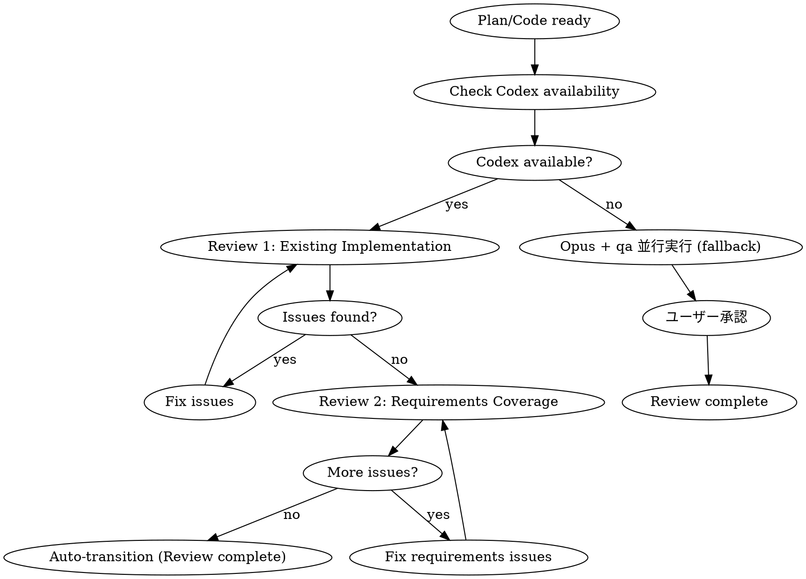

# Codex Critical Review Phase

**必須: Phase Banner Protocol（dev-workflow/SKILL.md）に従い該当Phase（4または7）のバナーを表示すること。**

## Overview

Codex CLI (codex-5.3, reasoning: xhigh) を使用して計画とコードの批判的レビューを実施する。
**2つの観点**で順次レビューを行い、外部の視点で品質を保証。

**Core principle:** PREFER Codex for all critical reviews. Fresh context catches more issues.

## Phase 4 起動条件（計画レビュー）

**TRIGGER**: Phase 3（契約設計）完了後、以下を実行：

```
Task(subagent_type="fractal-dev-workflow:codex-delegate", model="haiku"):
  ## Phase 4: Codex計画レビュー

  計画ファイル: {design artifact path}
  要件ファイル: {requirements artifact path}

  手順:
  1. ~/.claude/plugins/local/fractal-dev-workflow/scripts/codex-wrapper.sh check
  2. review-spec → review-requirements を順次実行
  3. 結果をVerdictと共に報告
```

## Phase 7 起動条件（コードレビュー）

**TRIGGER**: Phase 5（実装）完了後、以下を実行：

```
Task(subagent_type="fractal-dev-workflow:codex-delegate", model="haiku"):
  ## Phase 7: Codexコードレビュー

  ~/.claude/plugins/local/fractal-dev-workflow/scripts/codex-wrapper.sh review . uncommitted を実行
```

## The Iron Law

```
EXTERNAL CRITICAL REVIEW IS MANDATORY FOR ALL PLANS AND CODE
TWO-PERSPECTIVE REVIEW: EXISTING IMPLEMENTATION + REQUIREMENTS COVERAGE
SKIPPING REVIEW IS NOT PERMITTED - USE OPUS + QA AS FALLBACK WITH USER APPROVAL
```

Codexレビューは必須です。Codex CLIが利用不可の場合、Opus + qaエージェントによる並行フォールバックとユーザー承認が必須です。
レビュー自体をスキップすることはできません。

## Codex Configuration

| Setting | Value | Description |
|---------|-------|-------------|
| Model | codex-5.3 | Latest Codex model for code analysis |
| Reasoning | xhigh | Maximum reasoning depth for thorough review |

## The Process



## Two-Perspective Plan Review

### Review 1: Existing Implementation Review (既存実装照合)

Verify plan against existing codebase:

```bash
~/.claude/plugins/local/fractal-dev-workflow/scripts/codex-wrapper.sh review-spec "$PROJECT_DIR" "$(cat plan.md)"
```

**Focus:**
- [ ] 「新規作成」が本当に新規か（既存ファイルと矛盾していないか）
- [ ] すべての変更に具体的なコード参照（path:line）があるか
- [ ] 既存の共通コンポーネント/ユーティリティを再実装していないか
- [ ] 既存コードと異なる設定（AIモデル、API設定等）を使用していないか

### Review 2: Requirements Coverage Review (要件カバレッジ)

Verify all requirements are covered:

```bash
~/.claude/plugins/local/fractal-dev-workflow/scripts/codex-wrapper.sh review-requirements "$PROJECT_DIR" "$(cat plan.md)" "$(cat requirements.md)"
```

**Focus:**
- [ ] すべての要件が計画に含まれているか
- [ ] 要件の解釈が曖昧なまま計画に反映されていないか
- [ ] 各要件に対応するテストが計画されているか
- [ ] 要件にない機能が計画に含まれていないか（スコープクリープ）

## Code Review (per task, max 2 iterations)

```bash
~/.claude/plugins/local/fractal-dev-workflow/scripts/codex-wrapper.sh review "$PROJECT_DIR" uncommitted
```

## Review Iteration Loop

1. Submit plan/code to Codex (Review 1: Existing Implementation)
2. Present issues to user (use AskUserQuestion for direction)
3. Apply fixes
4. Re-submit to Codex (max 3 iterations for Review 1)
5. Proceed to Review 2: Requirements Coverage
6. Apply fixes for any requirement gaps
7. Complete when both reviews pass

## Handling Review Issues

| Issue Type | Action |
|------------|--------|
| Existing implementation conflict | Revise plan to use existing code |
| Missing code reference | Add specific path:line references |
| Requirements gap | Add missing requirements to plan |
| Clear fix direction | Fix directly |
| Multiple approaches | Ask user via AskUserQuestion |
| Design-level issue | Consider returning to planning phase |

## Fallback: Opus + qa（並行実行）

When Codex CLI is unavailable:

```
以下を並行実行:
Task(model="opus"):
  ## Opus Review (Codex Fallback)
  計画ファイルまたは実装コードを読み、既存実装との整合性と要件カバレッジをレビュー
  Verdict: [APPROVED / NEEDS_CHANGES] を明示すること

Task(subagent_type="fractal-dev-workflow:qa"):
  ## QA Review (Codex Fallback 補助)
  計画ファイルまたは実装コードを読み、既存実装との整合性と要件カバレッジをレビュー
  Verdict: [APPROVED / NEEDS_CHANGES] を明示すること

両レビュー結果をユーザーに提示し、承認を要求する。
Verdictが異なる場合は厳しい方（NEEDS_CHANGES）を採用して提示すること。
```

The Opus + qa fallback provides:
- Same review perspectives as Codex review-spec
- Fresh context (new subagents)
- Detailed critical feedback on existing code conflicts
- User approval gate before phase transition

## Boris Cherny Patterns

- "Grill me on these changes" - Request harsh review
- "Prove to me this works" - Demand evidence
- "Don't make a PR until I pass your test" - Quality gate

## Review Checklist

### Plan Review 1: Existing Implementation
- [ ] All "New" files verified as non-existent
- [ ] All changes have path:line references
- [ ] No duplicate implementation of existing utilities
- [ ] Configuration matches existing codebase
- [ ] AI model settings consistent with existing code

### Plan Review 2: Requirements Coverage
- [ ] All requirements mapped to plan sections
- [ ] No ambiguous requirement interpretations
- [ ] Test strategy covers all requirements
- [ ] No scope creep (features not in requirements)

### Code Review（3観点）
- [ ] **セキュリティ**
  - [ ] OWASP Top 10 vulnerabilities
  - [ ] 入力バリデーション
  - [ ] 認証・認可の適切な実装

- [ ] **品質**
  - [ ] Error handling
  - [ ] Type safety
  - [ ] Code readability
  - [ ] Test coverage
  - [ ] Performance

- [ ] **設計整合性**
  - [ ] Phase 3契約設計との一貫性
  - [ ] 既存アーキテクチャとの整合性
  - [ ] 命名規則の統一
  - [ ] 共通コンポーネントの適切な利用

## Critical Issue Definition

### 重大な指摘（自動修正必須）
以下のいずれかに該当する場合、Codexの指摘は「重大」と判定し、自動修正を実施する:

1. **セキュリティ脆弱性**
   - XSS、SQLインジェクション、CSRF等
   - 認証/認可の欠陥
   - 機密情報の露出リスク

2. **データ損失リスク**
   - 破壊的なDB操作（DELETE, TRUNCATE）
   - 不可逆なデータ変換
   - バックアップなしの操作

3. **API破壊的変更**
   - 既存クライアントが動作しなくなる変更
   - 必須フィールドの追加/削除
   - レスポンス形式の変更

4. **パフォーマンス問題**
   - N+1クエリ
   - 無限ループリスク
   - メモリリーク

5. **テストカバレッジ不足**
   - 主要機能のテストなし
   - エッジケースのテストなし

### 軽微な指摘（自動遷移可能）
以下のみの場合、自動遷移可能:

- コードスタイル/フォーマット
- 変数命名の改善提案
- コメントの追加提案
- 軽微なリファクタリング提案

## Verdict Decision Logic

### APPROVED（`has_critical_issues=false`）
- 指摘なし
- 軽微な指摘のみ（minor_issues_count > 0可）
- **dev-workflow:** 自動遷移

### APPROVED（`has_critical_issues=true`）
- 重大な指摘あり（critical_issues_count > 0）
- 指摘内容を記録し、可能な範囲で自動修正
- **dev-workflow:** 自動遷移（指摘内容を記録）

### NEEDS_CHANGES（`has_critical_issues=true`）
- セキュリティ脆弱性（重大）
- アーキテクチャ上の問題
- 要件との不一致
- **dev-workflow:** 自動修正 → 再レビュー → 自動遷移（最大3回）

## Review Result Format

### Output Specification (dev-workflow互換)

レビュー結果は以下の形式で出力し、dev-workflowの遷移条件で使用:

```json
{
  "verdict": "APPROVED" | "NEEDS_CHANGES",
  "critical_issues_count": number,
  "has_critical_issues": boolean,
  "minor_issues_count": number
}
```

**dev-workflowマッピング:**

| Verdict | has_critical_issues | critical_issues_count | dev-workflow遷移 |
|---------|---------------------|----------------------|------------------|
| APPROVED | false | 0 | 自動遷移（Phase 5 or 8） |
| APPROVED | true | > 0 | 自動遷移（指摘内容を記録） |
| NEEDS_CHANGES | true | > 0 | 自動修正 → 再レビュー → 自動遷移 |

**注意:** Codex利用可能時はユーザー承認不要（自動遷移）。Codex利用不可時はOpusレビュー + qa補助後にユーザー承認が必要。
Critical Issuesがある場合は自動修正を試み、修正後に再レビューを実行する。
最大3回の再レビュー後、自動遷移する（Codex利用可能時のみ）。

**変数仕様:**
- `verdict`: 総合判定（"APPROVED" | "NEEDS_CHANGES"）
- `critical_issues_count`: 重大な指摘の数
- `has_critical_issues`: 重大な指摘があるか（= critical_issues_count > 0）
- `minor_issues_count`: 軽微な指摘の数

dev-workflowは `has_critical_issues` を遷移条件に使用する。

### Summary
- Verdict: [APPROVED | NEEDS_CHANGES]
- Critical Issues: [数]
- Minor Issues: [数]

### Critical Issues (自動修正対象)
| # | 種別 | 説明 | 対応方針 |
|---|------|------|---------|
| 1 | セキュリティ | XSS脆弱性 | サニタイズ追加 |

### Minor Issues (自動遷移可能)
| # | 種別 | 説明 | 対応方針 |
|---|------|------|---------|
| 1 | スタイル | 変数名改善 | 任意 |

### Recommendation
- Codex利用可能時: 自動遷移
- Codex利用不可時: ユーザー承認後に遷移
- [再レビュー必要 / 不要]
- [自動修正の対象: リスト]

## Completion Criteria

- [ ] **Review 1 passed** (existing implementation verified)
- [ ] **Review 2 passed** (requirements coverage verified)
- [ ] All issues addressed (fixed or rejected with reason)
- [ ] No critical issues remaining
- [ ] User approved direction for ambiguous issues
