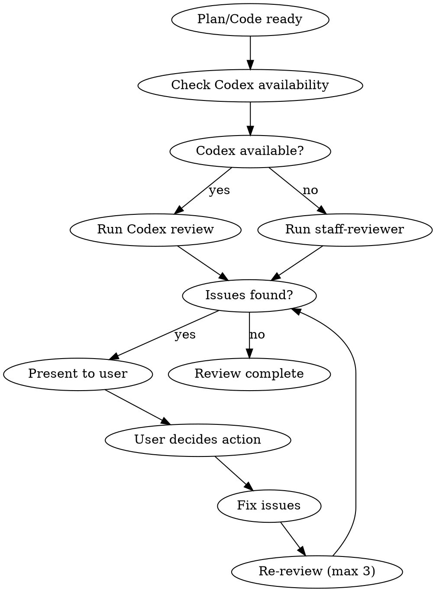

# Codex Critical Review Phase

## Overview

Codex CLIを使用して計画とコードの批判的レビューを実施する。外部の視点で品質を保証。

**Core principle:** PREFER Codex for all critical reviews. Fresh context catches more issues.

## The Iron Law

```
PREFER EXTERNAL CRITICAL REVIEW FOR ALL PLANS AND CODE
```

Codex is preferred but not required. Use staff-reviewer as fallback.

## The Process



### Plan Review (max 3 iterations)

```bash
scripts/codex-wrapper.sh exec "$PROJECT_DIR" \
  "以下の実装計画を批判的にレビューしてください。問題点、見落とし、改善点を指摘:

[Plan content here]"
```

### Code Review (per task, max 2 iterations)

```bash
scripts/codex-wrapper.sh review "$PROJECT_DIR" uncommitted
```

## Review Iteration Loop

1. Submit plan/code to Codex
2. Present issues to user (use AskUserQuestion for direction)
3. Apply fixes
4. Re-submit to Codex (max 3 for plan, 2 for code)
5. Complete when all issues resolved

## Handling Review Issues

| Issue Type | Action |
|------------|--------|
| Clear fix direction | Fix directly |
| Multiple approaches | Ask user via AskUserQuestion |
| Design-level issue | Consider returning to planning phase |

## Fallback: staff-reviewer

When Codex CLI is unavailable:

```
Task(subagent_type="staff-reviewer"):
  Perform critical review equivalent to Codex
```

The staff-reviewer agent provides:
- Same review perspectives as Codex
- Fresh context (new subagent)
- Detailed critical feedback

## Boris Cherny Patterns

- "Grill me on these changes" - Request harsh review
- "Prove to me this works" - Demand evidence
- "Don't make a PR until I pass your test" - Quality gate

## Review Checklist

### Plan Review
- [ ] Requirements coverage
- [ ] Technical feasibility
- [ ] Security considerations
- [ ] Performance impact
- [ ] Edge case handling
- [ ] Test strategy validity

### Code Review
- [ ] OWASP Top 10 vulnerabilities
- [ ] Error handling
- [ ] Type safety
- [ ] Code readability
- [ ] Test coverage
- [ ] Performance

## Completion Criteria

- [ ] All issues addressed (fixed or rejected with reason)
- [ ] No critical issues remaining
- [ ] User approved direction for ambiguous issues
