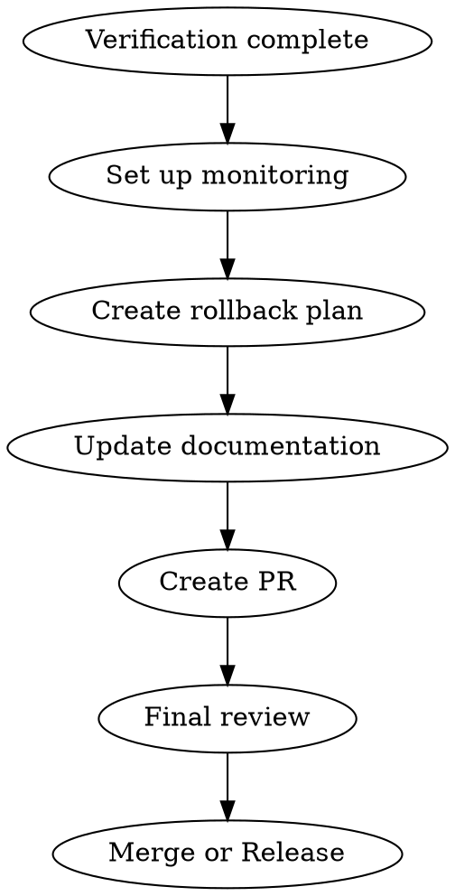

# Completion Phase

## Overview

「作って終わり」にしない。運用を見据えた準備を完了させる。

**Core principle:** 作って終わりの宗教を捨てる。運用開始がスタートライン。

## The Iron Law

```
NO RELEASE WITHOUT MONITORING
NO RELEASE WITHOUT ROLLBACK PLAN
NO RELEASE WITHOUT DOCUMENTATION
```

## The Process



---

## 1. 監視設定

### 目的
問題を早期に検知し、迅速に対応できる状態にする。

### 必須項目

#### A. ログ
| 項目 | 内容 |
|------|------|
| 追跡ID | リクエスト単位で一意のID |
| エラーログ | スタックトレース、コンテキスト |
| 監査ログ | 重要操作の記録（誰が、いつ、何を） |
| アクセスログ | リクエスト/レスポンス（機密データ除く） |

```typescript
// ログ出力例
logger.info({
  traceId: context.traceId,
  action: 'contact.create',
  userId: user.id,
  contactId: result.id,
  duration: endTime - startTime,
});

logger.error({
  traceId: context.traceId,
  error: error.message,
  stack: error.stack,
  context: { organizationId, input },
});
```

#### B. メトリクス
| メトリクス | 説明 | 閾値例 |
|-----------|------|--------|
| リクエスト数 | 時間あたりのリクエスト | - |
| エラー率 | エラー数/リクエスト数 | 5%超でアラート |
| レスポンス時間 | p50, p95, p99 | p95 > 500ms でアラート |
| キュー長 | 未処理ジョブ数 | 100超でアラート |
| DBコネクション | アクティブ接続数 | 80%超でアラート |

#### C. アラート
| 条件 | 重要度 | 通知先 |
|------|--------|--------|
| エラー率 5%超 | Critical | Slack + PagerDuty |
| レスポンス時間 p95 > 1s | Warning | Slack |
| DB接続 80%超 | Warning | Slack |
| ディスク使用率 90%超 | Critical | Slack + PagerDuty |

### チェックリスト
- [ ] ログに追跡IDが含まれる
- [ ] エラーログにスタックトレースがある
- [ ] 機密データがログに出力されない
- [ ] メトリクスが収集される
- [ ] アラート条件が設定されている
- [ ] 通知先が設定されている

---

## 2. ロールバック手順

### 目的
問題発生時に迅速に元の状態に戻せるようにする。

### 必須項目

#### A. ロールバック条件
```markdown
## ロールバック判断基準

### 即時ロールバック（判断不要）
- エラー率 20%超
- 主要機能が動作しない
- データ損失の可能性

### 判断が必要
- エラー率 5-20%
- 性能劣化（p95 > 2s）
- 一部機能の不具合
```

#### B. ロールバック手順
```markdown
## ロールバック手順

### 1. アプリケーション
```bash
# Vercel の場合
vercel rollback [deployment-id]

# Kubernetes の場合
kubectl rollout undo deployment/[name]

# Docker の場合
docker-compose -f docker-compose.prev.yml up -d
```

### 2. データベース（マイグレーション）
```bash
# Prisma の場合
npx prisma migrate resolve --rolled-back [migration-name]

# 手動の場合
psql -f rollback/[migration-name].sql
```

### 3. 確認
- [ ] エラー率が正常に戻った
- [ ] 主要機能が動作する
- [ ] データ整合性に問題がない
```

#### C. タイムライン
| 時間 | アクション |
|------|-----------|
| 0分 | 問題検知 |
| 5分 | 影響範囲確認 |
| 10分 | ロールバック判断 |
| 15分 | ロールバック実行 |
| 20分 | 正常性確認 |
| 30分 | 事後報告 |

---

## 3. 監視ダッシュボード

### 目的
システムの状態を一目で把握できるようにする。

### 必須グラフ
| グラフ | 内容 |
|--------|------|
| リクエスト数 | 時間あたりのリクエスト推移 |
| エラー率 | エラー数/リクエスト数の推移 |
| レスポンス時間 | p50, p95, p99 の推移 |
| アクティブユーザー | 同時接続数 |
| DB性能 | クエリ時間、接続数 |

### ダッシュボード例
```
┌─────────────────────────────────────────────────────────────┐
│  システム状態: 正常                              更新: 1分前  │
├─────────────────────────────────────────────────────────────┤
│                                                             │
│  リクエスト数          エラー率           レスポンス時間     │
│  ┌───────────────┐    ┌───────────────┐  ┌───────────────┐  │
│  │    ▂▃▅▇▆▅▄    │    │    ▁▁▁▁▁▁▁    │  │    ▂▂▂▃▂▂▂    │  │
│  │   1,234 req/s │    │       0.1%    │  │   p95: 120ms  │  │
│  └───────────────┘    └───────────────┘  └───────────────┘  │
│                                                             │
│  DB接続               メモリ使用率        ディスク使用率     │
│  ┌───────────────┐    ┌───────────────┐  ┌───────────────┐  │
│  │      45/100   │    │       62%     │  │       45%     │  │
│  └───────────────┘    └───────────────┘  └───────────────┘  │
│                                                             │
└─────────────────────────────────────────────────────────────┘
```

---

## 4. 障害対応フロー

### 目的
障害発生時の対応手順を明確にする。

### エスカレーションフロー
```
検知 → 一次対応 → エスカレーション → 対応 → 復旧 → 事後対応
```

### 役割分担
| 役割 | 責任 |
|------|------|
| 一次対応者 | 初動対応、影響範囲確認 |
| 二次対応者 | 原因調査、修正 |
| インシデントマネージャー | 判断、コミュニケーション |

### コミュニケーション
| 宛先 | 内容 | タイミング |
|------|------|-----------|
| チーム内 | 詳細な状況 | 随時 |
| 関係部署 | 影響と復旧見込み | 30分ごと |
| 顧客 | 障害情報と復旧見込み | 重大障害時 |

---

## 5. ドキュメント更新（サブエージェント駆動）

### 目的
PR前にドキュメントを整備し、冗長さを排除しつつ必要十分な情報を維持する。

### サブエージェントによる自動整備

```
# ドキュメント整備をサブエージェントで実行
Task(subagent_type="fractal-dev-workflow:doc-reviewer", model="sonnet"):
  ## ドキュメント整備

  ### 対象ファイル
  1. CLAUDE.md（プロジェクト）
  2. README.md
  3. 変更に関連するドキュメント

  ### 実行内容
  1. 冗長な記述の削減
  2. 必要情報の欠落チェック
  3. 一貫性の確認（用語、フォーマット）
  4. 修正の実行

  ### 出力形式
  - 変更したファイル一覧
  - 各ファイルの変更概要
  - 削減した行数/追加した行数
```

### CLAUDE.md最適化

#### 最適化基準
| 項目 | 基準 |
|------|------|
| 行数 | 200行以内（MEMORY.mdの制限） |
| 重複 | グローバルCLAUDE.mdとの重複を排除 |
| 鮮度 | 古い情報は削除 |
| 関連性 | プロジェクト固有の情報のみ |

#### 最適化フロー
1. 現在のCLAUDE.mdを読み取り
2. グローバルCLAUDE.mdと比較
3. 重複・冗長な記述を特定
4. プロジェクト固有の情報を抽出
5. 200行以内に圧縮

### memory更新

Phase完了時に学びをmemoryに記録:

```
# memory更新をサブエージェントで実行
Task(subagent_type="fractal-dev-workflow:doc-reviewer", model="sonnet"):
  ## Memory更新

  ### 対象
  ~/.claude/projects/{project-path}/memory/

  ### 記録内容
  - このワークフローで得た学び
  - 重要な決定事項
  - 次回への申し送り

  ### 制約
  - MEMORY.mdは200行以内
  - 冗長な記述は避ける
  - 具体的で再利用可能な形式
```

### 関連ドキュメントの更新チェックリスト
- [ ] CLAUDE.md最適化完了
- [ ] README.md更新（機能追加時）
- [ ] API ドキュメント更新（API変更時）
- [ ] memory記録完了
- [ ] CHANGELOG.md更新

---

## 6. PR作成/マージ

### PR作成チェックリスト
- [ ] タイトルが明確
- [ ] 説明に変更内容の要約がある
- [ ] テスト結果へのリンクがある
- [ ] レビュアーがアサインされている
- [ ] 必要なラベルが付いている

### PRテンプレート
```markdown
## 概要
[変更内容の要約]

## 変更内容
- [変更1]
- [変更2]

## テスト
- [ ] Unit Test: Pass
- [ ] Integration Test: Pass
- [ ] E2E Test: Pass
- [ ] セキュリティチェック: Pass

## 確認事項
- [ ] ドキュメント更新済み
- [ ] 監視設定完了
- [ ] ロールバック手順作成済み

## スクリーンショット（UIの変更がある場合）
[画像]
```

---

## 完了レポートテンプレート

```markdown
# 完了レポート: [タスク名]

## リリース情報
- バージョン: v1.2.3
- リリース日: YYYY-MM-DD
- 担当者: [名前]

## 変更内容
- [主要な変更1]
- [主要な変更2]

## 監視設定
- [ ] ログ設定完了
- [ ] メトリクス収集開始
- [ ] アラート設定完了
- [ ] ダッシュボード作成

## ロールバック準備
- [ ] ロールバック手順書作成
- [ ] ロールバック判断基準定義
- [ ] タイムライン設定

## ドキュメント
- [ ] README更新
- [ ] API ドキュメント更新
- [ ] 運用手順書更新

## 最終確認
- [ ] 本番環境で動作確認
- [ ] 監視ダッシュボードで正常確認
- [ ] ステークホルダーへの通知

## 備考
[特記事項]
```

---

## Completion Criteria

- [ ] 監視設定完了
  - [ ] ログ設定
  - [ ] メトリクス収集
  - [ ] アラート設定
  - [ ] ダッシュボード
- [ ] ロールバック準備
  - [ ] 手順書作成
  - [ ] 判断基準定義
- [ ] ドキュメント更新
  - [ ] コード内ドキュメント
  - [ ] プロジェクトドキュメント
  - [ ] 運用ドキュメント
- [ ] PR作成/マージ
- [ ] 完了レポート作成

---

## Red Flags

| Thought | Reality |
|---------|---------|
| "監視は後で設定する" | 問題発生時に気づけない |
| "ロールバックは多分不要" | 必要な時に準備がないのは最悪 |
| "ドキュメントは後で書く" | 後で書くドキュメントは書かれない |
| "動いてるからOK" | 動いている≠運用できる |
| "本番で問題が出たら直す" | 本番障害は避けるべき |

---

## Related Skills

- `verification` - リリース前検証
- `testing` - テスト戦略
- `design` - 監視設計の基礎
