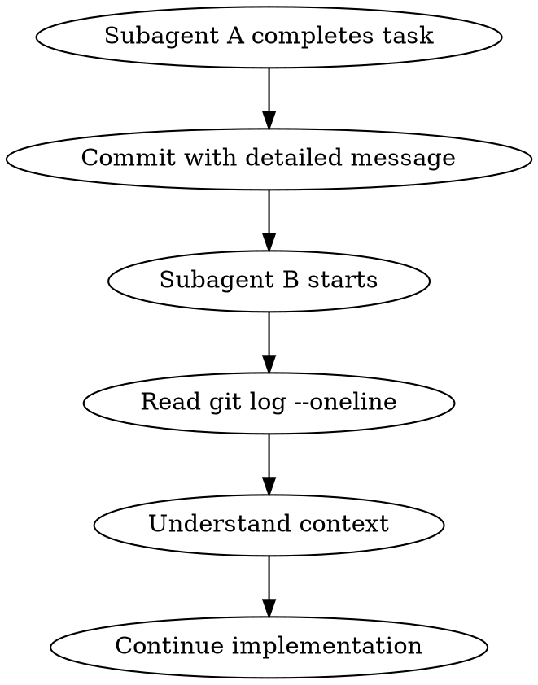

# Context Circulation

## Overview

コミットを活用して、サブエージェント間でコンテキストを共有する。

**Core principle:** Commits are the source of truth for what changed.

## The Iron Law

```
COMMIT FREQUENTLY, MESSAGE CLEARLY
```

## When to Use

- Long-running implementation
- Multiple subagents working
- Context needs to persist across agents
- Session might be interrupted

## The Process



## Commit Message Format

```
type(scope): subject

Body:
- What was done
- Why it was done
- Key decisions made
- Any gotchas for next task

Co-Authored-By: Claude Opus 4.6 <noreply@anthropic.com>
```

### Types
- `feat`: New feature
- `fix`: Bug fix
- `refactor`: Code restructuring
- `test`: Test additions
- `docs`: Documentation
- `chore`: Maintenance

## Context Extraction

When starting a new subagent:

```bash
# Get recent context
git log --oneline -10

# Get detailed context for specific commit
git show --stat HEAD

# Get diff of recent changes
git diff HEAD~3..HEAD --stat
```

## Context Sharing Pattern

### Between Subagents
```
Subagent A:
  1. Implement Task 1
  2. Commit: "feat(api): Add user endpoint - includes validation, returns JSON"
  3. Exit

Subagent B:
  1. Read: git log --oneline -5
  2. Understand: "User endpoint exists with validation"
  3. Implement Task 2 (uses user endpoint)
  4. Commit: "feat(auth): Add auth middleware - uses user endpoint from prev commit"
```

### Session Recovery
```
New session:
  1. Read: git log --oneline -20
  2. Understand: "Phase 5 in progress, Tasks 1-3 done"
  3. Read workflow state
  4. Continue from Task 4
```

## Best Practices

1. **Commit after each logical unit**
   - One task = one commit minimum
   - Split large tasks into multiple commits

2. **Message for future readers**
   - Assume no other context available
   - Include "why" not just "what"

3. **Use conventional commits**
   - Enables automated changelog
   - Consistent format for parsing

4. **Tag phase completions**
   ```bash
   git tag -a "phase-3-approved" -m "Planning phase approved"
   ```

## Integration

Used by:
- `implementation` skill - Commit per task
- `parallel-implementation` - Independent commits
- `dev-workflow` - Phase transition markers
