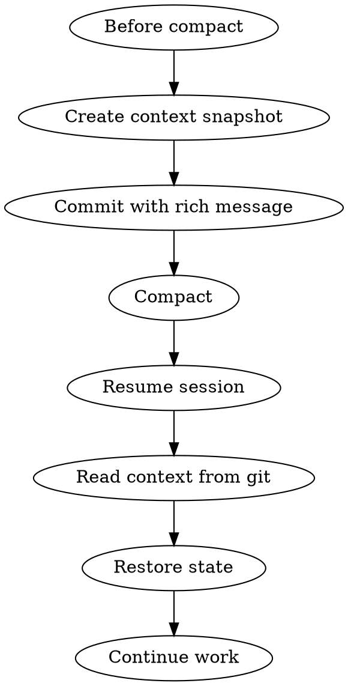

# Context Preservation

## Overview

Claudeのコンテキストウィンドウ制限に対応し、compact後も作業を継続できるようにコンテキストを保存・復元する。

**Core principle:** Preserve what matters, restore what's needed.

## The Iron Law

```
COMMIT WITH CONTEXT, RESUME WITH CLARITY
```

## When to Use

- コンテキストウィンドウがいっぱいになった時
- compactを実行する前
- 長期作業の中断時
- フェーズ遷移時
- 重要な決定を行った後

## The Process



## Commit Message Template

コンテキスト保存時のコミットメッセージは以下のテンプレートを使用すること。

```markdown
type(scope): 簡潔な説明

## 作業状態
- 現在のフェーズ: Phase X
- 完了したタスク:
  - [タスク1]: [結果]
  - [タスク2]: [結果]
- 進行中のタスク: [タスク名]
- 次のタスク:
  - [タスク1]
  - [タスク2]

## 重要な決定事項
- [決定1]: [理由と影響]
- [決定2]: [理由と影響]

## 技術的なコンテキスト
- 使用技術: [リスト]
- アーキテクチャ: [概要]
- 依存関係: [重要な依存]

## 再開時の注意点
- [注意1]: [詳細]
- [注意2]: [詳細]
- ブロッカー: [もしあれば]

## 関連ファイル
- path/to/file1: [変更概要と目的]
- path/to/file2: [変更概要と目的]

Co-Authored-By: Claude Opus 4.6 <noreply@anthropic.com>
```

### Message Components

#### 1. 作業状態
```markdown
## 作業状態
- 現在のフェーズ: Phase 5 (Implementation)
- 完了したタスク:
  - user-api: エンドポイント実装完了、テスト通過
  - auth-middleware: JWT検証実装完了
- 進行中のタスク: error-handling
- 次のタスク:
  - logging-setup
  - deployment-config
```

**目的**: どこまで完了し、何が残っているかを明確にする。

#### 2. 重要な決定事項
```markdown
## 重要な決定事項
- PostgreSQL採用: スキーマ複雑性とトランザクション要件から選択
- JWT有効期限24時間: セキュリティとUX のバランス
- REST over GraphQL: チーム経験とシンプルさを優先
```

**目的**: なぜその選択をしたかを記録し、後で覆さないようにする。

#### 3. 技術的なコンテキスト
```markdown
## 技術的なコンテキスト
- 使用技術: Node.js 20, Express 4.18, TypeScript 5.3
- アーキテクチャ: レイヤードアーキテクチャ (Controller/Service/Repository)
- 依存関係: prisma (ORM), zod (validation), jose (JWT)
```

**目的**: 技術スタックと設計パターンを記録する。

#### 4. 再開時の注意点
```markdown
## 再開時の注意点
- DB migration必要: prisma migrate dev実行すること
- 環境変数未設定: .env.exampleを.envにコピー
- ブロッカー: 外部API仕様待ち (Task #42)
```

**目的**: 再開時にハマるポイントを事前に記録する。

#### 5. 関連ファイル
```markdown
## 関連ファイル
- src/api/user.ts: ユーザーCRUD実装、バリデーション追加
- src/middleware/auth.ts: JWT検証ミドルウェア、リフレッシュトークン対応
- tests/api/user.test.ts: 統合テスト追加、エッジケース網羅
```

**目的**: どのファイルがどう変更されたかを記録する。

## Memory Record Guidelines

### memory.jsonに記録すべき内容

```json
{
  "phase": "Phase 5",
  "task": "error-handling",
  "context": {
    "decisions": [
      {
        "what": "PostgreSQL採用",
        "why": "スキーマ複雑性とトランザクション要件",
        "when": "2025-02-15T10:30:00Z"
      }
    ],
    "blockers": [
      {
        "issue": "外部API仕様待ち",
        "task": "#42",
        "status": "pending"
      }
    ],
    "state": {
      "completed": ["user-api", "auth-middleware"],
      "in_progress": "error-handling",
      "next": ["logging-setup", "deployment-config"]
    }
  },
  "files_modified": [
    "src/api/user.ts",
    "src/middleware/auth.ts",
    "tests/api/user.test.ts"
  ],
  "updated_at": "2025-02-15T14:20:00Z"
}
```

### Record Timing

- フェーズ遷移時
- 重要な決定後
- 3タスク完了ごと
- compact前（必須）
- 作業中断時

## Session Recovery Process

### Step 1: Read Recent Commits

```bash
# 最新10件のコミットを確認
git log --oneline -10

# 最新コミットの詳細を確認
git show HEAD
```

### Step 2: Read Memory

```bash
# memory.jsonを確認
cat memory.json

# workflow stateを確認
cat .fractal/state.json
```

### Step 3: Understand Context

以下を把握する:

1. 現在のフェーズ
2. 完了したタスク
3. 進行中のタスク
4. 次のタスク
5. 重要な決定事項
6. ブロッカーの有無

### Step 4: Verify State

```bash
# テストが通るか確認
npm test

# ビルドが通るか確認
npm run build

# リンターエラーがないか確認
npm run lint
```

### Step 5: Resume Work

- memory.jsonに記録された次のタスクから再開
- ブロッカーがあれば先に解決
- コンテキストが不足していれば関連ファイルを読む

## Subagent Integration

### Before Compact (親エージェント)

```markdown
1. 現在の状態をmemory.jsonに保存
2. コンテキスト保存用コミットを作成
3. サブエージェントに引き継ぎメッセージを送信

SendMessage:
  recipient: "subagent-id"
  content: |
    Context preserved in commit [hash]
    Phase: X
    Next task: [task-name]
    Important: [注意点]
  summary: "Context handoff before compact"
```

### After Compact (サブエージェント)

```markdown
1. git logから最新のコンテキストを読む
2. memory.jsonから詳細を復元
3. 親エージェントに復元完了を報告

SendMessage:
  recipient: "parent-agent"
  content: |
    Context restored from commit [hash]
    Current phase: X
    Resuming task: [task-name]
    Status: Ready to proceed
  summary: "Context restored, ready to proceed"
```

## Best Practices

### 1. Commit Frequently with Context

```
❌ Bad:
git commit -m "fix stuff"

✓ Good:
git commit -m "$(cat <<'EOF'
fix(auth): JWT検証エラー修正

## 作業状態
- 現在のフェーズ: Phase 5
- 完了: auth-middleware基本実装
- 次: リフレッシュトークン実装

## 重要な決定事項
- jose library採用: 軽量でセキュア

## 再開時の注意点
- SECRET_KEY環境変数必須

## 関連ファイル
- src/middleware/auth.ts: トークン検証ロジック追加

Co-Authored-By: Claude Opus 4.6 <noreply@anthropic.com>
EOF
)"
```

### 2. Memory is Append-Only

```json
{
  "history": [
    {
      "timestamp": "2025-02-15T10:00:00Z",
      "phase": "Phase 3",
      "decision": "PostgreSQL採用"
    },
    {
      "timestamp": "2025-02-15T14:00:00Z",
      "phase": "Phase 5",
      "decision": "JWT有効期限24時間"
    }
  ]
}
```

**理由**: 決定の履歴を保持することで、なぜその選択をしたかが追跡可能。

### 3. Context Layers

```
Layer 1: Git commits (permanent, detailed)
Layer 2: memory.json (structured, queryable)
Layer 3: .fractal/state.json (workflow state)
```

**使い分け**:
- Git: すべての変更履歴
- memory.json: 決定事項とコンテキスト
- state.json: ワークフロー状態のみ

### 4. Tag Important Milestones

```bash
# フェーズ完了時
git tag -a "phase-3-complete" -m "Planning completed, approved by user"

# 重要な決定時
git tag -a "decision-postgres" -m "Database selection: PostgreSQL"

# リリース時
git tag -a "v1.0.0" -m "Initial release"
```

## Context Preservation Checklist

compact前に以下を確認:

```
[ ] memory.jsonを最新に更新
[ ] コンテキスト保存コミットを作成
[ ] コミットメッセージに以下を含める:
    [ ] 作業状態
    [ ] 重要な決定事項
    [ ] 再開時の注意点
    [ ] 関連ファイル
[ ] テストが通ることを確認
[ ] ブロッカーがあれば記録
[ ] サブエージェントへ引き継ぎ（必要に応じて）
```

## Recovery Checklist

セッション再開時に以下を確認:

```
[ ] git log --oneline -10 を読む
[ ] git show HEAD でコンテキストを確認
[ ] memory.json を読む
[ ] .fractal/state.json でフェーズを確認
[ ] npm test でテストが通るか確認
[ ] 次のタスクを把握
[ ] ブロッカーがないか確認
[ ] 不明点があれば関連ファイルを読む
```

## Integration

このスキルは以下のスキルと連携:

- `context-circulation`: コミットベースのコンテキスト共有
- `dev-workflow`: フェーズ遷移時のコンテキスト保存
- `implementation`: タスク完了時のコンテキスト記録
- `failure-memory`: エラーコンテキストの永続化

## Common Patterns

### Pattern 1: Phase Transition

```bash
# フェーズ完了時
git commit -m "$(cat <<'EOF'
chore(workflow): Phase 3完了 - 設計承認済み

## 作業状態
- 現在のフェーズ: Phase 3 → Phase 4へ遷移
- 完了したタスク:
  - アーキテクチャ設計
  - DB スキーマ設計
  - API設計
- 次のフェーズ: Phase 4 (Setup)

## 重要な決定事項
- レイヤードアーキテクチャ採用
- PostgreSQL + Prisma
- REST API

## 再開時の注意点
- Phase 4でセットアップタスク実行
- 環境構築から開始

Co-Authored-By: Claude Opus 4.6 <noreply@anthropic.com>
EOF
)"
```

### Pattern 2: Before Long Break

```bash
# 作業中断前
git commit -m "$(cat <<'EOF'
chore(context): 作業中断前のコンテキスト保存

## 作業状態
- 現在のフェーズ: Phase 5
- 進行中のタスク: error-handling (70%完了)
- 次のタスク: logging-setup

## 重要な決定事項
- カスタムErrorクラス実装中
- HTTPステータスコードマッピング完了

## 再開時の注意点
- src/errors/custom-errors.ts が未完成
- tests/errors.test.ts でテスト追加必要

## 関連ファイル
- src/errors/custom-errors.ts: エラークラス定義（作業中）
- src/middleware/error-handler.ts: エラーハンドラー実装済み

Co-Authored-By: Claude Opus 4.6 <noreply@anthropic.com>
EOF
)"
```

### Pattern 3: Critical Decision

```bash
# 重要な技術選定後
git commit -m "$(cat <<'EOF'
docs(decision): データベースにPostgreSQL採用

## 重要な決定事項
- PostgreSQL採用: 以下の理由から選択
  - リレーショナルデータの複雑性
  - ACID特性が必須
  - JSONBサポート
  - チームの経験
  - Prismaとの相性

## 代替案と却下理由
- MongoDB: スキーマレスは要件に合わない
- MySQL: PostgreSQLの方が機能豊富
- SQLite: 本番環境で不十分

## 影響範囲
- ORMにPrisma使用
- マイグレーション管理必要
- バックアップ戦略必要

Co-Authored-By: Claude Opus 4.6 <noreply@anthropic.com>
EOF
)"
```

## Important

- **compact前は必ずコンテキスト保存コミットを作成**
- **memory.jsonは常に最新に保つ**
- **重要な決定は必ず記録する**
- コミットメッセージテンプレートを厳守
- 再開時は必ずgit logとmemory.jsonを確認
- ブロッカーは明確に記録
- 関連ファイルの変更目的を明記
- テスト結果も記録する
- サブエージェントへの引き継ぎを忘れない
- コンテキストは多層（git/memory/state）で保持
