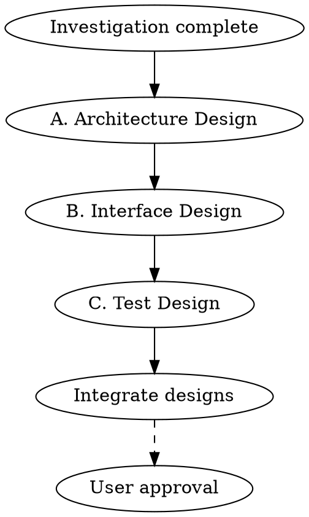
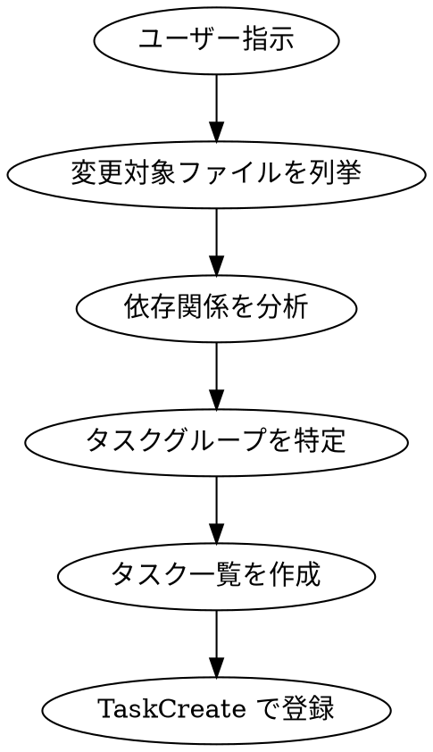

# Design Phase

## Overview

実装の前に「どう作るか」の骨格を固める。
接続点（インターフェース）を先に決めることで、並列実装を可能にする。

**Core principle:** 契約を先に固める。実装は後から。

---

## Design Scope by Mode

### new-creation モード
**詳細度: MAX**
- HTMLモック必須
- API仕様完全定義必須
- コンポーネント設計（props型、状態管理、ディレクトリ構成）必須

### existing-modification モード
**詳細度: MIN（必要な部分のみ）**
- HTMLモック不要（既存画面の変更箇所のみ記述）
- API仕様は変更部分のみ
- 整合性チェックリスト必須

## The Iron Law

```
NO IMPLEMENTATION WITHOUT INTERFACE DESIGN FIRST
DESIGN DECISIONS MUST BE RECORDED
TEST CASES BEFORE CODE
```

## The Process



---

## A. アーキテクチャ設計

### 目的
システムの骨格を決める。変更困難な決定を先に行う。

### 必須項目

#### 1. 境界を切る
```
┌─────────────┐     ┌─────────────┐     ┌─────────────┐
│  Frontend   │────▶│   Backend   │────▶│   Database  │
│  (Next.js)  │     │   (API)     │     │  (Prisma)   │
└─────────────┘     └─────────────┘     └─────────────┘
                           │
                           ▼
                    ┌─────────────┐
                    │  External   │
                    │   (Gemini)  │
                    └─────────────┘
```

#### 2. ドメイン境界（モジュール/サービス）
```markdown
| モジュール | 責務 | 依存先 |
|-----------|------|--------|
| contacts | 関係者管理 | organizations |
| organizations | 関係機関管理 | places |
| business-card | 名刺OCR | contacts, storage |
| places | 住所検索 | Google Places API |
```

#### 3. データモデル
```
┌──────────────────┐     ┌──────────────────┐
│   Organization   │     │     Contact      │
├──────────────────┤     ├──────────────────┤
│ id               │◀───┤│ organizationId   │
│ name             │     │ familyName       │
│ googlePlaceId    │     │ givenName        │
└──────────────────┘     │ businessCardUrl  │
                         └──────────────────┘
```

#### 4. 非機能の当て方
| 要件 | 実現方法 |
|------|---------|
| 認証 | 既存の NextAuth 使用 |
| 認可 | companyId によるマルチテナント分離 |
| キャッシュ | なし（リアルタイム性優先） |
| 監査ログ | Prisma middleware で自動記録 |

### 成果物: アーキ設計書
```markdown
## アーキテクチャ設計

### システム構成図
[図]

### モジュール構成
| モジュール | 責務 | 依存先 |
|-----------|------|--------|
| ... | ... | ... |

### データモデル
[ER図またはテキスト]

### 非機能実現方針
| 要件 | 実現方法 |
|------|---------|
| ... | ... |

### 重要な設計判断 (ADR)
#### ADR-001: [判断タイトル]
- 状況: [背景]
- 決定: [選択した方針]
- 理由: [なぜその方針か]
- 影響: [良い影響/悪い影響]
```

---

## B. インターフェース設計

### 目的
接続点の「契約」を先に固める。これにより並列実装が可能になる。

### 必須項目

#### 1. API仕様
```yaml
# OpenAPI形式（または同等の定義）
paths:
  /api/contacts/scan:
    post:
      summary: 名刺スキャンして関係者情報を抽出
      requestBody:
        content:
          application/json:
            schema:
              type: object
              required:
                - frontImageUrl
                - organizationId
              properties:
                frontImageUrl:
                  type: string
                backImageUrl:
                  type: string
                organizationId:
                  type: string
      responses:
        '200':
          description: 抽出成功
          content:
            application/json:
              schema:
                $ref: '#/components/schemas/ScanResult'
        '400':
          $ref: '#/components/responses/BadRequest'
```

#### 2. DBスキーマ/マイグレーション
```sql
-- マイグレーション: add_business_card_fields
ALTER TABLE "OrganizationContact"
ADD COLUMN "businessCardFrontUrl" TEXT,
ADD COLUMN "businessCardBackUrl" TEXT;
```

#### 3. 例外・エラーコード
| コード | HTTP | 説明 | 対処 |
|--------|------|------|------|
| OCR_FAILED | 500 | OCR処理失敗 | リトライ or 手動入力 |
| INVALID_IMAGE | 400 | 画像形式不正 | 形式を確認 |
| DUPLICATE_FOUND | 200 | 重複検出（警告） | ユーザー確認 |
| RATE_LIMITED | 429 | レート制限 | 時間を置く |

#### 4. リトライ方針
| 操作 | リトライ | 間隔 | 最大回数 |
|------|---------|------|---------|
| OCR API呼び出し | Yes | 指数バックオフ | 3回 |
| DB操作 | No | - | - |
| ファイルアップロード | Yes | 1秒 | 2回 |

### 成果物: インターフェース設計書
```markdown
## インターフェース設計

### API仕様
[OpenAPI形式またはテーブル形式]

### DBスキーマ変更
[マイグレーションSQL]

### エラーコード一覧
| コード | HTTP | 説明 | 対処 |
|--------|------|------|------|
| ... | ... | ... | ... |

### リトライ方針
| 操作 | リトライ | 間隔 | 最大回数 |
|------|---------|------|---------|
| ... | ... | ... | ... |
```

---

## HTML Mock Template (new-creation)

### 目的
新規機能の画面イメージを具体化する。実装前にレイアウトとコンポーネント配置を確定。

### テンプレート: docs/mocks/{feature}-{screen}.html

```html
<!DOCTYPE html>
<html lang="ja">
<head>
  <meta charset="UTF-8">
  <title>{機能名} - {画面名}</title>
  <style>
    body { font-family: sans-serif; margin: 20px; }
    .container { max-width: 1200px; }
    .form-group { margin-bottom: 16px; }
    button { padding: 8px 16px; }
  </style>
</head>
<body>
  <div class="container">
    <h1>{画面タイトル}</h1>
    <!-- 主要コンポーネントの配置 -->
  </div>
</body>
</html>
```

### 使用ルール
- **new-creation モードのみ**作成必須
- existing-modification モードでは不要（変更箇所のみ記述で可）
- レイアウト、主要コンポーネント、状態遷移を視覚化
- 実装前にユーザー確認を得るための成果物

---

## Component Design Template (new-creation)

### 目的
新規コンポーネントの設計を明確化。props、状態管理、ディレクトリ構成を事前に決定。

### テンプレート

````markdown
## コンポーネント: {ComponentName}

#### Props型定義
```typescript
interface {ComponentName}Props {
  // 必須props
  // オプションprops
}
```

#### 状態管理
- ローカル状態: useState for...
- グローバル状態: Context/Redux for...
- サーバー状態: React Query/SWR for...

#### ディレクトリ構成
```
src/components/{feature}/
  ├── {ComponentName}.tsx
  ├── {ComponentName}.test.tsx
  ├── use{ComponentName}.ts (hook)
  └── types.ts
```
````

### 使用ルール
- **new-creation モードのみ**作成必須
- existing-modification モードでは変更部分のみ記述で可
- コンポーネント設計はタスク分解の前に完了させる

---

## Consistency Checklist (existing-modification)

### 目的
既存機能への変更が整合性を保っているか確認。破壊的変更を事前に検出。

### チェックリスト

#### API整合性
- [ ] 既存APIとの互換性（破壊的変更の有無）
- [ ] 既存リクエスト形式との整合性
- [ ] 既存レスポンス形式との整合性
- [ ] エラーコードの一貫性

#### DBスキーマ整合性
- [ ] 既存テーブルへの影響
- [ ] 外部キー制約の整合性
- [ ] マイグレーションの後方互換性

#### テスト整合性
- [ ] 既存テストが引き続き動作するか
- [ ] 新規テストの追加箇所

### 破壊的変更の判定ロジック

#### 定義
以下のいずれかに該当する場合、`has_breaking_changes = true`:

| カテゴリ | 破壊的変更の例 | 非破壊的変更の例 |
|---------|---------------|-----------------|
| API | 削除、必須フィールド追加、型変更 | オプショナルフィールド追加 |
| DB | カラム削除、型変更、NOT NULL追加 | オプショナルカラム追加 |
| 認証 | 認可ルール変更、スコープ変更 | 新規スコープ追加 |
| 設定 | 必須環境変数追加 | オプショナル環境変数追加 |

#### state への記録
判定結果は workflow state に記録:
```bash
jq '.phases["3"].has_breaking_changes = true' ~/.claude/fractal-workflow/{workflow-id}.json > /tmp/wf.json && mv /tmp/wf.json ~/.claude/fractal-workflow/{workflow-id}.json
```

#### 判定フロー
1. Consistency Checklist を実行
2. 上記表に該当する変更を特定
3. 1件でも該当 → has_breaking_changes = true
4. 該当なし → has_breaking_changes = false

#### 破壊的変更の有無
- [ ] Yes → 破壊的変更を記録 → `TaskUpdate(id: workflow_id, status: "completed")`
- [ ] No → 自動遷移 → `TaskUpdate(id: workflow_id, status: "completed")`

### 記録パス
整合性チェック結果は以下のパスに保存:
- `docs/design/{workflow-id}-consistency.md`

### dev-workflowへの連携
結果ファイルは workflow state の artifacts に記録:
```
artifacts.consistencyCheck: "docs/design/{workflow-id}-consistency.md"
```

### 使用ルール
- **existing-modification モードのみ**必須
- new-creation モードでは基本不要（新規機能のため）
- 破壊的変更が検出された場合は必ずユーザーに確認

---

## C. テスト設計

### 目的
実装前に「どう壊れると困るか」を列挙する。
これにより、実装時にテストファーストが可能になる。

### 必須項目

#### 1. 重要フロー（壊れると致命的）
```markdown
| フロー | 壊れると | テスト種別 |
|--------|---------|----------|
| 名刺OCR | データ登録不可 | Integration |
| 重複チェック | 二重登録発生 | Unit + Integration |
| 権限チェック | データ漏洩 | Unit + Integration |
| 課金処理 | 収益損失 | E2E |
```

#### 2. 境界値（見落としやすい）
```markdown
| 対象 | 境界 | テストケース |
|------|------|-------------|
| 画像サイズ | 0, 10MB | 空ファイル、上限ちょうど |
| 名前 | 空, 100文字 | 空文字、最大長 |
| 同時リクエスト | 1, 10 | 単独、上限同時 |
```

#### 3. 外部依存（不安定な部分）
```markdown
| 依存 | 壊れ方 | テスト方法 |
|------|-------|----------|
| Gemini API | タイムアウト | MSW + 遅延レスポンス |
| Gemini API | エラーレスポンス | MSW + 500返却 |
| Cloud Storage | アップロード失敗 | モック |
| Places API | レート制限 | モック |
```

#### 4. 同時実行（レースコンディション）
```markdown
| シナリオ | 問題 | 対策 |
|---------|------|------|
| 同一名刺の二重スキャン | 重複登録 | 楽観的ロック |
| 同一関係者の同時編集 | データ競合 | updatedAt チェック |
```

### 成果物: テスト設計書
```markdown
## テスト設計

### テストマトリクス
| 対象 | Unit | Integration | E2E |
|------|------|-------------|-----|
| OCR抽出 | ✓ | ✓ | |
| 重複チェック | ✓ | ✓ | |
| 権限チェック | ✓ | ✓ | |
| 主要導線 | | | ✓ |

### 重要フローテスト
| フロー | テストケース | 期待結果 |
|--------|-------------|---------|
| ... | ... | ... |

### 境界値テスト
| 対象 | 入力 | 期待結果 |
|------|------|---------|
| ... | ... | ... |

### 外部依存モック
| 依存 | モック方法 | テストデータ |
|------|----------|-------------|
| Gemini | MSW | fixtures/ocr-response.json |
| Storage | vi.mock | - |

### 同時実行テスト
| シナリオ | 検証方法 |
|---------|---------|
| ... | ... |
```

---

## D. タスク分解（ファイル単位）

### 目的
ユーザーの指示/提案を**ファイル単位**に分解し、実装漏れを防ぐ。
「一つのプロンプトに詰め込む」傾向を排除する。

### 分解の鉄則

```
1タスク = 1ファイル（または密結合した数ファイル）
```

### 分解ルール

| ルール | 説明 | 例 |
|--------|------|-----|
| 1ファイル1タスク | 基本は1ファイル = 1タスク | `types/contact.ts` → Task 1 |
| 密結合は同一タスク | 実装+テスト など密結合なら同一タスク | `foo.ts` + `foo.test.ts` → 同一タスク |
| 独立性優先 | 依存関係がない場合は別タスクに分離 | 型定義 と UI は別タスク |
| レイヤー分離 | 型/API/UI は原則別タスク | 並列化のため |

### 分解プロセス



### タスク分解テンプレート

```markdown
## タスク分解: [機能名]

### 変更対象ファイル
1. types/contact.ts - 型定義
2. types/contact.test.ts - 型テスト
3. api/contacts/route.ts - APIハンドラ
4. api/contacts/route.test.ts - APIテスト
5. components/ContactForm.tsx - UIコンポーネント
6. components/ContactForm.test.tsx - UIテスト

### タスク一覧

| # | タスク | ファイル | 依存 | グループ |
|---|--------|---------|------|----------|
| 1 | 型定義 | types/contact.ts, types/contact.test.ts | - | A |
| 2 | API実装 | api/contacts/route.ts, api/contacts/route.test.ts | 1 | B |
| 3 | UI実装 | components/ContactForm.tsx, components/ContactForm.test.ts | 1 | C |

### 依存グラフ

```
Task 1 (型定義)
   ├── Task 2 (API)
   └── Task 3 (UI)
```

### 並列グループ
- **Group A**: Task 1（依存なし）
- **Group B**: Task 2, 3（Task 1 完了後、並列実行可）
```

### 分解時のチェックリスト

- [ ] 全ての変更対象ファイルが列挙されている
- [ ] 各タスクは1ファイル単位（または密結合ファイル群）
- [ ] 依存関係が明示されている
- [ ] 並列実行可能なグループが特定されている
- [ ] TaskCreate で全タスクが登録される

---

## E. worktree計画

### 目的
依存関係のないタスクグループを**Git worktree で分離**し、並列開発を可能にする。

### worktree の利点

| 利点 | 説明 |
|------|------|
| 完全な隔離 | ファイル競合なし |
| 並列コミット | 各worktreeで独立してコミット |
| サブエージェント活用 | 各worktreeに別のサブエージェントを割り当て |

### worktree配置ルール

| ルール | 説明 |
|--------|------|
| グループ単位 | 依存関係のないタスクグループごとにworktree |
| ベースディレクトリ | プロジェクト外の共通ディレクトリ |
| 命名規則 | `{project}-{feature}-{group}` |
| ブランチ命名 | `feature/{feature}-{group}` |

### worktree計画テンプレート

````markdown
## worktree計画: [機能名]

### ベースディレクトリ
/Users/t.asai/code/fractal-worktrees

### worktree一覧

| # | worktree名 | ブランチ | タスク | 担当 |
|---|-----------|---------|--------|------|
| A | project-feature-types | feature/contact-types | #1 | impl-types |
| B | project-feature-api | feature/contact-api | #2 | impl-api |
| C | project-feature-ui | feature/contact-ui | #3 | impl-ui |

### 作成コマンド

```bash
# worktree A
git worktree add ../fractal-worktrees/project-feature-types -b feature/contact-types

# worktree B
git worktree add ../fractal-worktrees/project-feature-api -b feature/contact-api

# worktree C
git worktree add ../fractal-worktrees/project-feature-ui -b feature/contact-ui
```

### マージ順序

```
feature/contact-types (A)
        ↓
    main にマージ
        ↓
feature/contact-api (B) ──┬── main にマージ
feature/contact-ui (C) ───┘
```

### クリーンアップ

```bash
git worktree remove ../fractal-worktrees/project-feature-types
git worktree remove ../fractal-worktrees/project-feature-api
git worktree remove ../fractal-worktrees/project-feature-ui
```
````

### worktree計画時のチェックリスト

- [ ] 各タスクグループにworktreeが割り当てられている
- [ ] ブランチ命名が一貫している
- [ ] マージ順序が依存関係を反映している
- [ ] クリーンアップ手順が記載されている

---

## 統合: 設計書テンプレート

````markdown
# 設計書: [タスク名]

## A. アーキテクチャ設計

### システム構成図
[図]

### モジュール構成
| モジュール | 責務 | 依存先 |
|-----------|------|--------|

### データモデル
[ER図]

### 重要な設計判断
#### ADR-001: [タイトル]
- 状況:
- 決定:
- 理由:

## B. インターフェース設計

### API仕様
| Endpoint | Method | 説明 |
|----------|--------|------|

### DBスキーマ変更
```sql
-- マイグレーション
```

### エラーコード
| コード | HTTP | 説明 |
|--------|------|------|

## C. テスト設計

### テストマトリクス
| 対象 | Unit | Integration | E2E |
|------|------|-------------|-----|

### 重要フローテスト
[テストケース一覧]

### モック戦略
| 依存 | モック方法 |
|------|----------|

## D. タスク分解

### タスク一覧
| # | タスク | ファイル | 依存 | グループ |
|---|--------|---------|------|----------|

### 依存グラフ
[テキストまたは図]

## E. worktree計画

### worktree一覧
| # | worktree名 | ブランチ | タスク | 担当 |
|---|-----------|---------|--------|------|

### マージ順序
[依存関係に基づくマージ順]
````

---

## Completion Criteria（モード別）

### new-creation モード

- [ ] アーキテクチャ設計完了
  - [ ] システム構成図
  - [ ] モジュール構成
  - [ ] データモデル
  - [ ] 重要な設計判断（ADR）
- [ ] インターフェース設計完了
  - [ ] API仕様完全定義
  - [ ] DBスキーマ/マイグレーション
  - [ ] エラーコード
  - [ ] リトライ方針
- [ ] HTMLモック作成（主要画面すべて）
- [ ] コンポーネント設計完了
- [ ] テスト設計完了
  - [ ] 重要フロー
  - [ ] 境界値
  - [ ] 外部依存モック
  - [ ] 同時実行
- [ ] **タスク分解完了**
  - [ ] 全変更対象ファイルが列挙
  - [ ] 各タスクが1ファイル単位
  - [ ] 依存関係が明示
  - [ ] TaskCreate で全タスク登録
- [ ] **worktree計画完了**
  - [ ] タスクグループにworktree割り当て
  - [ ] マージ順序が依存関係を反映
  - [ ] クリーンアップ手順記載

**承認:** ★ユーザー承認必須 → `TaskUpdate(id: workflow_id, status: "pending_approval")`

---

### existing-modification モード

- [ ] 整合性チェックリスト完了
  - [ ] API整合性確認
  - [ ] DBスキーマ整合性確認
  - [ ] テスト整合性確認
  - [ ] 破壊的変更の有無判定
- [ ] インターフェース設計（変更がある場合のみ）
  - [ ] API仕様変更
  - [ ] DBスキーマ変更
- [ ] テスト設計（影響範囲のみ）
- [ ] **タスク分解完了**
  - [ ] 全変更対象ファイルが列挙
  - [ ] 各タスクが1ファイル単位
  - [ ] 依存関係が明示
  - [ ] TaskCreate で全タスク登録

**承認:** ★ユーザー承認必須 → `TaskUpdate(id: workflow_id, status: "pending_approval")`

---

## Red Flags

| Thought | Reality |
|---------|---------|
| "設計は頭の中にある" | 文書化しないと共有できない |
| "実装しながら決める" | 後から変更はコストが高い |
| "APIは実装後に決める" | 契約が先、実装が後 |
| "テストは実装後で" | 実装前に壊れ方を考える |
| "ADRは大げさ" | 小さな判断の積み重ねが設計 |

---

## Related Skills

- `testing` - テストケース作成の詳細
- `codex-review` - 設計レビュー
- `investigation` - 既存実装との整合性確認
