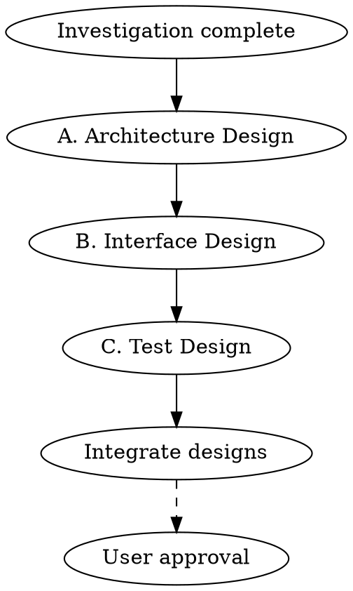

# Design Phase

## Overview

実装の前に「どう作るか」の骨格を固める。
接続点（インターフェース）を先に決めることで、並列実装を可能にする。

**Core principle:** 契約を先に固める。実装は後から。

## The Iron Law

```
NO IMPLEMENTATION WITHOUT INTERFACE DESIGN FIRST
DESIGN DECISIONS MUST BE RECORDED
TEST CASES BEFORE CODE
```

## The Process



---

## A. アーキテクチャ設計

### 目的
システムの骨格を決める。変更困難な決定を先に行う。

### 必須項目

#### 1. 境界を切る
```
┌─────────────┐     ┌─────────────┐     ┌─────────────┐
│  Frontend   │────▶│   Backend   │────▶│   Database  │
│  (Next.js)  │     │   (API)     │     │  (Prisma)   │
└─────────────┘     └─────────────┘     └─────────────┘
                           │
                           ▼
                    ┌─────────────┐
                    │  External   │
                    │   (Gemini)  │
                    └─────────────┘
```

#### 2. ドメイン境界（モジュール/サービス）
```markdown
| モジュール | 責務 | 依存先 |
|-----------|------|--------|
| contacts | 関係者管理 | organizations |
| organizations | 関係機関管理 | places |
| business-card | 名刺OCR | contacts, storage |
| places | 住所検索 | Google Places API |
```

#### 3. データモデル
```
┌──────────────────┐     ┌──────────────────┐
│   Organization   │     │     Contact      │
├──────────────────┤     ├──────────────────┤
│ id               │◀───┤│ organizationId   │
│ name             │     │ familyName       │
│ googlePlaceId    │     │ givenName        │
└──────────────────┘     │ businessCardUrl  │
                         └──────────────────┘
```

#### 4. 非機能の当て方
| 要件 | 実現方法 |
|------|---------|
| 認証 | 既存の NextAuth 使用 |
| 認可 | companyId によるマルチテナント分離 |
| キャッシュ | なし（リアルタイム性優先） |
| 監査ログ | Prisma middleware で自動記録 |

### 成果物: アーキ設計書
```markdown
## アーキテクチャ設計

### システム構成図
[図]

### モジュール構成
| モジュール | 責務 | 依存先 |
|-----------|------|--------|
| ... | ... | ... |

### データモデル
[ER図またはテキスト]

### 非機能実現方針
| 要件 | 実現方法 |
|------|---------|
| ... | ... |

### 重要な設計判断 (ADR)
#### ADR-001: [判断タイトル]
- 状況: [背景]
- 決定: [選択した方針]
- 理由: [なぜその方針か]
- 影響: [良い影響/悪い影響]
```

---

## B. インターフェース設計

### 目的
接続点の「契約」を先に固める。これにより並列実装が可能になる。

### 必須項目

#### 1. API仕様
```yaml
# OpenAPI形式（または同等の定義）
paths:
  /api/contacts/scan:
    post:
      summary: 名刺スキャンして関係者情報を抽出
      requestBody:
        content:
          application/json:
            schema:
              type: object
              required:
                - frontImageUrl
                - organizationId
              properties:
                frontImageUrl:
                  type: string
                backImageUrl:
                  type: string
                organizationId:
                  type: string
      responses:
        '200':
          description: 抽出成功
          content:
            application/json:
              schema:
                $ref: '#/components/schemas/ScanResult'
        '400':
          $ref: '#/components/responses/BadRequest'
```

#### 2. DBスキーマ/マイグレーション
```sql
-- マイグレーション: add_business_card_fields
ALTER TABLE "OrganizationContact"
ADD COLUMN "businessCardFrontUrl" TEXT,
ADD COLUMN "businessCardBackUrl" TEXT;
```

#### 3. 例外・エラーコード
| コード | HTTP | 説明 | 対処 |
|--------|------|------|------|
| OCR_FAILED | 500 | OCR処理失敗 | リトライ or 手動入力 |
| INVALID_IMAGE | 400 | 画像形式不正 | 形式を確認 |
| DUPLICATE_FOUND | 200 | 重複検出（警告） | ユーザー確認 |
| RATE_LIMITED | 429 | レート制限 | 時間を置く |

#### 4. リトライ方針
| 操作 | リトライ | 間隔 | 最大回数 |
|------|---------|------|---------|
| OCR API呼び出し | Yes | 指数バックオフ | 3回 |
| DB操作 | No | - | - |
| ファイルアップロード | Yes | 1秒 | 2回 |

### 成果物: インターフェース設計書
```markdown
## インターフェース設計

### API仕様
[OpenAPI形式またはテーブル形式]

### DBスキーマ変更
[マイグレーションSQL]

### エラーコード一覧
| コード | HTTP | 説明 | 対処 |
|--------|------|------|------|
| ... | ... | ... | ... |

### リトライ方針
| 操作 | リトライ | 間隔 | 最大回数 |
|------|---------|------|---------|
| ... | ... | ... | ... |
```

---

## C. テスト設計

### 目的
実装前に「どう壊れると困るか」を列挙する。
これにより、実装時にテストファーストが可能になる。

### 必須項目

#### 1. 重要フロー（壊れると致命的）
```markdown
| フロー | 壊れると | テスト種別 |
|--------|---------|----------|
| 名刺OCR | データ登録不可 | Integration |
| 重複チェック | 二重登録発生 | Unit + Integration |
| 権限チェック | データ漏洩 | Unit + Integration |
| 課金処理 | 収益損失 | E2E |
```

#### 2. 境界値（見落としやすい）
```markdown
| 対象 | 境界 | テストケース |
|------|------|-------------|
| 画像サイズ | 0, 10MB | 空ファイル、上限ちょうど |
| 名前 | 空, 100文字 | 空文字、最大長 |
| 同時リクエスト | 1, 10 | 単独、上限同時 |
```

#### 3. 外部依存（不安定な部分）
```markdown
| 依存 | 壊れ方 | テスト方法 |
|------|-------|----------|
| Gemini API | タイムアウト | MSW + 遅延レスポンス |
| Gemini API | エラーレスポンス | MSW + 500返却 |
| Cloud Storage | アップロード失敗 | モック |
| Places API | レート制限 | モック |
```

#### 4. 同時実行（レースコンディション）
```markdown
| シナリオ | 問題 | 対策 |
|---------|------|------|
| 同一名刺の二重スキャン | 重複登録 | 楽観的ロック |
| 同一関係者の同時編集 | データ競合 | updatedAt チェック |
```

### 成果物: テスト設計書
```markdown
## テスト設計

### テストマトリクス
| 対象 | Unit | Integration | E2E |
|------|------|-------------|-----|
| OCR抽出 | ✓ | ✓ | |
| 重複チェック | ✓ | ✓ | |
| 権限チェック | ✓ | ✓ | |
| 主要導線 | | | ✓ |

### 重要フローテスト
| フロー | テストケース | 期待結果 |
|--------|-------------|---------|
| ... | ... | ... |

### 境界値テスト
| 対象 | 入力 | 期待結果 |
|------|------|---------|
| ... | ... | ... |

### 外部依存モック
| 依存 | モック方法 | テストデータ |
|------|----------|-------------|
| Gemini | MSW | fixtures/ocr-response.json |
| Storage | vi.mock | - |

### 同時実行テスト
| シナリオ | 検証方法 |
|---------|---------|
| ... | ... |
```

---

## 統合: 設計書テンプレート

```markdown
# 設計書: [タスク名]

## A. アーキテクチャ設計

### システム構成図
[図]

### モジュール構成
| モジュール | 責務 | 依存先 |
|-----------|------|--------|

### データモデル
[ER図]

### 重要な設計判断
#### ADR-001: [タイトル]
- 状況:
- 決定:
- 理由:

## B. インターフェース設計

### API仕様
| Endpoint | Method | 説明 |
|----------|--------|------|

### DBスキーマ変更
```sql
-- マイグレーション
```

### エラーコード
| コード | HTTP | 説明 |
|--------|------|------|

## C. テスト設計

### テストマトリクス
| 対象 | Unit | Integration | E2E |
|------|------|-------------|-----|

### 重要フローテスト
[テストケース一覧]

### モック戦略
| 依存 | モック方法 |
|------|----------|
```

---

## Completion Criteria（★ユーザー承認必須）

- [ ] アーキテクチャ設計完了
  - [ ] システム構成図
  - [ ] モジュール構成
  - [ ] データモデル
  - [ ] 重要な設計判断（ADR）
- [ ] インターフェース設計完了
  - [ ] API仕様
  - [ ] DBスキーマ
  - [ ] エラーコード
  - [ ] リトライ方針
- [ ] テスト設計完了
  - [ ] 重要フロー
  - [ ] 境界値
  - [ ] 外部依存モック
  - [ ] 同時実行
- [ ] **ユーザー承認**

---

## Red Flags

| Thought | Reality |
|---------|---------|
| "設計は頭の中にある" | 文書化しないと共有できない |
| "実装しながら決める" | 後から変更はコストが高い |
| "APIは実装後に決める" | 契約が先、実装が後 |
| "テストは実装後で" | 実装前に壊れ方を考える |
| "ADRは大げさ" | 小さな判断の積み重ねが設計 |

---

## Related Skills

- `testing` - テストケース作成の詳細
- `codex-review` - 設計レビュー
- `investigation` - 既存実装との整合性確認
