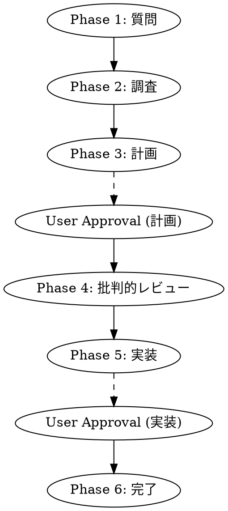

# Development Workflow Orchestrator

## Overview

開発タスクを6つのフェーズで体系的に進行させるオーケストレーター。各フェーズには明確な完了条件があり、承認なしに次へ進むことはできない。

**Core principle:** ALWAYS complete all phases before implementation. Shortcuts lead to rework.

## The Iron Law

```
NO IMPLEMENTATION WITHOUT COMPLETING PHASES 1-4 FIRST
NO MERGE WITHOUT COMPLETING ALL 6 PHASES
```

## The Six Phases



| Phase | Name | Skill | Approval |
|-------|------|-------|----------|
| 1 | 質問 | questioning | Auto |
| 2 | 調査 | investigation | Auto |
| 3 | 計画 | planning | **Required** |
| 4 | 批判的レビュー | codex-review | Auto |
| 5 | 実装 | implementation | **Required** |
| 6 | 完了 | - | - |

## Phase Transitions

### Automatic Transitions (Phases 1→2, 2→3, 4→5)
- Verify phase completion criteria
- Update workflow state
- Proceed to next phase

### Approval Required (Phases 3, 5)
- Present deliverable to user
- Wait for explicit approval
- Record approval timestamp
- Only then proceed

## Workflow State Management

State is stored in `~/.claude/fractal-workflow/{workflow-id}.json`:

```json
{
  "workflowId": "wf-20260212-001",
  "taskDescription": "タスクの説明",
  "status": "active",
  "currentPhase": 3,
  "phases": {
    "1": {"status": "completed", "completedAt": "..."},
    "2": {"status": "completed", "completedAt": "..."},
    "3": {"status": "in_progress", "startedAt": "..."},
    "4": {"status": "pending"},
    "5": {"status": "pending"},
    "6": {"status": "pending"}
  }
}
```

## Usage

```
/dev [task description]  # Start new workflow
/dev resume              # Resume interrupted workflow
/dev status              # Show current state
/dev cancel              # Cancel workflow
```

## Red Flags - STOP and Follow Process

If you catch yourself thinking:
- "This is simple, I can skip phases"
- "I already know what to do"
- "Let me just code this quickly"
- "Planning is overkill for this"
- "The user wants it fast"

**ALL of these mean: STOP. Follow the full process.**

## Rationalization Prevention

| Excuse | Reality |
|--------|---------|
| "Simple task, no need for phases" | Simple tasks have hidden complexity |
| "Already done this before" | Context changes, assumptions differ |
| "User wants speed" | Rework from skipped phases takes longer |
| "Investigation is obvious" | Existing code often has reusable patterns |
| "Review is overkill" | External review catches 2-3x more issues |

## Integration

**Required skills:**
- questioning - Phase 1
- investigation - Phase 2
- planning - Phase 3
- codex-review - Phase 4
- implementation - Phase 5

**Optional skills:**
- parallel-implementation - For parallel subagent execution
- context-circulation - For commit-based context sharing
- failure-memory - For learning from failures
