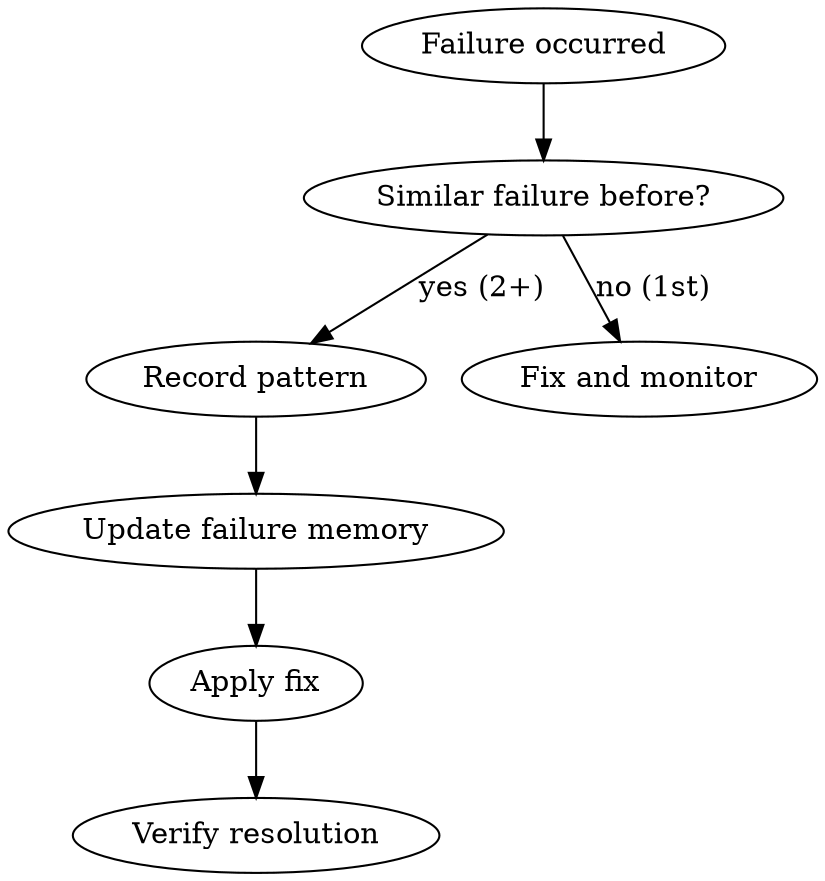

# Failure Memory

## Overview

同じ失敗を繰り返さないために、失敗パターンを記録・学習する。

**Core principle:** Learn from every failure. Same mistake twice is a process failure.

## The Iron Law

```
RECORD FAILURE PATTERN AFTER 2+ OCCURRENCES
```

## When to Use

- Same error occurred twice
- Similar fix was applied before
- Pattern of failures emerging
- "I've seen this before" feeling

## The Process



## Memory Storage

Location: `$(bash ~/.claude/plugins/local/fractal-dev-workflow/scripts/workflow-manager.sh get-dir)/failure-memory.json`

```json
{
  "patterns": [
    {
      "id": "fm-001",
      "category": "async",
      "pattern": "Race condition in parallel API calls",
      "symptoms": ["Intermittent failures", "Data inconsistency"],
      "rootCause": "Missing await on Promise.all",
      "solution": "Always await parallel operations",
      "occurrences": 3,
      "lastSeen": "2026-02-12T00:00:00Z"
    }
  ]
}
```

## Recording a Pattern

When failure occurs twice:

1. **Identify the pattern**
   - What's the symptom?
   - What's the root cause?
   - What's the fix?

2. **Check existing patterns**
   - Search failure-memory.json
   - Update occurrence count if exists

3. **Record new pattern**
   ```
   {
     "category": "[async|security|type|config|...]",
     "pattern": "[brief description]",
     "symptoms": ["symptom 1", "symptom 2"],
     "rootCause": "[why it happens]",
     "solution": "[how to fix/prevent]"
   }
   ```

## Using Memory

Before implementing:
1. Check failure-memory.json for relevant patterns
2. Apply preventive measures from recorded solutions
3. Add defensive code for known failure modes

## Categories

| Category | Examples |
|----------|----------|
| async | Race conditions, missing awaits |
| security | XSS, injection, auth issues |
| type | Type mismatches, null checks |
| config | Missing env vars, wrong paths |
| test | Flaky tests, missing mocks |
| build | Dependency issues, bundling |

## Integration

Used automatically by:
- superpowers:systematic-debugging skill
- implementation skill (preventive check)
- codex-review skill (known issues check)
