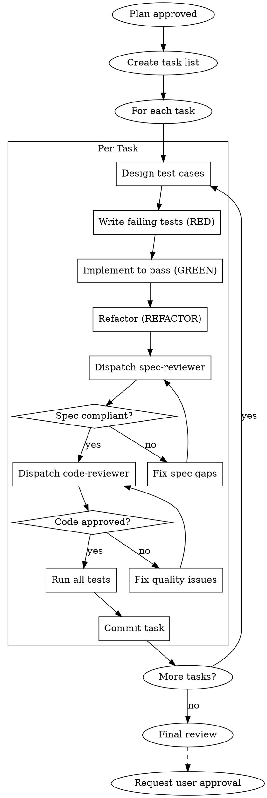

# Implementation Phase

## Overview

承認された計画に基づいてコードを実装する。サブエージェント駆動で品質を担保。

**Core principle:** Execute plan with fresh subagents per task, TDD-first, two-stage review after each.

## The Iron Law

```
NO IMPLEMENTATION WITHOUT TEST FIRST (TDD)
NO TASK COMPLETION WITHOUT SPEC + CODE REVIEW
```

## The Process



## Task Execution

### 1. Task List Creation
Convert plan to TaskCreate entries:
```
TaskCreate:
  subject: "[verb] [target] [purpose]"
  description: |
    ## Overview
    [what to do]

    ## Completion Criteria
    - [ ] [criterion 1]
    - [ ] [criterion 2]

    ## Test Requirements
    - [ ] Unit: [what to unit test]
    - [ ] Integration: [what to integration test]

    ## Related Files
    - [file paths]
  activeForm: "[verb]ing [target]"
```

### 2. Per-Task Workflow

#### Step 1: Test Case Design (using testing skill)

Refer to `testing` skill for detailed guidance.

```markdown
## テストケース設計: [タスク名]

### テスト種類判定
| 質問 | 判定 |
|------|------|
| 純粋ロジック? | → Unit Test |
| DB/API境界? | → Integration Test |
| 主要導線? | → E2E Test |

### Unit Tests
| ケース | 入力 | 期待出力 |
|--------|------|---------|
| 正常系 | ... | ... |
| 境界値 | 0, null | ... |
| 異常系 | invalid | throw |

### Integration Tests (if needed)
| ケース | 前提 | 検証 |
|--------|------|------|
| ... | ... | ... |
```

#### Step 2: TDD Cycle

**RED - 失敗するテストを書く:**
```
Task(subagent_type="implementer"):
  - Write test cases first (they should FAIL)
  - Run tests to confirm failure
```

**GREEN - 最小限のコードで通す:**
```
Task(subagent_type="implementer"):
  - Write minimum code to pass tests
  - Run tests to confirm pass
```

**REFACTOR - 綺麗にする:**
```
Task(subagent_type="implementer"):
  - Clean up code while keeping tests green
  - Run tests after each refactor
```

#### Step 3: Reviews

**Spec reviewer:**
```
Task(subagent_type="spec-reviewer"):
  - Verify implementation matches spec
  - Verify test coverage matches requirements
  - Check nothing extra added
  - Check nothing missing
```

**Code reviewer:**
```
Task(subagent_type="code-reviewer"):
  - Review code quality
  - Review test quality (not just code)
  - Check security (OWASP)
  - Verify test coverage metrics
```

### 3. Test Execution

Before commit, run all tests:
```bash
# Unit tests
npm run test:unit

# Integration tests (if applicable)
npm run test:integration

# All tests
npm run test
```

### 4. Commit Strategy

Each task completion = one commit (implementation + tests together):
```bash
git add [specific files including tests]
git commit -m "[type]: [subject]

[body]

Tests: [summary of test coverage]

Co-Authored-By: Claude Opus 4.6 <noreply@anthropic.com>"
```

## Test Type Priority (per task)

| 優先度 | テスト種類 | 作成タイミング |
|--------|----------|---------------|
| 1 | Unit Test | 全タスクで必須 |
| 2 | Integration Test | DB/API境界タスクで必須 |
| 3 | Contract Test | API変更タスクで推奨 |
| 4 | E2E Test | 主要導線の最終確認のみ |

## Parallel Implementation

When tasks are independent:
```
Task(subagent_type="implementer", run_in_background=true):
  Task A - no dependencies (include tests)

Task(subagent_type="implementer", run_in_background=true):
  Task B - no dependencies (include tests)
```

## Approval Required

**This phase requires user approval after all tasks complete.**

Present:
- Summary of implemented changes
- **Test results with coverage**
- **Test types created (Unit/Integration/E2E)**
- Final code review results

Wait for explicit approval before Phase 6.

## Completion Criteria

- [ ] All tasks completed
- [ ] **Each task has corresponding tests**
- [ ] **All tests passing**
- [ ] **Test coverage meets target (if defined)**
- [ ] Spec review passed for each task
- [ ] Code review passed for each task
- [ ] **User approval received**

## Related Skills

- `testing` - Detailed test creation guidance
- `systematic-debugging` - When tests fail unexpectedly
