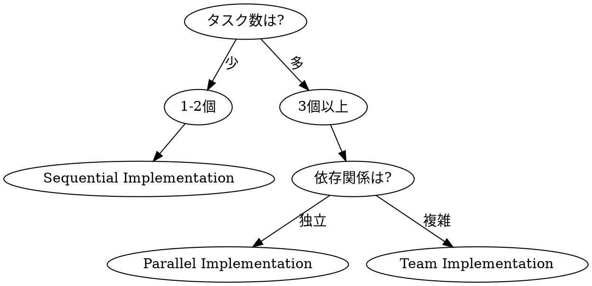

# Implementation Phase

**必須: Phase Banner Protocol（dev-workflow/SKILL.md）に従い Phase 5 バナーを表示すること。Slice開始時は上記 Slice Banner Protocol も適用。**

## Overview

承認された計画に基づいてコードを実装する。
**サブエージェント（Sonnet 4.5）を駆使した並列実装**で効率を最大化し、品質を担保。

**Core principles:**
- 縦スライスで最短で動かす
- 独立タスクは並列化
- **共通化できるものはコンポーネントにする**

## Worktree確認（Phase 1で作成済み）

**worktreeはPhase 1開始前に作成済み。worktree内で作業していることを確認すること。**

```bash
# Phase 5 開始時の確認（worktreeはPhase 1で作成済み）
git rev-parse --git-dir  # .git ファイルであればworktree内
```

並列実装用の追加worktreeが必要な場合（Phase 3設計で計画済み）:
```bash
git worktree add /Users/t.asai/code/fractal-worktrees/{project}-{feature}-{group} -b feature/{feature}-{group}
```

**Red Flags:**
| Thought | Reality |
|---------|---------|
| "worktreeから出て作業した" | 全Phase（1-9）をworktree内で実施 |
| "追加worktreeは面倒" | 並列実装には追加worktreeが必要 |

## The Iron Law

```
NO IMPLEMENTATION WITHOUT TEST FIRST (TDD)
PARALLELIZE INDEPENDENT TASKS (with Sonnet 4.5)
SERIALIZE DEPENDENT TASKS
COMPONENTIZE REUSABLE CODE
NO TASK COMPLETION WITHOUT REVIEW
```

## Subagent Model Configuration

**Sonnet 4.5 を積極的に使用する：**

```
Task(subagent_type="fractal-dev-workflow:implementer", model="sonnet"):
  ...
```

| 用途 | モデル | 理由 |
|------|--------|------|
| 実装 | **sonnet** | 高速・バランス良好 |
| 調査・探索 | **sonnet** | コスト効率 |
| コードレビュー | **sonnet** | 十分な品質 |
| 複雑な設計判断 | opus | 深い推論が必要な場合のみ |

---

## 実装戦略の選択



| タスク数 | 依存関係 | 戦略 |
|---------|---------|------|
| 1-2 | - | Sequential（順次実装） |
| 3+ | 独立 | Parallel（並列サブエージェント） |
| 3+ | 複雑 | Team（チーム編成） |

---

## Strategy A: Sequential Implementation（順次実装）

### 使用条件
- タスクが1-2個
- または強い依存関係がある

### フロー
```
Task 1 → Review → Commit → Task 2 → Review → Commit → ...
```

### 実行パターン
```
Task(subagent_type="fractal-dev-workflow:implementer", model="sonnet"):
  Implement Task 1 with TDD

[Wait for completion]

Task(subagent_type="fractal-dev-workflow:qa", model="sonnet"):
  Review Task 1

[Commit Task 1]

Task(subagent_type="fractal-dev-workflow:implementer", model="sonnet"):
  Implement Task 2 with TDD

...
```

#### タスク進捗管理（全Strategy共通）

各Slice開始時・完了時にタスク状態を更新:

```
# Slice N 開始時
TaskUpdate: taskId={slice_task_id}, status="in_progress"
bash ~/.claude/plugins/local/fractal-dev-workflow/scripts/workflow-manager.sh update-slice {workflow_id} {N} in_progress

# Slice N 完了時（テスト・code-simplifier完了後）
TaskUpdate: taskId={slice_task_id}, status="completed"
bash ~/.claude/plugins/local/fractal-dev-workflow/scripts/workflow-manager.sh update-slice {workflow_id} {N} completed
```

`{N}` は Slice番号（1, 2, 3）。update-slice は currentSlice の更新と startedAt/completedAt の記録も自動で行う。

---

## Strategy B: Parallel Implementation（並列サブエージェント）

### 使用条件
- 3個以上の独立タスク
- タスク間でファイル競合なし

### 依存関係分析

```markdown
## 依存関係分析

### タスク一覧
1. 型定義を作成
2. テストフィクスチャを作成
3. ユーティリティ関数を作成
4. API ハンドラを作成（1, 3 に依存）
5. UI コンポーネントを作成（1 に依存）
6. E2E テストを作成（4, 5 に依存）

### 依存グラフ
```
1 ──┬──▶ 4 ──┐
    │        │
3 ──┘        ├──▶ 6
             │
2 ──▶ 5 ────┘
```

### 並列グループ
| Group | Tasks | 依存 |
|-------|-------|------|
| A | 1, 2, 3 | なし |
| B | 4, 5 | Group A |
| C | 6 | Group B |
```

### 実行パターン
```
# === Group A: 並列実行（Sonnet 4.5）===
Task(subagent_type="fractal-dev-workflow:implementer", model="sonnet", run_in_background=true, name="impl-types"):
  Task 1: 型定義を作成

Task(subagent_type="fractal-dev-workflow:implementer", model="sonnet", run_in_background=true, name="impl-fixtures"):
  Task 2: テストフィクスチャを作成

Task(subagent_type="fractal-dev-workflow:implementer", model="sonnet", run_in_background=true, name="impl-utils"):
  Task 3: ユーティリティ関数を作成

# === Group A 完了待ち ===
[Monitor background tasks until all complete]
[Each task commits independently]

# === Group B: 並列実行（Sonnet 4.5）===
Task(subagent_type="fractal-dev-workflow:implementer", model="sonnet", run_in_background=true, name="impl-api"):
  Task 4: API ハンドラを作成
  Context: Task 1, 3 のコミットを参照

Task(subagent_type="fractal-dev-workflow:implementer", model="sonnet", run_in_background=true, name="impl-ui"):
  Task 5: UI コンポーネントを作成
  Context: Task 1, 2 のコミットを参照

# === Group B 完了待ち ===
...
```

### 進捗監視
```bash
# バックグラウンドタスクの出力を確認
Read(output_file_path)

# または
Bash: tail -f [output_file_path]
```

---

## Strategy C: Team Implementation（チーム編成）

### 使用条件
- 複雑な依存関係
- 長期間の実装
- 役割分担が必要

### チーム構成

```
TeamCreate:
  team_name: "feature-implementation"
  description: "[機能名]の実装チーム"

# チームメンバー
┌─────────────────────────────────────────────────┐
│  Team Lead (You)                                │
│  - タスク割り当て                               │
│  - 進捗監視                                     │
│  - コンテキスト共有                             │
├─────────────────────────────────────────────────┤
│  Implementer A        Implementer B             │
│  - Backend tasks      - Frontend tasks          │
│                                                 │
│  Implementer C        Code Reviewer             │
│  - Test tasks         - 品質チェック            │
└─────────────────────────────────────────────────┘
```

### チーム実行パターン
```
# 1. チーム作成
TeamCreate:
  team_name: "impl-[feature]"
  description: "[feature] implementation team"

# 2. タスク作成（TaskCreate で全タスクを登録）
TaskCreate: Task 1 - 型定義
TaskCreate: Task 2 - API実装
TaskCreate: Task 3 - UI実装
TaskCreate: Task 4 - テスト

# 3. 依存関係設定
TaskUpdate: Task 2 blockedBy: [Task 1]
TaskUpdate: Task 3 blockedBy: [Task 1]
TaskUpdate: Task 4 blockedBy: [Task 2, Task 3]

# 4. チームメンバー起動
Task(subagent_type="fractal-dev-workflow:implementer", team_name="impl-[feature]", name="backend-dev"):
  あなたは Backend 担当です。
  TaskList でタスクを確認し、backend 関連のタスクを担当してください。

Task(subagent_type="fractal-dev-workflow:implementer", team_name="impl-[feature]", name="frontend-dev"):
  あなたは Frontend 担当です。
  TaskList でタスクを確認し、frontend 関連のタスクを担当してください。

# 5. 進捗監視
SendMessage:
  type: "broadcast"
  content: "進捗を報告してください"

# 6. 完了後チーム解散
SendMessage:
  type: "shutdown_request"
  recipient: "backend-dev"

TeamDelete
```

### コンテキスト共有（Git Commit 経由）

```markdown
## コンテキスト循環パターン

1. Implementer A がタスク完了
   → git commit（変更内容を記録）

2. Team Lead がコミットを確認
   → Implementer B に共有

3. Implementer B が続行
   → git log で前のコミットを参照
   → 最新のコードで作業

**利点:**
- サブエージェントはコンテキストが短い
- Git がコンテキストの永続化を担う
- いつでも最新状態を取得可能
```

---

## 縦スライス実装

### 原則
**水平に全部やらず、1機能を端から端まで通す。**

```
❌ 水平スライス（避ける）
┌─────────────────────────────────┐
│ 全部の型定義                      │
├─────────────────────────────────┤
│ 全部のAPI                        │
├─────────────────────────────────┤
│ 全部のUI                         │
└─────────────────────────────────┘

✅ 縦スライス（推奨）
┌─────┐ ┌─────┐ ┌─────┐
│ 型  │ │ 型  │ │ 型  │
│ API │ │ API │ │ API │
│ UI  │ │ UI  │ │ UI  │
│機能1│ │機能2│ │機能3│
└─────┘ └─────┘ └─────┘
   ↓       ↓       ↓
 動く！   動く！   動く！
```

## Slice Banner Protocol（必須）

各Sliceを開始する際、**必ず**以下のバナーをユーザーに表示すること。表示なしでSliceの作業を開始してはならない。

### Slice開始バナー

```
----------------------------------------
  Phase 5 > Slice {N}: {Slice名称}
  Workflow: {workflowId}
----------------------------------------
```

### Slice名称マッピング

| Slice | 名称 |
|-------|------|
| 1 | 最小動作版 (MVP) |
| 2 | エラーハンドリング |
| 3 | エッジケース |

### 状態更新

バナー表示と同時に以下を実行:

```bash
# TaskCreate UIの状態更新
TaskUpdate: taskId={slice_task_id}, status="in_progress"

# workflow-manager.sh でJSON状態更新（currentSlice + startedAt を自動設定）
bash ~/.claude/plugins/local/fractal-dev-workflow/scripts/workflow-manager.sh update-slice {workflow_id} {N} in_progress
```

---

### 縦スライスの切り方
```markdown
## 縦スライス設計: [機能名]

### Slice 1: 最小動作版（MVP）
- [ ] 基本データ型
- [ ] 最小API（1エンドポイント）
- [ ] 最小UI（1画面）
- [ ] 正常系テスト
→ ここで一度動かす

### Slice 2: エラーハンドリング
- [ ] エラー型追加
- [ ] APIエラーレスポンス
- [ ] UIエラー表示
- [ ] 異常系テスト

### Slice 3: エッジケース
- [ ] 境界値対応
- [ ] 空データ対応
- [ ] 大量データ対応
```

### Slice登録

**Phase 3（設計）完了時に登録済み**のはず。Phase 5開始時に登録状態を確認:

```
bash ~/.claude/plugins/local/fractal-dev-workflow/scripts/workflow-manager.sh slices {workflow_id}
```

未登録の場合のみ、以下を実行（Phase 3: design/SKILL.md のSlice登録手順を参照）:

```
TaskCreate(subject="Slice 1: 最小動作版 (MVP)", description="基本データ型 + 最小API + 最小UI + 正常系テスト", activeForm="Slice 1 実装中")
TaskCreate(subject="Slice 2: エラーハンドリング", description="エラー型 + APIエラー + UIエラー表示 + 異常系テスト", activeForm="Slice 2 実装中")
TaskCreate(subject="Slice 3: エッジケース", description="権限チェック + 監査ログ + 境界値対応 + Integration Test", activeForm="Slice 3 実装中")
TaskUpdate: Slice 2 addBlockedBy: [Slice 1]
TaskUpdate: Slice 3 addBlockedBy: [Slice 2]
bash workflow-manager.sh add-slice {workflow_id} 1 "最小動作版 (MVP)" {slice1_taskId}
bash workflow-manager.sh add-slice {workflow_id} 2 "エラーハンドリング" {slice2_taskId}
bash workflow-manager.sh add-slice {workflow_id} 3 "エッジケース" {slice3_taskId}
```

---

## TDD サイクル（各タスク）

```
┌─────────────────────────────────────────┐
│  RED: 失敗するテストを書く              │
│  ─────────────────────────────────────  │
│  テストを実行 → 失敗を確認              │
└─────────────────────────────────────────┘
                    ↓
┌─────────────────────────────────────────┐
│  GREEN: 最小限のコードで通す            │
│  ─────────────────────────────────────  │
│  テストを実行 → 成功を確認              │
└─────────────────────────────────────────┘
                    ↓
┌─────────────────────────────────────────┐
│  REFACTOR: 綺麗にする                   │
│  ─────────────────────────────────────  │
│  テストを実行 → 成功を維持              │
└─────────────────────────────────────────┘
```

---

## コンポーネント化

### 原則
**共通使用する可能性がある機能やページはコンポーネントにする。**

### 判断基準

| 条件 | アクション |
|------|-----------|
| 2箇所以上で使用 | **共通化必須** |
| 将来的に再利用の可能性大 | 共通化推奨 |
| アプリ固有のロジック | 共通化しない |

### 共通化の配置先

```
packages/
├── ui/                    # 共通UIコンポーネント
│   └── src/components/
│       ├── business-card-scanner/
│       ├── place-autocomplete/
│       └── contact-form/
├── action-utils/          # 共通Server Actionsロジック
│   └── src/
│       ├── contacts/
│       ├── organizations/
│       └── business-card/
└── types/                 # 共通型定義
    └── src/
```

### 共通化チェックリスト

```markdown
## コンポーネント化対象

### 共通化すべき（2箇所以上で使用）
| コンポーネント | 使用箇所 | 配置先 |
|---------------|---------|--------|
| BusinessCardScanner | sales, nursing, calls | @fractal/ui |
| PlaceAutocomplete | organization作成, 検索 | @fractal/ui |
| createContactCore | 全アプリ | @fractal/action-utils |

### 共通化しない（アプリ固有）
| コンポーネント | 使用箇所 | 理由 |
|---------------|---------|------|
| SalesDashboard | sales のみ | 営業固有のUI |
| NursingReport | nursing のみ | 介護固有のロジック |
```

### コンポーネント作成時の注意

1. **Props は汎用的に**: アプリ固有のロジックを入れない
2. **Composition 優先**: 継承より合成
3. **テストも共通化**: コンポーネントと一緒にテストも移動
4. **破壊的変更は慎重に**: 複数アプリに影響

---

## レビュー戦略

### タスク単位レビュー
```
Task(subagent_type="fractal-dev-workflow:qa"):
  Review the following changes:
  - Files: [list of changed files]
  - Tests: [test file locations]

  Check:
  - [ ] Code quality
  - [ ] Test coverage
  - [ ] Security (OWASP)
  - [ ] Spec compliance
```

### 並列レビュー（複数タスク完了時）
```
# 複数タスクを並列レビュー
Task(subagent_type="fractal-dev-workflow:qa", run_in_background=true):
  Review Task 1 changes

Task(subagent_type="fractal-dev-workflow:qa", run_in_background=true):
  Review Task 2 changes

Task(subagent_type="fractal-dev-workflow:qa", run_in_background=true):
  Review Task 3 changes
```

---

## コミット戦略

### タスク単位コミット
```bash
# 1タスク = 1コミット（実装 + テスト）
git add src/feature.ts src/feature.test.ts
git commit -m "feat(feature): implement [description]

- Added [what]
- Tests: unit tests for [coverage]

Co-Authored-By: Claude Opus 4.6 <noreply@anthropic.com>"
```

### 並列タスクのコミット
```
各サブエージェントが独立してコミット
→ ファイル競合がなければ問題なし
→ 競合した場合は Team Lead が解決
```

---

## 進捗レポート

### テンプレート
```markdown
## 実装進捗: [機能名]

### 完了タスク
| Task | Implementer | Status | Commit |
|------|-------------|--------|--------|
| 型定義 | impl-types | ✅ Done | abc123 |
| API | impl-api | ✅ Done | def456 |
| UI | impl-ui | 🔄 In Progress | - |

### テスト結果
- Unit: 45/45 Pass
- Integration: 12/12 Pass
- Coverage: 85%

### 残タスク
- [ ] UI コンポーネント完了
- [ ] E2E テスト

### ブロッカー
- なし
```

---

## Code Simplification Step

### 実行タイミング
各縦スライス（Slice）実装完了後、次のスライスに進む前

### 呼び出し方法
```
Task(subagent_type="code-simplifier:code-simplifier", model="sonnet"):
  ## コード簡素化: Slice X 完了後

  ### 対象ファイル
  [このスライスで変更したファイル一覧]

  ### 簡素化の観点
  1. 冗長なコードの削減
  2. 命名の一貫性（用語定義との整合性）
  3. 不要な抽象化の排除
  4. 重複コードの共通化

  ### 制約
  - 機能を変更しない
  - テストが引き続きパスすること
```

### フロー
```
Slice 1 バナー表示 → 実装 → テストPass → code-simplifier → コミット
Slice 2 バナー表示 → 実装 → テストPass → code-simplifier → コミット
Slice 3 バナー表示 → 実装 → テストPass → code-simplifier → コミット
全Slice完了 → Phase 6へ
```

### スキップ条件
- 変更行数が50行未満の場合はオプショナル

---

## Completion Criteria

- [ ] worktree内で作業していることを確認（Phase 1で作成済み）
- [ ] 全タスク完了
- [ ] 各タスクにテスト
- [ ] 全テスト Pass
- [ ] カバレッジ目標達成
- [ ] code-simplifier 実行（変更ファイル3以上の場合）
- [ ] 実装完了コミット
- [ ] **Phase 7: codex-delegate 起動（必須・スキップ不可）**
  ```
  Task(subagent_type="fractal-dev-workflow:codex-delegate", model="haiku"):
    ## Phase 7: Codexコードレビュー
    ~/.claude/plugins/local/fractal-dev-workflow/scripts/codex-wrapper.sh review . uncommitted を実行
    ★Codex利用不可時: qaエージェントフォールバック必須
  ```

---

## Red Flags

| Thought | Reality |
|---------|---------|
| "依存関係は多分ない" | 明示的に確認する |
| "同じファイルだけど大丈夫" | 並列化できない |
| "レビューは最後にまとめて" | タスク単位でやる |
| "テストは後で" | TDDファースト |
| "縦スライスは面倒" | 水平は動かない期間が長い |

---

## Related Skills

- `testing` - テスト作成ガイダンス
- `parallel-implementation` - 並列実装の詳細
- `context-circulation` - コンテキスト共有
- `verification` - 実装後の検証
