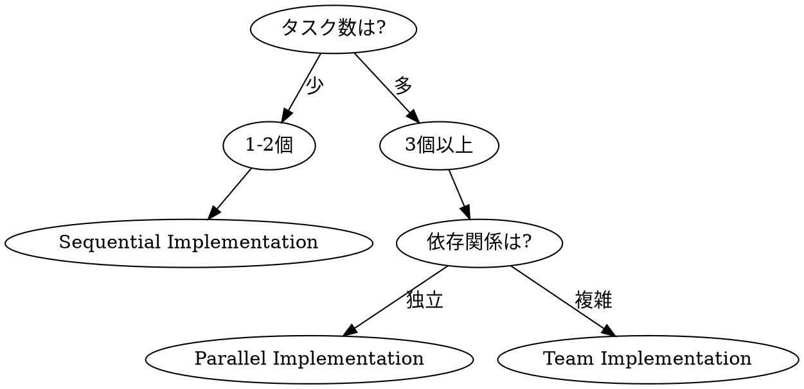

# Implementation Phase

## Overview

承認された計画に基づいてコードを実装する。
**サブエージェントを駆使した並列実装**で効率を最大化し、品質を担保。

**Core principle:** 縦スライスで最短で動かす。独立タスクは並列化。

## The Iron Law

```
NO IMPLEMENTATION WITHOUT TEST FIRST (TDD)
PARALLELIZE INDEPENDENT TASKS
SERIALIZE DEPENDENT TASKS
NO TASK COMPLETION WITHOUT REVIEW
```

---

## 実装戦略の選択



| タスク数 | 依存関係 | 戦略 |
|---------|---------|------|
| 1-2 | - | Sequential（順次実装） |
| 3+ | 独立 | Parallel（並列サブエージェント） |
| 3+ | 複雑 | Team（チーム編成） |

---

## Strategy A: Sequential Implementation（順次実装）

### 使用条件
- タスクが1-2個
- または強い依存関係がある

### フロー
```
Task 1 → Review → Commit → Task 2 → Review → Commit → ...
```

### 実行パターン
```
Task(subagent_type="implementer"):
  Implement Task 1 with TDD

[Wait for completion]

Task(subagent_type="code-reviewer"):
  Review Task 1

[Commit Task 1]

Task(subagent_type="implementer"):
  Implement Task 2 with TDD

...
```

---

## Strategy B: Parallel Implementation（並列サブエージェント）

### 使用条件
- 3個以上の独立タスク
- タスク間でファイル競合なし

### 依存関係分析

```markdown
## 依存関係分析

### タスク一覧
1. 型定義を作成
2. テストフィクスチャを作成
3. ユーティリティ関数を作成
4. API ハンドラを作成（1, 3 に依存）
5. UI コンポーネントを作成（1 に依存）
6. E2E テストを作成（4, 5 に依存）

### 依存グラフ
```
1 ──┬──▶ 4 ──┐
    │        │
3 ──┘        ├──▶ 6
             │
2 ──▶ 5 ────┘
```

### 並列グループ
| Group | Tasks | 依存 |
|-------|-------|------|
| A | 1, 2, 3 | なし |
| B | 4, 5 | Group A |
| C | 6 | Group B |
```

### 実行パターン
```
# === Group A: 並列実行 ===
Task(subagent_type="implementer", run_in_background=true, name="impl-types"):
  Task 1: 型定義を作成

Task(subagent_type="implementer", run_in_background=true, name="impl-fixtures"):
  Task 2: テストフィクスチャを作成

Task(subagent_type="implementer", run_in_background=true, name="impl-utils"):
  Task 3: ユーティリティ関数を作成

# === Group A 完了待ち ===
[Monitor background tasks until all complete]
[Each task commits independently]

# === Group B: 並列実行 ===
Task(subagent_type="implementer", run_in_background=true, name="impl-api"):
  Task 4: API ハンドラを作成
  Context: Task 1, 3 のコミットを参照

Task(subagent_type="implementer", run_in_background=true, name="impl-ui"):
  Task 5: UI コンポーネントを作成
  Context: Task 1, 2 のコミットを参照

# === Group B 完了待ち ===
...
```

### 進捗監視
```bash
# バックグラウンドタスクの出力を確認
Read(output_file_path)

# または
Bash: tail -f [output_file_path]
```

---

## Strategy C: Team Implementation（チーム編成）

### 使用条件
- 複雑な依存関係
- 長期間の実装
- 役割分担が必要

### チーム構成

```
TeamCreate:
  team_name: "feature-implementation"
  description: "[機能名]の実装チーム"

# チームメンバー
┌─────────────────────────────────────────────────┐
│  Team Lead (You)                                │
│  - タスク割り当て                               │
│  - 進捗監視                                     │
│  - コンテキスト共有                             │
├─────────────────────────────────────────────────┤
│  Implementer A        Implementer B             │
│  - Backend tasks      - Frontend tasks          │
│                                                 │
│  Implementer C        Code Reviewer             │
│  - Test tasks         - 品質チェック            │
└─────────────────────────────────────────────────┘
```

### チーム実行パターン
```
# 1. チーム作成
TeamCreate:
  team_name: "impl-[feature]"
  description: "[feature] implementation team"

# 2. タスク作成（TaskCreate で全タスクを登録）
TaskCreate: Task 1 - 型定義
TaskCreate: Task 2 - API実装
TaskCreate: Task 3 - UI実装
TaskCreate: Task 4 - テスト

# 3. 依存関係設定
TaskUpdate: Task 2 blockedBy: [Task 1]
TaskUpdate: Task 3 blockedBy: [Task 1]
TaskUpdate: Task 4 blockedBy: [Task 2, Task 3]

# 4. チームメンバー起動
Task(subagent_type="implementer", team_name="impl-[feature]", name="backend-dev"):
  あなたは Backend 担当です。
  TaskList でタスクを確認し、backend 関連のタスクを担当してください。

Task(subagent_type="implementer", team_name="impl-[feature]", name="frontend-dev"):
  あなたは Frontend 担当です。
  TaskList でタスクを確認し、frontend 関連のタスクを担当してください。

# 5. 進捗監視
SendMessage:
  type: "broadcast"
  content: "進捗を報告してください"

# 6. 完了後チーム解散
SendMessage:
  type: "shutdown_request"
  recipient: "backend-dev"

TeamDelete
```

### コンテキスト共有（Git Commit 経由）

```markdown
## コンテキスト循環パターン

1. Implementer A がタスク完了
   → git commit（変更内容を記録）

2. Team Lead がコミットを確認
   → Implementer B に共有

3. Implementer B が続行
   → git log で前のコミットを参照
   → 最新のコードで作業

**利点:**
- サブエージェントはコンテキストが短い
- Git がコンテキストの永続化を担う
- いつでも最新状態を取得可能
```

---

## 縦スライス実装

### 原則
**水平に全部やらず、1機能を端から端まで通す。**

```
❌ 水平スライス（避ける）
┌─────────────────────────────────┐
│ 全部の型定義                      │
├─────────────────────────────────┤
│ 全部のAPI                        │
├─────────────────────────────────┤
│ 全部のUI                         │
└─────────────────────────────────┘

✅ 縦スライス（推奨）
┌─────┐ ┌─────┐ ┌─────┐
│ 型  │ │ 型  │ │ 型  │
│ API │ │ API │ │ API │
│ UI  │ │ UI  │ │ UI  │
│機能1│ │機能2│ │機能3│
└─────┘ └─────┘ └─────┘
   ↓       ↓       ↓
 動く！   動く！   動く！
```

### 縦スライスの切り方
```markdown
## 縦スライス設計: [機能名]

### Slice 1: 最小動作版（MVP）
- [ ] 基本データ型
- [ ] 最小API（1エンドポイント）
- [ ] 最小UI（1画面）
- [ ] 正常系テスト
→ ここで一度動かす

### Slice 2: エラーハンドリング
- [ ] エラー型追加
- [ ] APIエラーレスポンス
- [ ] UIエラー表示
- [ ] 異常系テスト

### Slice 3: エッジケース
- [ ] 境界値対応
- [ ] 空データ対応
- [ ] 大量データ対応
```

---

## TDD サイクル（各タスク）

```
┌─────────────────────────────────────────┐
│  RED: 失敗するテストを書く              │
│  ─────────────────────────────────────  │
│  テストを実行 → 失敗を確認              │
└─────────────────────────────────────────┘
                    ↓
┌─────────────────────────────────────────┐
│  GREEN: 最小限のコードで通す            │
│  ─────────────────────────────────────  │
│  テストを実行 → 成功を確認              │
└─────────────────────────────────────────┘
                    ↓
┌─────────────────────────────────────────┐
│  REFACTOR: 綺麗にする                   │
│  ─────────────────────────────────────  │
│  テストを実行 → 成功を維持              │
└─────────────────────────────────────────┘
```

---

## レビュー戦略

### タスク単位レビュー
```
Task(subagent_type="code-reviewer"):
  Review the following changes:
  - Files: [list of changed files]
  - Tests: [test file locations]

  Check:
  - [ ] Code quality
  - [ ] Test coverage
  - [ ] Security (OWASP)
  - [ ] Spec compliance
```

### 並列レビュー（複数タスク完了時）
```
# 複数タスクを並列レビュー
Task(subagent_type="code-reviewer", run_in_background=true):
  Review Task 1 changes

Task(subagent_type="code-reviewer", run_in_background=true):
  Review Task 2 changes

Task(subagent_type="code-reviewer", run_in_background=true):
  Review Task 3 changes
```

---

## コミット戦略

### タスク単位コミット
```bash
# 1タスク = 1コミット（実装 + テスト）
git add src/feature.ts src/feature.test.ts
git commit -m "feat(feature): implement [description]

- Added [what]
- Tests: unit tests for [coverage]

Co-Authored-By: Claude Opus 4.6 <noreply@anthropic.com>"
```

### 並列タスクのコミット
```
各サブエージェントが独立してコミット
→ ファイル競合がなければ問題なし
→ 競合した場合は Team Lead が解決
```

---

## 進捗レポート

### テンプレート
```markdown
## 実装進捗: [機能名]

### 完了タスク
| Task | Implementer | Status | Commit |
|------|-------------|--------|--------|
| 型定義 | impl-types | ✅ Done | abc123 |
| API | impl-api | ✅ Done | def456 |
| UI | impl-ui | 🔄 In Progress | - |

### テスト結果
- Unit: 45/45 Pass
- Integration: 12/12 Pass
- Coverage: 85%

### 残タスク
- [ ] UI コンポーネント完了
- [ ] E2E テスト

### ブロッカー
- なし
```

---

## Completion Criteria（★ユーザー承認必須）

- [ ] 全タスク完了
- [ ] 各タスクにテスト
- [ ] 全テスト Pass
- [ ] カバレッジ目標達成
- [ ] コードレビュー完了
- [ ] **ユーザー承認**

---

## Red Flags

| Thought | Reality |
|---------|---------|
| "依存関係は多分ない" | 明示的に確認する |
| "同じファイルだけど大丈夫" | 並列化できない |
| "レビューは最後にまとめて" | タスク単位でやる |
| "テストは後で" | TDDファースト |
| "縦スライスは面倒" | 水平は動かない期間が長い |

---

## Related Skills

- `testing` - テスト作成ガイダンス
- `parallel-implementation` - 並列実装の詳細
- `context-circulation` - コンテキスト共有
- `verification` - 実装後の検証
