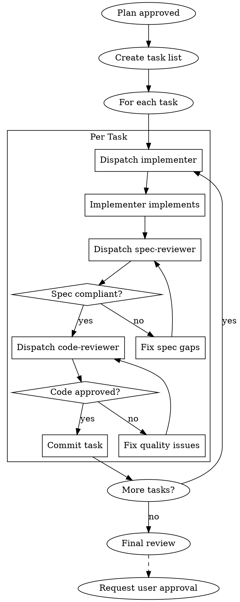

# Implementation Phase

## Overview

承認された計画に基づいてコードを実装する。サブエージェント駆動で品質を担保。

**Core principle:** Execute plan with fresh subagents per task, two-stage review after each.

## The Iron Law

```
NO TASK COMPLETION WITHOUT SPEC + CODE REVIEW
```

## The Process



## Task Execution

### 1. Task List Creation
Convert plan to TaskCreate entries:
```
TaskCreate:
  subject: "[verb] [target] [purpose]"
  description: |
    ## Overview
    [what to do]

    ## Completion Criteria
    - [ ] [criterion 1]
    - [ ] [criterion 2]

    ## Related Files
    - [file paths]
  activeForm: "[verb]ing [target]"
```

### 2. Per-Task Workflow

**Implementer subagent:**
```
Task(subagent_type="implementer"):
  - Implement according to task spec
  - Write tests (TDD preferred)
  - Self-review before handoff
```

**Spec reviewer:**
```
Task(subagent_type="spec-reviewer"):
  - Verify implementation matches spec
  - Check nothing extra added
  - Check nothing missing
```

**Code reviewer:**
```
Task(subagent_type="code-reviewer"):
  - Review code quality
  - Check security (OWASP)
  - Verify test coverage
```

### 3. Commit Strategy

Each task completion = one commit:
```bash
git add [specific files]
git commit -m "[type]: [subject]

[body]

Co-Authored-By: Claude Opus 4.6 <noreply@anthropic.com>"
```

## Parallel Implementation

When tasks are independent:
```
Task(subagent_type="implementer", run_in_background=true):
  Task A - no dependencies

Task(subagent_type="implementer", run_in_background=true):
  Task B - no dependencies
```

## Approval Required

**This phase requires user approval after all tasks complete.**

Present:
- Summary of implemented changes
- Test results
- Final code review results

Wait for explicit approval before Phase 6.

## Completion Criteria

- [ ] All tasks completed
- [ ] All tests passing
- [ ] Spec review passed for each task
- [ ] Code review passed for each task
- [ ] **User approval received**
