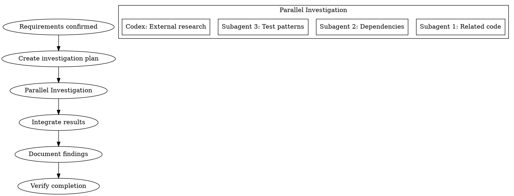

# Investigation Phase

## Overview

計画を立てる前に、コードベースと外部情報のエビデンスを収集する。

**Core principle:** NEVER plan without evidence-based investigation first.

## The Iron Law

```
NO PLANNING WITHOUT EVIDENCE-BASED INVESTIGATION FIRST
```

## The Process



### Step 1: Investigation Planning
Identify areas to investigate:
- Related existing code sections
- Available utilities and patterns
- External library/API specifications
- Similar implementation references

### Step 2: Parallel Investigation

**Subagent investigations (max 3 parallel):**
```
Task(subagent_type="Explore", model="haiku"):
  - Investigation 1: Identify related existing code
  - Investigation 2: Analyze dependencies and impact
  - Investigation 3: Find test patterns and utilities
```

**Codex parallel investigation (when available):**
```bash
scripts/codex-wrapper.sh exec "$PROJECT_DIR" \
  "以下の調査を行ってください: [investigation content]"
```

### Step 3: Results Integration
- Document investigation results
- Identify reusable code/patterns
- Decide: componentize vs standalone implementation

## Results Format

```markdown
## Investigation Results: [Topic]

### Existing Code
- [file path]: [description of related functionality]

### Reusable Utilities
- [utility name]: [usage method]

### Technical Constraints
- [constraint description]

### Risks
- [risk description and mitigation]
```

## Completion Criteria

- [ ] All related existing code identified
- [ ] Reusable utilities listed
- [ ] Technical constraints/risks documented
- [ ] External dependency specs confirmed
