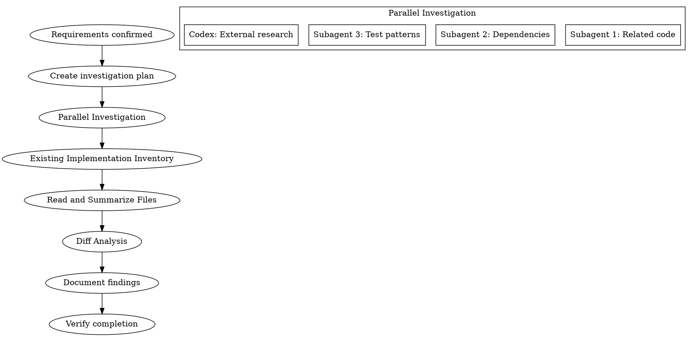

# Investigation Phase

## Overview

計画を立てる前に、コードベースと外部情報のエビデンスを収集する。

**Core principle:** NEVER plan without evidence-based investigation first.

## Investigation Scope by Mode

### new-creation モード
**調査観点:**
- 既存実装の棚卸し（再利用可能コード）
- 用語統一
- ビジネスルール
- 共通化可能なコンポーネント候補

### existing-modification モード（★強化）
**調査観点:**
- **変更対象ファイルの完全読み込み（必須）**
- **依存関係分析（呼び出し元/呼び出し先）（必須）**
- **影響範囲マップ（必須）**
- 既存テストの棚卸し
- 用語統一
- ビジネスルール確認

## The Iron Law

```
NO PLANNING WITHOUT EVIDENCE-BASED INVESTIGATION FIRST
NO FILE LISTING WITHOUT READING ACTUAL CONTENT
```

## The Process



### Step 1: Investigation Planning
Identify areas to investigate:
- Related existing code sections
- Available utilities and patterns
- External library/API specifications
- Similar implementation references

### Step 2: Parallel Investigation

**Subagent investigations (max 3 parallel):**
```
Task(subagent_type="Explore", model="haiku"):
  - Investigation 1: Identify related existing code
  - Investigation 2: Analyze dependencies and impact
  - Investigation 3: Find test patterns and utilities
```

**Codex parallel investigation (when available):**
```bash
CODEX_REASONING=xhigh scripts/codex-wrapper.sh exec "$PROJECT_DIR" \
  "以下の調査を行ってください: [investigation content]"
```

### Step 3: Existing Implementation Inventory (MANDATORY)

**This step is REQUIRED. File paths alone are NOT sufficient.**

For each related file identified:
1. **Actually Read the file** using Read tool
2. **Extract implementation summary**:
   - Main exported functions/classes
   - Key type definitions
   - External dependencies
   - Current functionality

```markdown
## Implementation Inventory

| File | Status | Key Exports | Summary |
|------|--------|-------------|---------|
| path/to/file.ts | Read | funcA, funcB | [what it does] |
```

**Red Flags - STOP if you catch yourself:**
- "I'll just list the file paths" → NO. Read each file.
- "The file name suggests..." → NO. Read the actual content.
- "Based on the directory structure..." → NO. Read the files.

### Step 4: Diff Analysis (for multi-app/multi-module tasks)

When multiple implementations exist:

```markdown
## Diff Analysis

| Feature | App A | App B | App C | Status |
|---------|-------|-------|-------|--------|
| Feature X | uses shared | custom impl | not present | Needs migration |
| Feature Y | shared | shared | shared | Already unified |
```

**Classification:**
- **Unified**: Already using shared implementation
- **Needs migration**: Custom implementation that should migrate to shared
- **App-specific**: Intentionally different per app (document why)

### Step 5: Dependency Analysis (for existing-modification)

**This step is REQUIRED for existing-modification mode.**

#### Procedure:

**Step 1: 変更対象ファイルの特定**
```bash
# Grep/Glob で変更対象を特定
Grep pattern="function_name|class_name"
```

**Step 2: 呼び出し元の特定**
```bash
# 変更対象の関数/クラスがどこで使用されているか
Grep pattern="import.*{function_name}" output_mode="files_with_matches"
Grep pattern="function_name\(" output_mode="content"
```

**Step 3: 呼び出し先の特定**
```
# 変更対象ファイルをReadして、import文から呼び出し先を特定
Read: [target file]
# import文を解析して依存先をリストアップ
```

**Step 4: テストの特定**
```bash
# 関連テストを検索
Glob pattern="**/*.test.{ts,tsx}"
Grep pattern="function_name|class_name" glob="**/*.test.{ts,tsx}"
```

#### Impact Map Template:

```markdown
## Impact Map (existing-modification)

### 変更対象ファイル
| ファイル | 変更内容 | 理由 |
|---------|---------|------|
| path/to/file.ts | 関数Aの修正 | バグ修正 |

### 依存関係グラフ
[変更対象]
path/to/file.ts (関数A)
  ↑ 呼び出し元
  ├── src/pages/xxx.tsx
  ├── src/components/xxx.tsx
  └── apps/xxx/pages/index.tsx
  ↓ 呼び出し先
  ├── src/db/xxx.ts
  └── src/utils/xxx.ts

### 影響範囲
| アプリ/機能 | 影響度 | 理由 |
|-----------|-------|------|
| xxx アプリ | 高 | 直接使用 |
| yyy アプリ | 低 | 使用していない |

### 既存テスト
| テストファイル | 影響 | 対応 |
|-------------|------|------|
| xxx.test.ts | あり | 更新必須 |
| yyy.test.ts | なし | 追加検討 |
```

### Step 6: 整合性チェックリストへの活用

Impact Mapの結果は、Phase 3（design）の整合性チェックリストで活用する:

| Impact Map項目 | 整合性チェックリスト項目 |
|---------------|----------------------|
| 変更対象ファイル | API整合性 → 変更対象API |
| 依存関係グラフ | DBスキーマ整合性 → 影響テーブル |
| 既存テスト | テスト整合性 → 更新必須テスト |
| 影響範囲 | 破壊的変更判定 → 影響アプリ |

この結果を `docs/investigation/{workflow-id}-impact.md` に保存し、
Phase 3で参照する。

### Step 7: Results Integration
- Document investigation results
- Identify reusable code/patterns
- Decide: componentize vs standalone implementation

## Results Format

```markdown
## Investigation Results: [Topic]

### Implementation Inventory (REQUIRED)

| File | Exported | Summary |
|------|----------|---------|
| path/file.ts:L10-50 | createFoo() | Creates Foo with validation |

### Diff Analysis (if applicable)

| Feature | Location A | Location B | Status |
|---------|-----------|-----------|--------|
| X | custom | shared | Needs migration |

### Reusable Utilities
- [utility name] (path:line): [usage method]

### Technical Constraints
- [constraint description]

### Risks
- [risk description and mitigation]

### What Exists vs What's Needed
| Capability | Exists? | Location | Gap |
|------------|---------|----------|-----|
| OCR extraction | Yes | pkg/ocr.ts:L20 | PDF not supported |
```

## Completion Criteria

### Common (all modes)
- [ ] All related existing code identified
- [ ] **Each file ACTUALLY READ (not just listed)**
- [ ] **Implementation summary for each file documented**
- [ ] Reusable utilities listed with exact paths
- [ ] Technical constraints/risks documented
- [ ] External dependency specs confirmed
- [ ] **Diff analysis completed (for multi-app tasks)**
- [ ] **Exists vs Needed gap analysis documented**

### Additional for existing-modification mode
- [ ] **変更対象ファイルの完全読み込み完了**
- [ ] **呼び出し元の特定完了**
- [ ] **呼び出し先の特定完了**
- [ ] **影響範囲マップ作成完了**
- [ ] **既存テストの棚卸し完了**
