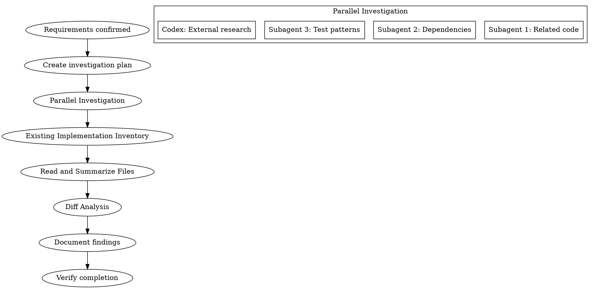

# Investigation Phase

## Overview

計画を立てる前に、コードベースと外部情報のエビデンスを収集する。

**Core principle:** NEVER plan without evidence-based investigation first.

## The Iron Law

```
NO PLANNING WITHOUT EVIDENCE-BASED INVESTIGATION FIRST
NO FILE LISTING WITHOUT READING ACTUAL CONTENT
```

## The Process



### Step 1: Investigation Planning
Identify areas to investigate:
- Related existing code sections
- Available utilities and patterns
- External library/API specifications
- Similar implementation references

### Step 2: Parallel Investigation

**Subagent investigations (max 3 parallel):**
```
Task(subagent_type="Explore", model="haiku"):
  - Investigation 1: Identify related existing code
  - Investigation 2: Analyze dependencies and impact
  - Investigation 3: Find test patterns and utilities
```

**Codex parallel investigation (when available):**
```bash
CODEX_REASONING=xhigh scripts/codex-wrapper.sh exec "$PROJECT_DIR" \
  "以下の調査を行ってください: [investigation content]"
```

### Step 3: Existing Implementation Inventory (MANDATORY)

**This step is REQUIRED. File paths alone are NOT sufficient.**

For each related file identified:
1. **Actually Read the file** using Read tool
2. **Extract implementation summary**:
   - Main exported functions/classes
   - Key type definitions
   - External dependencies
   - Current functionality

```markdown
## Implementation Inventory

| File | Status | Key Exports | Summary |
|------|--------|-------------|---------|
| path/to/file.ts | Read | funcA, funcB | [what it does] |
```

**Red Flags - STOP if you catch yourself:**
- "I'll just list the file paths" → NO. Read each file.
- "The file name suggests..." → NO. Read the actual content.
- "Based on the directory structure..." → NO. Read the files.

### Step 4: Diff Analysis (for multi-app/multi-module tasks)

When multiple implementations exist:

```markdown
## Diff Analysis

| Feature | App A | App B | App C | Status |
|---------|-------|-------|-------|--------|
| Feature X | uses shared | custom impl | not present | Needs migration |
| Feature Y | shared | shared | shared | Already unified |
```

**Classification:**
- **Unified**: Already using shared implementation
- **Needs migration**: Custom implementation that should migrate to shared
- **App-specific**: Intentionally different per app (document why)

### Step 5: Results Integration
- Document investigation results
- Identify reusable code/patterns
- Decide: componentize vs standalone implementation

## Results Format

```markdown
## Investigation Results: [Topic]

### Implementation Inventory (REQUIRED)

| File | Exported | Summary |
|------|----------|---------|
| path/file.ts:L10-50 | createFoo() | Creates Foo with validation |

### Diff Analysis (if applicable)

| Feature | Location A | Location B | Status |
|---------|-----------|-----------|--------|
| X | custom | shared | Needs migration |

### Reusable Utilities
- [utility name] (path:line): [usage method]

### Technical Constraints
- [constraint description]

### Risks
- [risk description and mitigation]

### What Exists vs What's Needed
| Capability | Exists? | Location | Gap |
|------------|---------|----------|-----|
| OCR extraction | Yes | pkg/ocr.ts:L20 | PDF not supported |
```

## Completion Criteria

- [ ] All related existing code identified
- [ ] **Each file ACTUALLY READ (not just listed)**
- [ ] **Implementation summary for each file documented**
- [ ] Reusable utilities listed with exact paths
- [ ] Technical constraints/risks documented
- [ ] External dependency specs confirmed
- [ ] **Diff analysis completed (for multi-app tasks)**
- [ ] **Exists vs Needed gap analysis documented**
