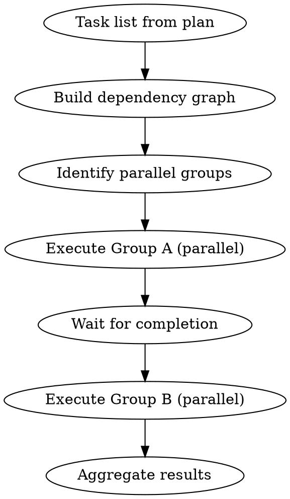

# Parallel Implementation

## Overview

独立したタスクを並列サブエージェントで実装し、効率を最大化する。

**Core principle:** Parallelize independent tasks, serialize dependent ones.

## The Iron Law

```
NEVER PARALLELIZE DEPENDENT TASKS
```

## When to Use

- Plan has 3+ independent tasks
- Tasks don't share state
- No sequential dependencies

## The Process



## Dependency Analysis

### Independent (Can Parallelize)
```
Task 1: Create type definitions
Task 2: Create test fixtures
Task 3: Create documentation
→ All can run in parallel
```

### Dependent (Must Serialize)
```
Task 1: Create data model
Task 2: Create storage layer (needs Task 1)
Task 3: Create API handler (needs Task 2)
→ Must run sequentially
```

## Parallel Group Identification

```
Group A (no dependencies):
  - Task 1
  - Task 2
  - Task 3

Group B (depends on Group A):
  - Task 4 (needs Task 1)
  - Task 5 (needs Task 2)

Group C (depends on Group B):
  - Task 6 (needs Tasks 4, 5)
```

## Execution Pattern

```
# Group A - Launch all in parallel
Task(subagent_type="implementer", run_in_background=true):
  Task 1

Task(subagent_type="implementer", run_in_background=true):
  Task 2

Task(subagent_type="implementer", run_in_background=true):
  Task 3

# Wait for Group A
[Check completion of all background tasks]

# Group B - Launch next parallel group
Task(subagent_type="implementer", run_in_background=true):
  Task 4

Task(subagent_type="implementer", run_in_background=true):
  Task 5
```

## Progress Aggregation

Monitor all parallel agents:
- Check output files periodically
- Aggregate completion status
- Report overall progress

## Commit Strategy for Parallel Work

Each parallel task commits independently:
```
# Task 1 commits
git add src/types.ts
git commit -m "feat: Add type definitions"

# Task 2 commits (parallel)
git add tests/fixtures/
git commit -m "test: Add test fixtures"
```

Merge conflicts are rare if tasks are truly independent.

## Red Flags

- "This task probably doesn't depend on that" → Verify explicitly
- "They touch the same file" → NOT parallelizable
- "Race condition won't happen" → It will. Serialize.

## Completion Criteria

- [ ] All parallel tasks completed
- [ ] No merge conflicts
- [ ] All commits successful
- [ ] Progress aggregated
