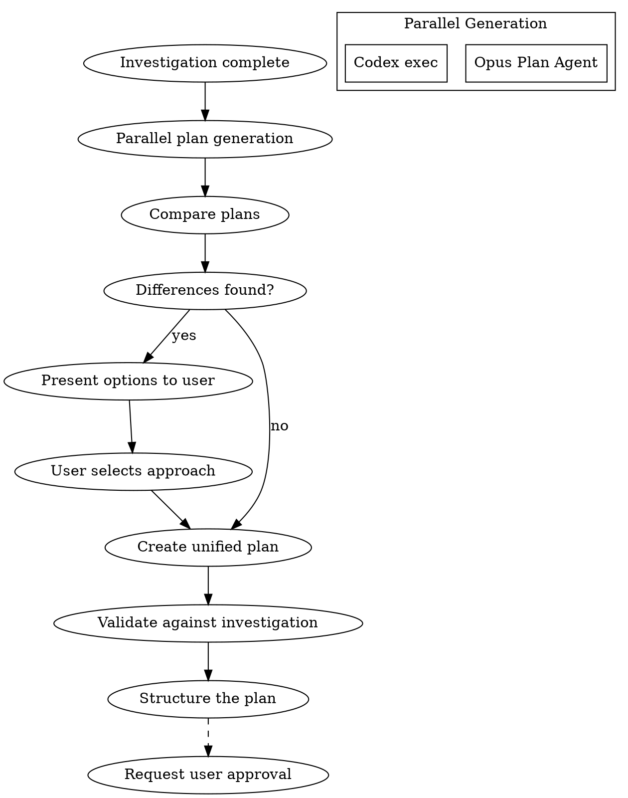

# Planning Phase

## Overview

調査結果に基づいて実装計画を策定する。計画策定後はPhase 4（Codex計画レビュー）に自動遷移する。

**Core principle:** NEVER implement without a reviewed plan first.

## The Iron Law

```
NO IMPLEMENTATION WITHOUT A REVIEWED PLAN FIRST
NO "NEW FILE" WITHOUT CONFIRMING IT DOESN'T EXIST
ALL CHANGES MUST REFERENCE EXISTING CODE (path:line)
```

## The Process



### Step 1: Parallel Plan Generation

**Opus Plan Agent:**
```
Task(subagent_type="Plan"):
  Create implementation plan based on investigation results and requirements
```

**Codex parallel plan (when available):**
```bash
CODEX_REASONING=xhigh scripts/codex-wrapper.sh exec "$PROJECT_DIR" \
  "以下の要件に基づいて実装計画を策定: [requirements and investigation]"
```

### Step 2: Plan Integration
Present differences as options:
```
AskUserQuestion:
  question: "計画Aと計画Bで[差異点]が異なります。どちらを採用しますか？"
  options:
    - label: "計画A: [概要]"
      description: "[メリット/デメリット]"
    - label: "計画B: [概要]"
      description: "[メリット/デメリット]"
    - label: "ハイブリッド"
      description: "両方の良い部分を組み合わせる"
```

### Step 3: Plan Validation Against Investigation

**MANDATORY CHECK before finalizing:**

For each file in the plan:
- If "New": Verify file does NOT exist in investigation inventory
- If "Modify": Reference exact location (path:line) from investigation
- If "Extend": Document what exists vs what's being added

**Red Flags - STOP if you see:**
- "Create contacts/create.ts" without checking if it exists → INVESTIGATE FIRST
- "Add function X" without referencing existing code → ADD CODE REFERENCE
- Generic file operations without specific line numbers → BE SPECIFIC

### Step 4: Plan Structure

Final plan must include:
1. **目的**: What to achieve
2. **アプローチ**: How to implement
3. **既存実装との差分** (REQUIRED): What exists vs what changes
4. **ファイル変更一覧**: Files to create/modify with existing code references
5. **依存関係**: Task dependencies
6. **リスク**: Foreseen risks and mitigations
7. **テスト戦略**: Detailed verification methods

## Plan Template

```markdown
# Implementation Plan: [Task Name]

## 目的
[What to achieve]

## アプローチ
[Implementation method overview]

## 既存実装との差分 (REQUIRED)

| Capability | Current State | Planned Change | Reference |
|------------|--------------|----------------|-----------|
| OCR extraction | Exists (pkg/ocr.ts:L20) | Extend for PDF | Extract.ts:L45 |
| Upload | Exists (pkg/upload.ts) | No change | - |
| New feature X | Does NOT exist | New file | Verified: not in codebase |

## ファイル変更一覧

| File | Type | Description | Existing Reference |
|------|------|-------------|-------------------|
| src/foo.ts | New | [description] | Verified: does not exist |
| src/bar.ts | Extend | Add PDF support | bar.ts:L50-80 (current impl) |
| src/baz.ts | Modify | Fix edge case | baz.ts:L120 (bug location) |

**Type definitions:**
- **New**: File does not exist (MUST verify with investigation)
- **Extend**: Add functionality to existing file (MUST reference current code)
- **Modify**: Change existing behavior (MUST reference specific lines)
- **Migrate**: Move from app-specific to shared (MUST reference both locations)

## タスク分解
1. [Task 1] - No dependencies
2. [Task 2] - Depends on Task 1
3. [Task 3] - No dependencies (parallelizable)

## リスク
| Risk | Impact | Mitigation |
|------|--------|------------|
| [risk] | High/Med/Low | [mitigation] |

## テスト戦略 (REQUIRED DETAIL)

### Unit Tests
| Target | Test File | Mock Strategy |
|--------|-----------|---------------|
| createFoo() | foo.test.ts | Mock DB with Prisma mock |

### External API Mocking
| API | Mock Method | Test Data |
|-----|-------------|-----------|
| Gemini OCR | vi.mock('@google/ai') | fixtures/ocr-response.json |
| Places API | MSW handler | fixtures/places.json |

### Integration Tests
- [ ] E2E flow: [description]
- [ ] Error handling: [scenarios]

### Manual Verification
1. [Step 1]
2. [Step 2]
```

## Approval Required

**This phase requires explicit user approval before proceeding.**

Present the plan and wait for:
- "承認" / "Approved" / explicit approval
- Record approval timestamp in workflow state
- Only then proceed to Phase 4

## Completion Criteria

- [ ] Implementation plan is structured
- [ ] **既存実装との差分が明記されている**
- [ ] **各ファイル変更に既存コード参照（path:line）がある**
- [ ] **"New"タイプのファイルは存在しないことを確認済み**
- [ ] File change list is clear with types (New/Extend/Modify/Migrate)
- [ ] Risks and mitigations identified
- [ ] **Test strategy includes mock methods for external APIs**
- [ ] **User approval received**

## Related Skills

- `testing` - Detailed test type selection and creation guidance
- `investigation` - For existing implementation inventory
- `codex-review` - For plan review before approval
