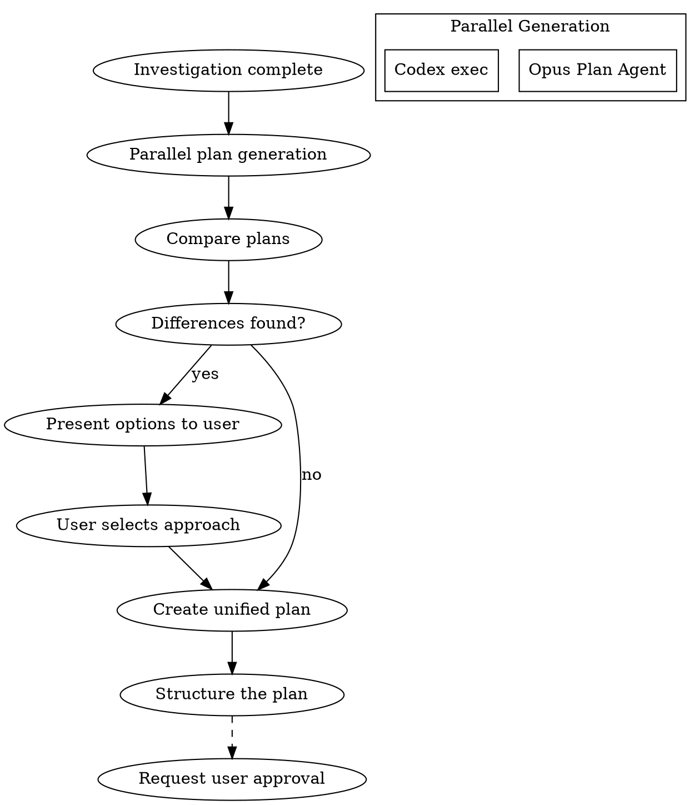

# Planning Phase

## Overview

調査結果に基づいて実装計画を策定する。このフェーズは**ユーザー承認が必須**。

**Core principle:** NEVER implement without a reviewed plan first.

## The Iron Law

```
NO IMPLEMENTATION WITHOUT A REVIEWED PLAN FIRST
```

## The Process



### Step 1: Parallel Plan Generation

**Opus Plan Agent:**
```
Task(subagent_type="Plan"):
  Create implementation plan based on investigation results and requirements
```

**Codex parallel plan (when available):**
```bash
scripts/codex-wrapper.sh exec "$PROJECT_DIR" \
  "以下の要件に基づいて実装計画を策定: [requirements and investigation]"
```

### Step 2: Plan Integration
Present differences as options:
```
AskUserQuestion:
  question: "計画Aと計画Bで[差異点]が異なります。どちらを採用しますか？"
  options:
    - label: "計画A: [概要]"
      description: "[メリット/デメリット]"
    - label: "計画B: [概要]"
      description: "[メリット/デメリット]"
    - label: "ハイブリッド"
      description: "両方の良い部分を組み合わせる"
```

### Step 3: Plan Structure

Final plan must include:
1. **目的**: What to achieve
2. **アプローチ**: How to implement
3. **ファイル変更一覧**: Files to create/modify
4. **依存関係**: Task dependencies
5. **リスク**: Foreseen risks and mitigations
6. **テスト戦略**: Verification methods

## Plan Template

```markdown
# Implementation Plan: [Task Name]

## 目的
[What to achieve]

## アプローチ
[Implementation method overview]

## ファイル変更一覧
| File | Operation | Description |
|------|-----------|-------------|
| src/foo.ts | New | [description] |
| src/bar.ts | Modify | [description] |

## タスク分解
1. [Task 1] - No dependencies
2. [Task 2] - Depends on Task 1
3. [Task 3] - No dependencies (parallelizable)

## リスク
| Risk | Impact | Mitigation |
|------|--------|------------|
| [risk] | High/Med/Low | [mitigation] |

## テスト戦略
- Unit tests: [targets]
- Integration tests: [targets]
- Manual verification: [steps]
```

## Approval Required

**This phase requires explicit user approval before proceeding.**

Present the plan and wait for:
- "承認" / "Approved" / explicit approval
- Record approval timestamp in workflow state
- Only then proceed to Phase 4

## Completion Criteria

- [ ] Implementation plan is structured
- [ ] File change list is clear
- [ ] Risks and mitigations identified
- [ ] Test strategy defined
- [ ] **User approval received**
