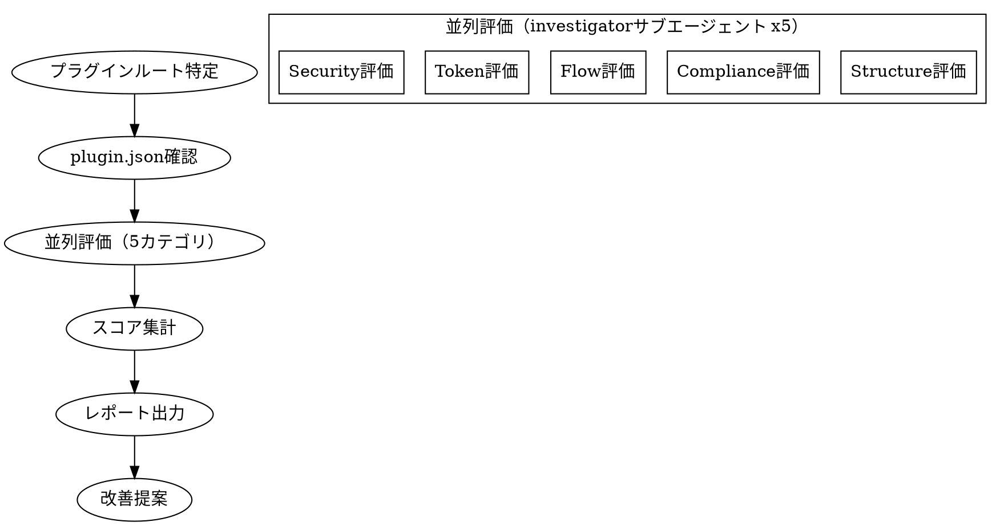
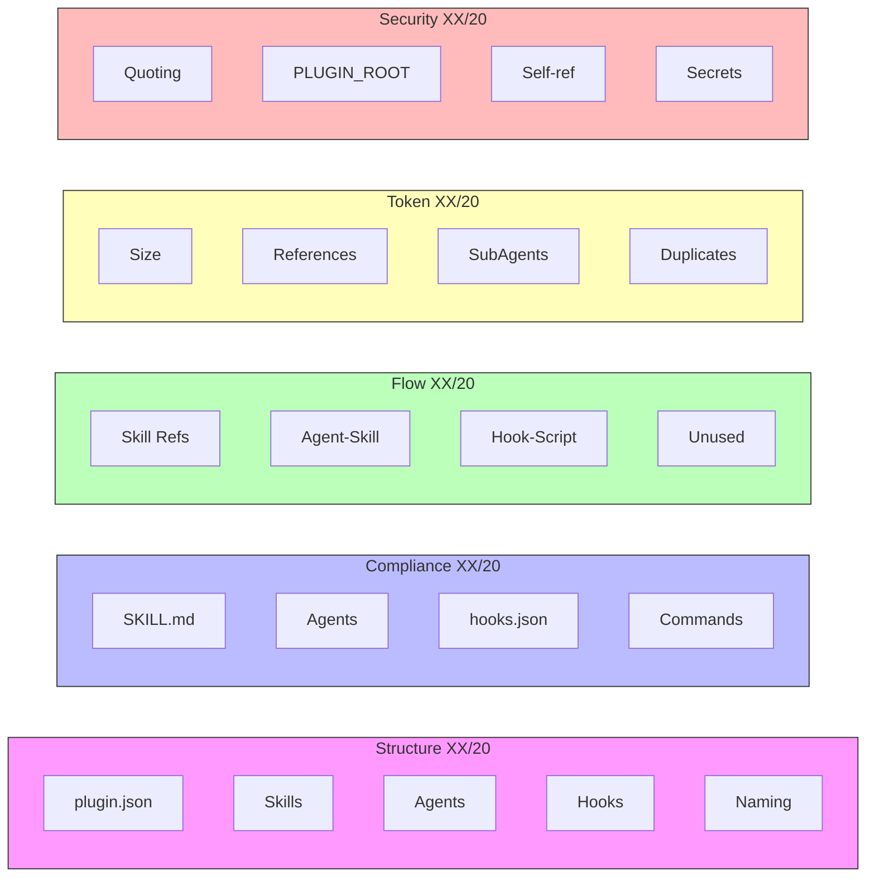

# plugin-audit

## Overview

fractal-dev-workflowプラグインを5カテゴリ（Structure, Compliance, Flow, Token, Security）で評価し、100点満点のスコア付きレポートを生成する。

**評価の原則:**
- 証拠ベースの評価（未確認項目は0点、推測禁止）
- サブエージェントによる並列評価で客観性を確保
- 改善提案を必ず付与する

## The Process



## Steps

### Step 1: プラグインルート特定

```bash
# プラグインルートを特定
git rev-parse --show-toplevel

# .claude-plugin/plugin.json の存在確認
ls .claude-plugin/plugin.json
```

必須フィールドの確認:
- `name`: プラグイン名
- `version`: バージョン番号

### Step 2: 5カテゴリ並列評価

5つの investigator サブエージェントを並列起動して評価する。

```
Task(subagent_type="fractal-dev-workflow:investigator", run_in_background=true):
  評価カテゴリ: Structure (構造) / 20点
  調査対象: .claude-plugin/plugin.json, skills/, agents/, hooks/
  評価基準: references/scoring-rubric.md#structure

Task(subagent_type="fractal-dev-workflow:investigator", run_in_background=true):
  評価カテゴリ: Compliance (仕様準拠) / 20点
  調査対象: skills/**/SKILL.md, agents/**.md, hooks/hooks.json
  評価基準: references/scoring-rubric.md#compliance

Task(subagent_type="fractal-dev-workflow:investigator", run_in_background=true):
  評価カテゴリ: Flow (フロー効率) / 20点
  調査対象: skills間の参照、エージェント⇔スキル対応、hooks.json⇔スクリプト
  評価基準: references/scoring-rubric.md#flow

Task(subagent_type="fractal-dev-workflow:investigator", run_in_background=true):
  評価カテゴリ: Token (トークン効率) / 20点
  調査対象: skills/**/SKILL.md（行数・重複）、references/分離状況
  評価基準: references/scoring-rubric.md#token

Task(subagent_type="fractal-dev-workflow:investigator", run_in_background=true):
  評価カテゴリ: Security (セキュリティ) / 20点
  調査対象: hooks/**/*.sh（変数クォート、自己参照ガード）
  評価基準: references/scoring-rubric.md#security
```

各サブエージェントは以下を返すこと:
- カテゴリスコア（XX/20）
- 各チェック項目の得点と証拠（path:line）
- 発見した問題（Findings）

詳細チェックルールは [references/compliance-rules.md](references/compliance-rules.md) を参照。
スコアリング基準は [references/scoring-rubric.md](references/scoring-rubric.md) を参照。

### Step 3: スコア集計

各サブエージェントの結果を集計する:

| カテゴリ    | スコア | ステータス |
|------------|-------|----------|
| Structure  | XX/20 | PASS/WARN/FAIL |
| Compliance | XX/20 | PASS/WARN/FAIL |
| Flow       | XX/20 | PASS/WARN/FAIL |
| Token      | XX/20 | PASS/WARN/FAIL |
| Security   | XX/20 | PASS/WARN/FAIL |

ステータス判定:
- **PASS**: 16〜20点
- **WARN**: 10〜15点
- **FAIL**: 0〜9点

### Step 4: レポート出力

レポートを `docs/audit-report.md` に出力する。マーメイド図でスコアを可視化する。

出力ファイル: `docs/audit-report.md`

レポートフォーマット:

~~~markdown
# Plugin Audit Report

Generated: {date}
Plugin: {name} v{version}

## Overall Score: XX / 100


| Category    | Score | Status |
|-------------|-------|--------|
| Structure   | XX/20 | PASS/WARN/FAIL |
| Compliance  | XX/20 | PASS/WARN/FAIL |
| Flow        | XX/20 | PASS/WARN/FAIL |
| Token       | XX/20 | PASS/WARN/FAIL |
| Security    | XX/20 | PASS/WARN/FAIL |

## Category Details



## Findings

### [{Category}] {Issue Title}
- Severity: {High/Medium/Low}
- File: {path:line}
- Issue: {具体的な問題}
- Fix: {改善提案}

## Severity Distribution


## Top Recommendations

1. {最優先の改善提案}
2. {次の改善提案}
~~~

### Step 5: 改善提案

Overall Score に基づいて優先度付きの改善提案を生成する:
- Score 80+: 軽微な改善のみ
- Score 60-79: WARN項目の解消が推奨
- Score 0-59: FAIL項目の即時対応が必要

## Completion Criteria

- [ ] プラグインルートが正しく特定されている
- [ ] 5カテゴリすべての評価が完了している（未評価項目なし）
- [ ] 各チェック項目に証拠（path:line）が付いている
- [ ] Overall Score が計算されている
- [ ] Findings に改善提案が記載されている
- [ ] Top Recommendations が最低1件以上ある
- [ ] `docs/audit-report.md` にレポートが出力されている

## Red Flags

- スコアを証拠なしに高く評価してはならない（推測禁止）
- 未確認・未調査の項目を1点以上にしてはならない（0点が正直な評価）
- Findingsが空のままレポートを終えてはならない（改善提案なしは禁止）
- FAIL項目を改善提案なしで放置してはならない

## Related Skills

- `plugin-reinstall` - プラグイン再インストール
- `user-guide` - 使い方ガイド
