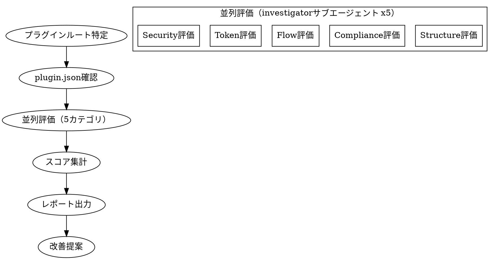
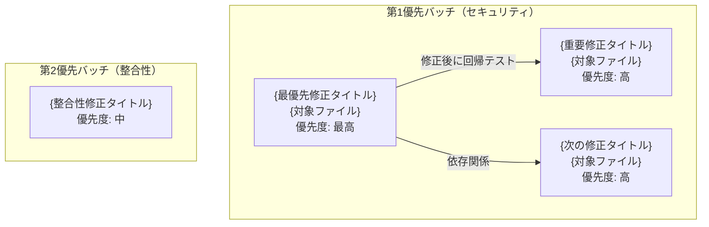

# plugin-audit

## Overview

fractal-dev-workflowプラグインを5カテゴリ（Structure, Compliance, Flow, Token, Security）で評価し、100点満点のスコア付きレポートを生成する。

**評価の原則:**
- 証拠ベースの評価（未確認項目は0点、推測禁止）
- サブエージェントによる並列評価で客観性を確保
- 改善提案を必ず付与する

## The Process



## Steps

### Step 1: プラグインルート特定

```bash
# プラグインルートを特定
git rev-parse --show-toplevel

# .claude-plugin/plugin.json の存在確認
ls .claude-plugin/plugin.json
```

必須フィールドの確認:
- `name`: プラグイン名
- `version`: バージョン番号

### Step 2: 5カテゴリ並列評価

5つの investigator サブエージェントを並列起動して評価する。

```
Task(subagent_type="fractal-dev-workflow:investigator", run_in_background=true):
  評価カテゴリ: Structure (構造) / 20点
  調査対象: .claude-plugin/plugin.json, skills/, agents/, hooks/
  評価基準: references/scoring-rubric.md#structure

Task(subagent_type="fractal-dev-workflow:investigator", run_in_background=true):
  評価カテゴリ: Compliance (仕様準拠) / 20点
  調査対象: skills/**/SKILL.md, agents/**.md, hooks/hooks.json
  評価基準: references/scoring-rubric.md#compliance

Task(subagent_type="fractal-dev-workflow:investigator", run_in_background=true):
  評価カテゴリ: Flow (フロー効率) / 20点
  調査対象: skills間の参照、エージェント⇔スキル対応、hooks.json⇔スクリプト
  評価基準: references/scoring-rubric.md#flow

Task(subagent_type="fractal-dev-workflow:investigator", run_in_background=true):
  評価カテゴリ: Token (トークン効率) / 20点
  調査対象: skills/**/SKILL.md（行数・重複）、references/分離状況
  評価基準: references/scoring-rubric.md#token

Task(subagent_type="fractal-dev-workflow:investigator", run_in_background=true):
  評価カテゴリ: Security (セキュリティ) / 20点
  調査対象: hooks/**/*.sh（変数クォート、自己参照ガード）
  評価基準: references/scoring-rubric.md#security
```

各サブエージェントは以下を返すこと:
- カテゴリスコア（XX/20）
- 各チェック項目の得点と証拠（path:line）
- 発見した問題（Findings）

詳細チェックルールは [references/compliance-rules.md](references/compliance-rules.md) を参照。
スコアリング基準は [references/scoring-rubric.md](references/scoring-rubric.md) を参照。

### Step 3: スコア集計

各サブエージェントの結果を集計する:

| カテゴリ | スコア | 状態 |
|----------|-------|------|
| 1. 構造健全性 | XX/20 | PASS/WARN/FAIL |
| 2. Claude Code仕様準拠 | XX/20 | PASS/WARN/FAIL |
| 3. ワークフロー効率 | XX/20 | PASS/WARN/FAIL |
| 4. トークン効率 | XX/20 | PASS/WARN/FAIL |
| 5. セキュリティ | XX/20 | PASS/WARN/FAIL |

ステータス判定:
- **PASS**: 16〜20点
- **WARN**: 10〜15点
- **FAIL**: 0〜9点

### Step 4: レポート出力

レポートを `docs/audits/YYYY-MM-DD.md`（実行日の日付）に出力する。マーメイド図3種類でスコアと問題を可視化する。

出力ファイル: `docs/audits/{実行日付}.md`（例: `docs/audits/2026-02-19.md`）

レポートフォーマット:

~~~markdown
# プラグイン監査レポート - {YYYY-MM-DD}

**バージョン**: {version}
**総合スコア**: {total}/100 ({PASS/WARN/FAIL})

## スコアサマリー

| カテゴリ | スコア | 状態 |
|----------|-------|------|
| 1. 構造健全性 | {structure_score}/20 | PASS/WARN/FAIL |
| 2. Claude Code仕様準拠 | {compliance_score}/20 | PASS/WARN/FAIL |
| 3. ワークフロー効率 | {flow_score}/20 | PASS/WARN/FAIL |
| 4. トークン効率 | {token_score}/20 | PASS/WARN/FAIL |
| 5. セキュリティ | {security_score}/20 | PASS/WARN/FAIL |

```mermaid
xychart-beta
    title "カテゴリ別スコア (満点20点)"
    x-axis ["構造健全性", "仕様準拠", "ワークフロー効率", "トークン効率", "セキュリティ"]
    y-axis "スコア" 0 --> 20
    bar [{structure_score}, {compliance_score}, {flow_score}, {token_score}, {security_score}]
```

---

## 1. 構造健全性 ({structure_score}/20)

### 良好
- {良好な点を列挙}

### 警告
- {警告事項を列挙}

### 致命的
- {致命的な問題を列挙（なければセクション省略可）}

---

## 2. Claude Code仕様準拠 ({compliance_score}/20)

### 良好
- {良好な点を列挙}

### 警告
- {警告事項を列挙}

### 致命的
- {致命的な問題を列挙（なければセクション省略可）}

---

## 3. ワークフロー効率 ({flow_score}/20)

### 良好
- {良好な点を列挙}

### 警告
- {警告事項を列挙}

---

## 4. トークン効率 ({token_score}/20)

### 良好
- {良好な点を列挙}

### 警告
- {警告事項を列挙}

### 致命的
- {致命的な問題を列挙（なければセクション省略可）}

---

## 5. セキュリティ ({security_score}/20)

### 良好
- {良好な点を列挙}

### 致命的

**[C-1] {問題タイトル} - {path:line}**
{具体的な問題内容}

### 重要

**[I-1] {問題タイトル} - {path:line}**
{具体的な問題内容}

### 軽微

**[M-1] {問題タイトル}**
{具体的な問題内容}

---


## 仕様との乖離

| 項目 | 仕様 | 実際 | 状態 |
|------|------|------|------|
| {項目名} | {仕様の記述} | {実際の記述} | NG/OK |

---



## 必須修正 ({critical_fix_count}件)

1. **{修正タイトル}** - `{path}` - {修正方法}

## 推奨修正 ({recommended_fix_count}件)

{推奨修正番号}. **{修正タイトル}** - {修正方法}

## テスト追加 ({test_count}件)

{テスト番号}. {追加すべきテストの説明}
~~~

### Step 5: 改善提案

Overall Score に基づいて優先度付きの改善提案を生成する:
- Score 80+: 軽微な改善のみ
- Score 60-79: WARN項目の解消が推奨
- Score 0-59: FAIL項目の即時対応が必要

## Completion Criteria

- [ ] プラグインルートが正しく特定されている
- [ ] 5カテゴリすべての評価が完了している（未評価項目なし）
- [ ] 各チェック項目に証拠（path:line）が付いている
- [ ] 総合スコアが計算されている
- [ ] 全セクションが日本語で記述されている
- [ ] 致命的・警告・重要・軽微の重要度ラベルを使用している
- [ ] マーメイド図3種類（xychart-beta 棒グラフ・pie 円グラフ・flowchart TD フローチャート）が含まれている
- [ ] 必須修正が最低1件以上記載されている
- [ ] `docs/audits/YYYY-MM-DD.md` にレポートが出力されている（YYYY-MM-DDは実行日付）

## Red Flags

- スコアを証拠なしに高く評価してはならない（推測禁止）
- 未確認・未調査の項目を1点以上にしてはならない（0点が正直な評価）
- Findingsが空のままレポートを終えてはならない（改善提案なしは禁止）
- FAIL項目を改善提案なしで放置してはならない

## Related Skills

- `plugin-reinstall` - プラグイン再インストール
- `user-guide` - 使い方ガイド
