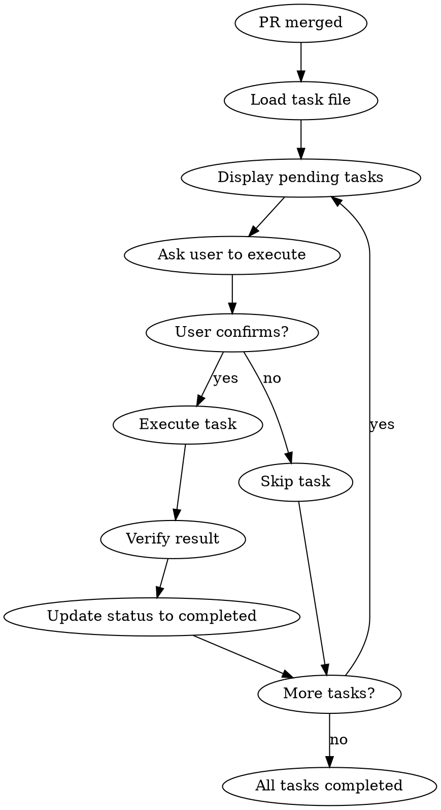

# Post-Merge Execute

## Overview

マージ後に実行すべきタスクを体系的に管理し、確実に実行する。

**Core principle:** マージして終わりにしない。タスクは必ず完了させる。

## The Iron Law

```
NO MERGE WITHOUT POST-MERGE TASKS
NO TASK WITHOUT COMPLETION TRACKING
NO COMPLETION WITHOUT VERIFICATION
```

## When to Use

- PRマージ直後
- post-mergeフックで自動トリガー
- マージ後タスクの手動実行時
- タスクステータスの確認時

## The Process



---

## 1. タスクファイルの検索

### 目的
マージされたブランチに関連するpost-mergeタスクファイルを見つける。

### 検索パターン

```bash
# タスクファイルの検索
docs/post-merge-tasks/YYYY-MM-DD-*.md
```

### 検索基準

| 条件 | 優先度 |
|------|--------|
| 最新日付のタスク | 高 |
| Status: pending | 高 |
| 現在のブランチ名と一致 | 中 |

### 実装例

```bash
# 最新のpendingタスクを検索
find docs/post-merge-tasks/ -name "*.md" -type f | \
  sort -r | \
  head -1
```

---

## 2. タスクの読み込みと解析

### 目的
タスクファイルを解析し、実行すべきタスクを抽出する。

### タスクフォーマット

```markdown
## Tasks

### 1. タスク名
- Status: pending / completed
- Description: タスクの説明
- Command:
  ```bash
  実行するコマンド
  ```
- Verification:
  - [ ] 確認項目1
  - [ ] 確認項目2
```

### 解析ロジック

1. ファイルを読み込み
2. `Status: pending` のタスクを抽出
3. タスク順に番号を付与
4. 各タスクの詳細情報を取得

---

## 3. タスク一覧の表示

### 目的
ユーザーに未完了タスクを明確に提示する。

### 表示形式

```
┌─────────────────────────────────────────────────────────┐
│  Post-Merge Tasks                                       │
│  File: docs/post-merge-tasks/2026-02-15-feature-x.md    │
├─────────────────────────────────────────────────────────┤
│                                                         │
│  [ ] 1. デプロイ実行                                     │
│      Description: staging環境へのデプロイ               │
│      Command: npm run deploy:staging                    │
│                                                         │
│  [ ] 2. 環境変数設定                                     │
│      Description: 新規環境変数を.envに追加              │
│      Command: (manual)                                  │
│                                                         │
│  [ ] 3. ドキュメント更新                                 │
│      Description: README.mdに新機能を追記               │
│      Command: (manual)                                  │
│                                                         │
│  Total: 3 tasks pending                                 │
│                                                         │
└─────────────────────────────────────────────────────────┘
```

---

## 4. タスクの順次実行

### 目的
各タスクを確認しながら順次実行する。

### 実行フロー

#### Step 1: タスク確認
```
Task: デプロイ実行
Description: staging環境へのデプロイ
Command: npm run deploy:staging

Verification:
- [ ] デプロイが正常に完了
- [ ] 環境でアプリケーションが起動
- [ ] ヘルスチェックがPass

Proceed with this task? (yes/no/skip)
```

#### Step 2: ユーザー確認（AskUserQuestion）

```
AskUserQuestion:
  question: |
    Task 1/3: デプロイ実行

    Description: staging環境へのデプロイ
    Command: npm run deploy:staging

    実行しますか？
  options:
    - "yes - 実行する"
    - "no - スキップする"
    - "quit - 中断する"
```

#### Step 3: コマンド実行

```bash
# yes の場合
npm run deploy:staging

# 結果を記録
echo "Exit code: $?"
```

#### Step 4: 検証確認

```
AskUserQuestion:
  question: |
    Verification checklist:
    - [ ] デプロイが正常に完了
    - [ ] 環境でアプリケーションが起動
    - [ ] ヘルスチェックがPass

    すべての確認項目をクリアしましたか？
  options:
    - "yes - 完了"
    - "no - 失敗（タスクをpendingのまま）"
```

#### Step 5: ステータス更新

```markdown
### 1. デプロイ実行
- Status: completed  # pending → completed
- Completed at: 2026-02-15 14:30
- Description: staging環境へのデプロイ
- Command:
  ```bash
  npm run deploy:staging
  ```
- Verification:
  - [x] デプロイが正常に完了
  - [x] 環境でアプリケーションが起動
  - [x] ヘルスチェックがPass
```

---

## 5. ファイル更新

### 目的
タスクの完了状態をファイルに永続化する。

### 更新パターン

#### Pattern 1: 個別タスク完了

```markdown
# 変更前
- Status: pending

# 変更後
- Status: completed
- Completed at: 2026-02-15 14:30
```

#### Pattern 2: すべてのタスク完了

```markdown
# 変更前
Status: pending

# 変更後
Status: completed
Completed at: 2026-02-15 15:00
```

#### Pattern 3: チェックリスト更新

```markdown
# 変更前
- [ ] 確認項目1

# 変更後
- [x] 確認項目1
```

---

## 6. 実行ログ記録

### 目的
タスク実行履歴を記録し、トレーサビリティを確保する。

### ログ形式

```markdown
## Execution Log

### 2026-02-15 14:30:00
- Task: デプロイ実行
- Status: completed
- Command: npm run deploy:staging
- Exit code: 0
- Duration: 45s
- Executor: claude-opus-4

### 2026-02-15 14:35:00
- Task: 環境変数設定
- Status: completed
- Command: (manual)
- Executor: claude-opus-4
```

### ログ配置

```
docs/post-merge-tasks/logs/
  2026-02-15-feature-x.log
```

---

## 7. 完了レポート

### 目的
すべてのタスク完了時に実行結果を報告する。

### レポートテンプレート

```markdown
# Post-Merge Tasks Completion Report

## Summary
- File: docs/post-merge-tasks/2026-02-15-feature-x.md
- Total tasks: 3
- Completed: 3
- Skipped: 0
- Failed: 0
- Started at: 2026-02-15 14:25
- Completed at: 2026-02-15 15:00
- Duration: 35 minutes

## Tasks Executed

### 1. デプロイ実行
- Status: completed
- Completed at: 2026-02-15 14:30
- Duration: 45s

### 2. 環境変数設定
- Status: completed
- Completed at: 2026-02-15 14:35
- Duration: manual

### 3. ドキュメント更新
- Status: completed
- Completed at: 2026-02-15 15:00
- Duration: manual

## Verification

All verification checklists completed:
- [x] デプロイ確認
- [x] 環境変数確認
- [x] ドキュメント確認

## Next Steps

- Monitor staging environment
- Notify team of deployment
- Schedule production deployment
```

---

## エラーハンドリング

### タスクファイルが見つからない

```
Error: No post-merge task file found

Checked locations:
- docs/post-merge-tasks/*.md

Possible reasons:
1. post-mergeフックが実行されなかった
2. タスクファイルが別の場所にある
3. このマージにはpost-mergeタスクがない

Action: 手動でタスクファイルを確認してください
```

### コマンド実行失敗

```
Error: Command failed with exit code 1

Task: デプロイ実行
Command: npm run deploy:staging
Exit code: 1
Output: [エラーメッセージ]

Action:
1. エラーを確認
2. 問題を修正
3. タスクを再実行

タスクステータスは pending のまま維持されます
```

### 検証失敗

```
Warning: Verification failed

Task: デプロイ実行
Unchecked items:
- [ ] ヘルスチェックがPass

タスクステータスを completed にしますか？
- yes: 完了とマーク（後で再確認）
- no: pending のまま
- retry: コマンドを再実行
```

---

## Best Practices

### 1. タスクは段階的に実行

```
❌ Bad:
すべてのタスクを一度に実行

✓ Good:
1タスクずつ確認しながら実行
各タスクの結果を検証してから次へ
```

### 2. 自動と手動を区別

```markdown
# 自動実行可能
- Command: npm run deploy:staging

# 手動実行必要
- Command: (manual)
- Description: 詳細な手順を記載
```

### 3. 検証を必須に

```markdown
# タスクには必ず検証項目を含める
- Verification:
  - [ ] 確認項目1
  - [ ] 確認項目2
```

### 4. ログを必ず記録

```
すべてのタスク実行は必ず記録する:
- 実行時刻
- 実行コマンド
- 結果（成功/失敗）
- Exit code
```

---

## Completion Criteria

- [ ] タスクファイルを正常に読み込めた
- [ ] すべてのpendingタスクが表示された
- [ ] 各タスクを順次実行した
- [ ] 実行結果を検証した
- [ ] タスクステータスを更新した
- [ ] 実行ログを記録した
- [ ] 完了レポートを作成した

---

## 実装ガイドライン

### サブエージェント使用推奨

```
Task(subagent_type="fractal-dev-workflow:coder", model="sonnet"):
  ## post-merge-executeスキル実行スクリプト作成

  ### 要件
  1. タスクファイル検索
  2. タスク解析
  3. 順次実行（AskUserQuestion使用）
  4. ステータス更新
  5. ログ記録

  ### 出力
  - scripts/post-merge-execute.sh
  - tests/post-merge-execute.test.sh
```

### インタラクティブモード

```bash
# ユーザー確認を含む実行
./scripts/post-merge-execute.sh --interactive

# 自動実行（確認なし、自動実行可能なタスクのみ）
./scripts/post-merge-execute.sh --auto

# ドライラン（実行せず表示のみ）
./scripts/post-merge-execute.sh --dry-run
```

---

## Integration

このスキルは以下と連携:

- `post-merge-create`: タスクファイル作成
- `context-circulation`: マージ後のコンテキスト共有
- `completion`: リリース後の完了確認

---

## Common Patterns

### Pattern 1: デプロイタスク

```markdown
### デプロイ実行
- Status: pending
- Description: staging環境へのデプロイ
- Command:
  ```bash
  npm run deploy:staging
  ```
- Verification:
  - [ ] デプロイが正常に完了
  - [ ] アプリケーションが起動
  - [ ] ヘルスチェックPass
```

### Pattern 2: 設定変更タスク

```markdown
### 環境変数追加
- Status: pending
- Description: 新規環境変数を追加
- Command: (manual)
- Steps:
  1. .env.exampleを参照
  2. 必要な環境変数を.envに追加
  3. アプリケーションを再起動
- Verification:
  - [ ] 環境変数が設定されている
  - [ ] アプリケーションが正常起動
```

### Pattern 3: ドキュメント更新タスク

```markdown
### README更新
- Status: pending
- Description: 新機能をREADME.mdに追記
- Command: (manual)
- Sections:
  - ## 機能
  - ## 使い方
  - ## API
- Verification:
  - [ ] 新機能セクションを追加
  - [ ] サンプルコードを追加
  - [ ] 目次を更新
```

---

## Red Flags

| Thought | Reality |
|---------|---------|
| "マージしたから終わり" | post-mergeタスクが残っている |
| "後でやる" | 後でやるタスクは忘れられる |
| "自動化できるはず" | 手動確認が必要なタスクもある |
| "検証は不要" | 検証なしは失敗に気づけない |
| "ログは面倒" | ログがないと追跡不可能 |

---

## Related Skills

- `post-merge-create` - タスクファイル作成
- `verification` - 検証プロセス
- `completion` - 完了確認
- `context-circulation` - コンテキスト共有
