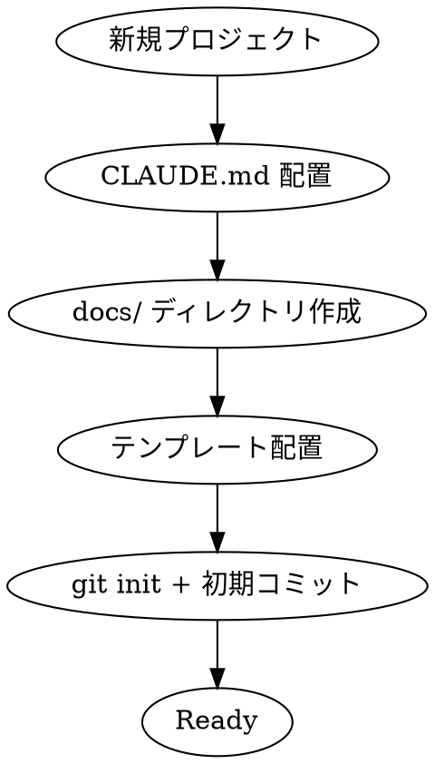

# Project Setup（プロジェクト初期化）

## Overview

新規プロジェクト開始時に、AIの「ゆらぎ」を殺すための**プロジェクト憲法**とテンプレートを配置する。

**Core principle:**
- ファイルシステムを唯一の真実（Single Source of Truth）とする
- AIは「執行者」として動き、仕様をねじ曲げない
- ユーザーは「指揮官」として指示を出し、成果物を監査する

## The Iron Law

```
NO IMPLEMENTATION WITHOUT PROJECT RULES
NO DESIGN WITHOUT TEMPLATES
FILE SYSTEM IS THE ONLY SOURCE OF TRUTH
```

## Setup Process



---

## Step 1: CLAUDE.md（プロジェクト憲法）

プロジェクトルートに `CLAUDE.md` を配置。テンプレートを参照：

```
.claude/templates/project_rules.md
```

### 必須項目

| セクション | 内容 |
|-----------|------|
| 基本原則 | ドキュメントファースト、TDD、YAGNI |
| 技術スタック | 言語、フレームワーク、禁止事項 |
| 禁止事項 | any型、console.log残留、勝手な仕様変更 |
| コミュニケーション | 挨拶不要、結論から述べる |

### テンプレート使用方法

```bash
# テンプレートをコピーしてカスタマイズ
cp ~/.claude/plugins/cache/fractal-marketplace/fractal-dev-workflow/*/templates/project_rules.md ./CLAUDE.md

# プロジェクト固有の設定を編集
# - 技術スタック
# - 禁止事項
# - コミュニケーションルール
```

---

## Step 2: docs/ ディレクトリ構造

```
docs/
├── prd.md           # 要件定義書（Architect が作成）
├── tasks.md         # タスクリスト（TechLead が作成）
├── api_spec.yaml    # API仕様（OpenAPI形式）
├── schema.prisma    # DBスキーマ（Prisma形式）
└── adr/             # Architecture Decision Records
    └── 0001-*.md    # 重要な意思決定ログ
```

### テンプレート配置

```bash
# 要件定義書テンプレート
cp ~/.claude/plugins/cache/fractal-marketplace/fractal-dev-workflow/*/templates/prd.md ./docs/prd.md

# タスクリストテンプレート
cp ~/.claude/plugins/cache/fractal-marketplace/fractal-dev-workflow/*/templates/tasks.md ./docs/tasks.md

# ADRディレクトリ
mkdir -p docs/adr
```

---

## Step 3: 初期コミット

```bash
git init
git add CLAUDE.md docs/
git commit -m "chore: プロジェクト初期化（憲法 + テンプレート）

- CLAUDE.md: プロジェクト憲法
- docs/prd.md: 要件定義書テンプレート
- docs/tasks.md: タスクリストテンプレート

Co-Authored-By: Claude Opus 4.6 <noreply@anthropic.com>"
```

---

## テンプレート一覧

### project_rules.md（プロジェクト憲法）

AIの「ゆらぎ」を殺す絶対ルール：

```markdown
# Project Rules (Absolute Law)

## 1. 基本原則
- **ドキュメントファースト:** 実装前に docs/ 内の仕様書を更新
- **TDD:** テストを先に書き、失敗を確認してから実装
- **YAGNI:** 「将来のために」は禁止

## 2. 技術スタック
- Language: [言語]
- Framework: [フレームワーク]
- Prohibited: [禁止事項]

## 3. コミュニケーション
- 挨拶不要。結論から述べる
- 修正提案時は理由を論理的に説明
```

### prd.md（要件定義書）

Architect が記入するテンプレート：

```markdown
# [プロジェクト名] 要件定義書

## 1. 目的
[このプロジェクトが解決する問題]

## 2. 成功条件（KPI）
- [ ] [測定可能な条件 1]
- [ ] [測定可能な条件 2]

## 3. スコープ
### やること（MVP）
- [ ] [機能1]

### やらないこと
- [ ] [機能A] - 理由: Phase 2

## 4. 受け入れ条件
- [ ] Given [前提] When [アクション] Then [結果]
```

### tasks.md（タスクリスト）

TechLead が記入するテンプレート：

```markdown
# タスクリスト: [機能名]

## 依存グラフ
Task 1 ──┬──▶ Task 3
         │
Task 2 ──┘

## タスク一覧
### [ ] Task 1: [説明]
- **担当**: Coder
- **依存**: なし
- **完了条件**:
  - [ ] テストが書かれている
  - [ ] テストがパスしている
```

---

## Completion Criteria

- [ ] CLAUDE.md がプロジェクトルートに配置
- [ ] docs/ ディレクトリが作成
- [ ] prd.md テンプレートが配置
- [ ] tasks.md テンプレートが配置
- [ ] 初期コミットが完了

---

## Related Skills

- `dev-workflow` - 開発ワークフロー全体
- `requirements` - Phase 1 要件定義
- `user-guide` - ユーザー向けガイド
