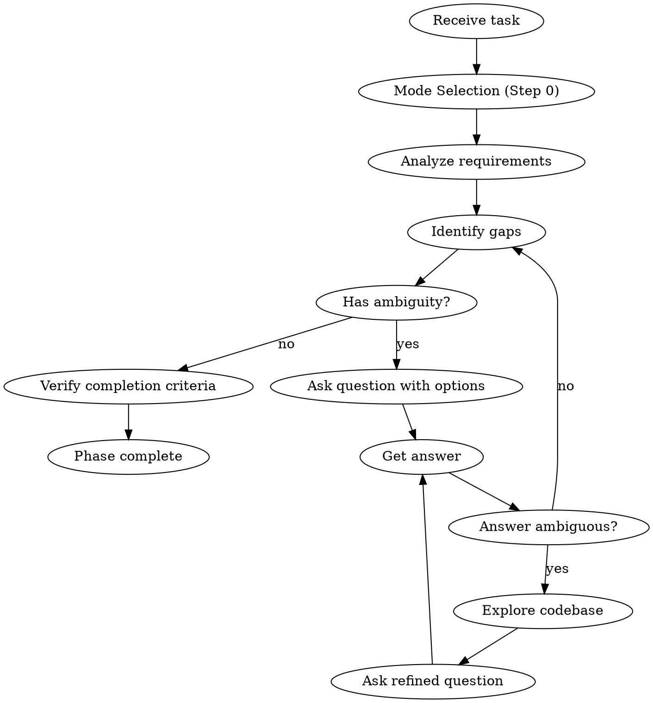

# Questioning Phase

## Overview

調査に入る前に、全ての要件を明確にする。曖昧さは実装の手戻りにつながる。

**Core principle:** NEVER investigate without thorough requirements first.

## The Iron Law

```
NO INVESTIGATION WITHOUT THOROUGH REQUIREMENTS FIRST
```

曖昧さを残したまま次のフェーズに進んではならない。

## The Process



### Step 0: Mode Selection Question (FIRST)

**注意:** workflow stateに既に `mode` が設定されている場合は、このステップをスキップする。

タスクを受けたら、最初にモード判定を行う:

```
AskUserQuestion:
  question: "このタスクは新規作成と既存修正のどちらですか？"
  header: "モード選択"
  options:
    - label: "新規作成（新しい機能/ページ/API）"
      description: "ゼロから設計。HTMLモック、完全なAPI仕様が必要"
    - label: "既存修正（バグ修正/改善/リファクタリング）"
      description: "既存コード調査重視。影響範囲分析が必要"
```

#### モード保存
回答を workflow state の `mode` フィールドに保存:
- "新規作成" → `mode: "new-creation"`
- "既存修正" → `mode: "existing-modification"`

#### モード別の質問観点

**new-creation モードの重点:**
- UI/UX要件（デザインモック、ワイヤーフレーム）
- 技術選択（フレームワーク、ライブラリ、API設計）
- アーキテクチャ（ディレクトリ構造、命名規則、状態管理）
- データモデル（スキーマ定義、バリデーション）

**existing-modification モードの重点:**
- 影響範囲（変更するファイル、依存関係）
- 互換性（既存APIとの互換性維持）
- 既存テスト（修正によるテスト破壊の有無）
- 既存パターン（コードベースの命名・スタイル規則への準拠）

### Step 1: Requirements Analysis
From user's task description, identify:
- Clearly defined requirements
- Ambiguous or missing information
- Implicit assumptions

### Step 2: Question Execution
- Ask **one question at a time** using AskUserQuestion
- Always provide **2-4 specific options**
- Include impact description for each option
- "Other" is auto-added, don't include it

### Step 3: Handle Ambiguous Answers
When user's answer is unclear:
1. Use fractal-dev-workflow:investigator subagent to investigate codebase
2. Present concrete information from investigation
3. Re-ask with more specific options

## Question Best Practices

### Good Questions
```
AskUserQuestion:
  question: "認証方式はどちらを使用しますか？"
  options:
    - label: "JWT"
      description: "ステートレス、スケーラブル。トークン失効の管理が必要"
    - label: "セッションベース"
      description: "シンプル、サーバーサイド管理。スケーリング時にセッション共有が必要"
    - label: "OAuth 2.0"
      description: "外部プロバイダー連携。実装複雑度が高い"
```

### Bad Questions
- "どうしますか？" → No options
- "全部入りにしますか？" → Yes/No binary
- "わかりましたか？" → Confirmation, not question

## Completion Criteria

All must be satisfied before proceeding:
- [ ] Feature scope is clear
- [ ] Technical constraints identified
- [ ] Impact on existing code understood
- [ ] Success criteria defined
- [ ] Edge cases identified

## Red Flags

| Thought | Reality |
|---------|---------|
| "I mostly understand" | Ambiguity causes rework |
| "Can ask later" | Later questions cost more context |
| "Standard approach, no need to ask" | User's "standard" may differ |
| "Code will tell me" | User intent isn't in the code |
| "Too many questions" | Precise requirements are most efficient |
