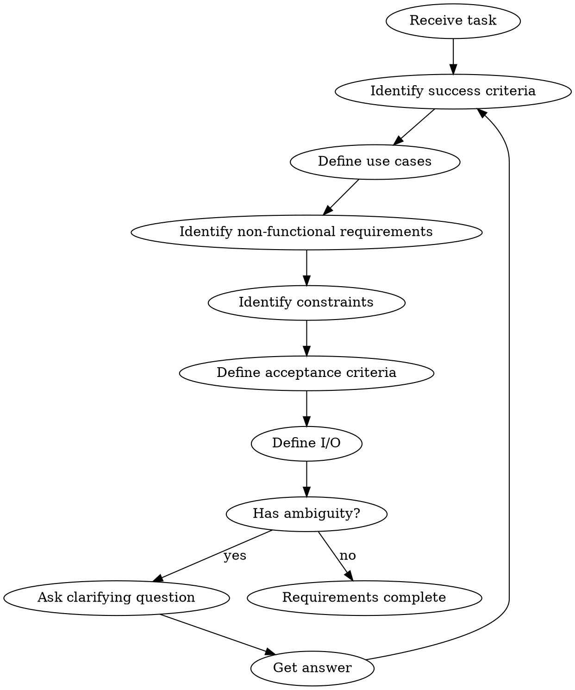

# Requirements Phase

## Overview

実装に入る前に「何を作るか」と「**何をやらないか**」を完全に明確にする。
**ここが曖昧だと、後工程が全部"宗教戦争"になる。**

**Core principle:**
- 曖昧なまま進まない
- 全ての「なぜ」に答えられる状態にする
- **やることを減らす（最重要）**

## Step 0: 質問フェーズ（最初に実行）

要件定義の各ステップに入る前に、**`questioning` スキルに従って曖昧さを排除する。**

```
questioning スキルの流れ:
1. タスク説明から曖昧な点を特定
2. AskUserQuestion で 2-4 個のオプションを提示
3. 回答が曖昧なら Explore エージェントで調査してから再質問
4. 全ての曖昧さが解消されたら Step 1 へ
```

**必須:** 以下のいずれかに該当する場合、必ず質問する
- MVP境界が不明確
- 技術選択に複数の選択肢がある
- 非機能要件（性能、セキュリティ）が未定義
- 既存コードとの互換性要件が不明

→ `questioning` スキル参照

## The Iron Law

```
NO INVESTIGATION WITHOUT CLEAR REQUIREMENTS FIRST
NO "WHAT" WITHOUT "WHY"
DEFINE WHAT YOU WON'T DO (MVP BOUNDARY)
```

## Phase 0 思考: そもそもやることを減らす

```markdown
## スコープ削減チェックリスト

### MVP境界
- **やること（必須）**
  - [ ] [機能1] - 理由: 売上直結
  - [ ] [機能2] - 理由: ユーザー要望

- **やらないこと（除外）**
  - [ ] [機能A] - 理由: Phase 2で対応
  - [ ] [機能B] - 理由: ユーザー要望なし
  - [ ] [機能C] - 理由: 代替手段あり

### 成功条件（KPI）
- [ ] [測定可能な条件 1] - 現状: X → 目標: Y
- [ ] [測定可能な条件 2] - 現状: X → 目標: Y
```

## The Process



---

## Step 1: 成功条件 (KPI)

### 質問すべきこと
- この変更で何が改善されるか？
- 成功をどう測定するか？
- 数値化できる目標はあるか？

### 例
```markdown
### 成功条件
- [ ] 名刺スキャンから関係者登録までの時間が50%短縮
- [ ] 手動入力エラーが80%減少
- [ ] 3アプリで同一のUIが提供される
```

### AskUserQuestion の使い方
```
AskUserQuestion:
  question: "この機能の成功をどう測定しますか？"
  options:
    - label: "時間短縮"
      description: "作業時間の削減率で測定"
    - label: "エラー削減"
      description: "エラー発生率の減少で測定"
    - label: "ユーザー満足度"
      description: "フィードバック/NPS で測定"
    - label: "コスト削減"
      description: "運用コストの削減額で測定"
```

---

## Step 2: ユースケース

### 必須項目
| 項目 | 説明 |
|------|------|
| アクター | 誰が |
| アクション | 何をする |
| 目的 | なぜ |
| 前提条件 | いつ・どんな状態で |
| 事後条件 | 結果どうなる |

### テンプレート
```markdown
### ユースケース

| # | アクター | アクション | 目的 |
|---|---------|----------|------|
| UC1 | 営業担当 | 名刺をスキャンする | 関係者情報を登録するため |
| UC2 | 営業担当 | 重複チェック結果を確認する | 二重登録を防ぐため |
| UC3 | 管理者 | 関係者一覧を確認する | 営業活動を把握するため |

#### UC1 詳細
- 前提条件: ログイン済み、関係機関が選択済み
- 基本フロー:
  1. 名刺画像をアップロード
  2. OCR結果を確認・編集
  3. 保存ボタンを押す
- 代替フロー:
  - 2a. OCR失敗時、手動入力に切り替え
- 事後条件: 関係者が登録され、名刺画像が保存される
```

---

## Step 3: 非機能要件

### チェックリスト

| カテゴリ | 質問 | 例 |
|---------|------|-----|
| **性能** | 許容レスポンス時間は？ | OCR: 5秒以内 |
| | 同時ユーザー数は？ | 100人 |
| | データ量は？ | 月10万件 |
| **セキュリティ** | 認証方式は？ | 既存の認証を使用 |
| | 機密データはあるか？ | 名刺画像は署名付きURL |
| | 監査ログは必要か？ | 登録・編集・削除を記録 |
| **可用性** | 許容ダウンタイムは？ | 月30分以内 |
| | バックアップ頻度は？ | 日次 |
| **運用性** | 監視項目は？ | エラー率、レスポンス時間 |
| | アラート条件は？ | エラー率5%超で通知 |

### テンプレート
```markdown
### 非機能要件

| 種別 | 要件 | 備考 |
|------|------|------|
| 性能 | レスポンス: 3秒以内 | OCRを含む |
| 性能 | 同時処理: 10リクエスト/秒 | ピーク時 |
| セキュリティ | 名刺画像は署名付きURL | 有効期限1時間 |
| セキュリティ | 他社データアクセス不可 | companyId分離 |
| 可用性 | 99.5% SLA | 計画メンテ除く |
| 運用性 | エラーログに追跡ID | トレース用 |
```

---

## Step 4: 制約

### チェックリスト

| カテゴリ | 質問 |
|---------|------|
| **技術** | 使用可能な言語/フレームワークは？ |
| | 既存システムとの互換性要件は？ |
| | 外部サービスの制限は？ |
| **期限** | いつまでに完了？ |
| | 段階的リリースは可能？ |
| **既存資産** | 再利用すべきコードはあるか？ |
| | 置き換えるべきコードはあるか？ |
| **規制** | 法規制の要件は？（GDPR等） |
| | 社内ポリシーの制約は？ |

### テンプレート
```markdown
### 制約

#### 技術制約
- TypeScript + Next.js（既存スタック）
- Prisma ORM
- Vertex AI（OCR用）

#### 期限制約
- 2週間以内にリリース
- Phase 1: コア機能、Phase 2: 追加機能

#### 既存資産
- @fractal/action-utils の共通ロジックを使用
- @fractal/ui の共通コンポーネントを使用

#### 規制
- 個人情報保護法に準拠
- 名刺画像は90日で自動削除
```

---

## Step 5: 受け入れ条件 (Acceptance Criteria)

### Given/When/Then 形式（推奨）

```gherkin
Scenario: 名刺から関係者を登録
  Given ユーザーがログイン済みで
  And 関係機関が選択されている
  When 名刺画像をアップロードする
  Then OCR結果が5秒以内に表示される
  And 抽出された情報を編集できる
  And 保存すると関係者が登録される
```

### SMART原則
- **S**pecific: 具体的
- **M**easurable: 測定可能
- **A**chievable: 達成可能
- **R**elevant: 関連性がある
- **T**ime-bound: 期限がある

### テンプレート
```markdown
### 受け入れ条件

#### 機能要件（Given/When/Then）
- [ ] Given ログイン済み When 名刺アップロード Then OCR結果表示（5秒以内）
- [ ] Given OCR結果表示 When 編集して保存 Then 関係者登録
- [ ] Given 同名の関係者存在 When 登録 Then 重複警告表示

#### 非機能要件
- [ ] OCRレスポンスが5秒以内
- [ ] 同時10リクエストを処理できる
- [ ] 名刺画像は署名付きURLでアクセス

#### 除外事項（スコープ外）★重要
- PDF対応は Phase 2
- バッチインポートは Phase 2
- 名刺の自動削除機能は対象外
```

---

## Step 6: I/O定義（最低限）

### 画面の場合
```markdown
### 画面I/O: 名刺スキャン

#### 入力
| 項目 | 型 | 必須 | 備考 |
|------|-----|------|------|
| 画像ファイル | File | Yes | JPG/PNG, 10MB以下 |
| 表裏指定 | enum | Yes | front/back |

#### 出力
| 項目 | 型 | 備考 |
|------|-----|------|
| 抽出結果 | Object | 氏名、会社名、電話等 |
| 信頼度 | number | 0-1 |
| エラー | string? | OCR失敗時 |
```

### APIの場合
```markdown
### API I/O: POST /api/contacts/scan

#### Request
```json
{
  "frontImageUrl": "string (required)",
  "backImageUrl": "string (optional)",
  "organizationId": "string (required)"
}
```

#### Response (200)
```json
{
  "contact": {
    "familyName": "string",
    "givenName": "string",
    "email": "string",
    ...
  },
  "duplicates": [
    { "id": "string", "name": "string", "similarity": 0.9 }
  ]
}
```

#### Error (400/500)
```json
{
  "error": "string",
  "code": "OCR_FAILED | INVALID_IMAGE | ..."
}
```
```

---

## 成果物テンプレート

```markdown
# 要件定義: [タスク名]

## 成功条件
- [ ] [KPI 1]
- [ ] [KPI 2]

## ユースケース
| # | アクター | アクション | 目的 |
|---|---------|----------|------|
| UC1 | ... | ... | ... |

## 非機能要件
| 種別 | 要件 | 備考 |
|------|------|------|
| ... | ... | ... |

## 制約
- [技術制約]
- [期限制約]
- [既存資産]

## 受け入れ条件
### 機能要件
- [ ] [AC 1]
- [ ] [AC 2]

### 非機能要件
- [ ] [AC N1]

### 除外事項
- [スコープ外 1]

## I/O定義
[画面/APIの入出力]
```

---

## Completion Criteria

All must be satisfied before proceeding:
- [ ] 成功条件（KPI）が明確
- [ ] ユースケースが網羅
- [ ] 非機能要件が特定
- [ ] 制約が把握
- [ ] 受け入れ条件が SMART
- [ ] I/O定義が完了
- [ ] **曖昧さが残っていない**

---

## Red Flags

| Thought | Reality |
|---------|---------|
| "要件はだいたいわかった" | "だいたい"は手戻りの元 |
| "後で聞ける" | 後の質問はコストが高い |
| "コードを見ればわかる" | ユーザーの意図はコードにない |
| "標準的な実装で" | ユーザーの"標準"は異なる |
| "非機能要件は後で" | 後から追加は設計変更を伴う |
