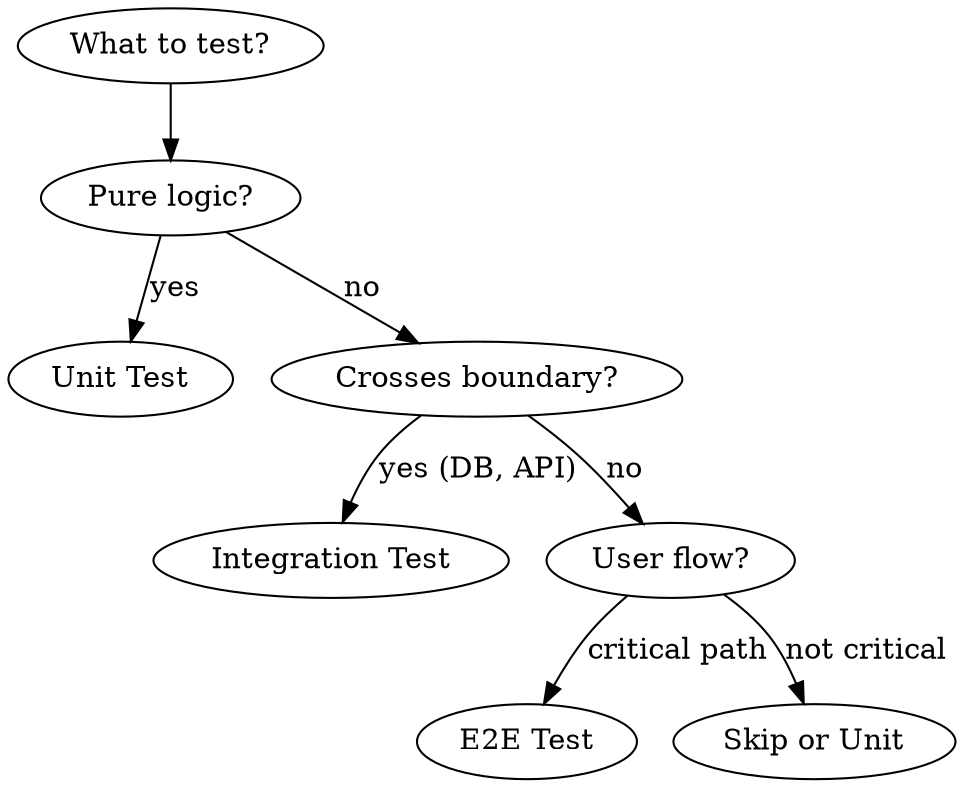
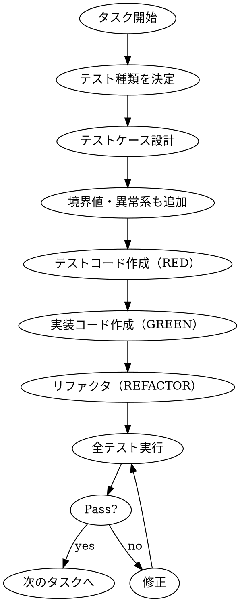

# Testing Phase

## Overview

効果的なテストを作成するための体系的なプロセス。テスト種類の優先順位を理解し、適切なテストを適切な量で作成する。

**Core principle:** Test what matters. More tests ≠ better quality.

## The Iron Law

```
UNIT TESTS FIRST, ALWAYS
E2E TESTS LAST, SPARINGLY
NO IMPLEMENTATION WITHOUT CORRESPONDING TESTS
```

## Test Pyramid

```
        △
       /E\         E2E: 3-10本（主要導線のみ）
      /2E \
     /-----\
    / Integ \      Integration: コンポーネント境界
   /  ration \
  /-----------\
 /    Unit     \   Unit: 最優先・量産枠
/_______________\
```

## Test Type Selection Flow



---

## 1. Unit Test（最優先・量産枠）

### 目的
- ロジックの正しさを証明
- 回帰防止（壊れたらすぐ気づく）

### 対象
- 純粋関数
- ドメインサービス
- バリデーション
- 計算・変換ロジック

### 必須ケース

| カテゴリ | テストケース |
|---------|-------------|
| 正常系 | 代表的な入力で期待出力 |
| 境界値 | 0, 最大値, 空配列, null/undefined |
| 異常系 | 不正入力, 例外スロー |

### 命名規則

```typescript
describe('[対象]', () => {
  describe('[メソッド/シナリオ]', () => {
    it('[条件]のとき[期待結果]', () => {
      // test
    });
  });
});
```

**例:**
```typescript
describe('calculateTax', () => {
  describe('標準税率', () => {
    it('100円の商品に10%の税が加算される', () => {
      expect(calculateTax(100, 0.1)).toBe(110);
    });
  });

  describe('境界値', () => {
    it('0円のとき0円を返す', () => {
      expect(calculateTax(0, 0.1)).toBe(0);
    });
  });

  describe('異常系', () => {
    it('負の金額でエラーをスローする', () => {
      expect(() => calculateTax(-1, 0.1)).toThrow('Invalid amount');
    });
  });
});
```

### ポイント
- DB/ネットワークは**必ずモック**
- 1テスト1アサーション（理想）
- テスト名は**仕様の文章**そのもの

---

## 2. Integration Test（次に重要）

### 目的
- コンポーネント間が"本物同士"で繋がるか検証

### 対象
- API ⇄ DB
- Repository層
- 外部APIラッパー
- 認証認可ミドルウェア

### 必須ケース

| カテゴリ | テストケース |
|---------|-------------|
| CRUD | Create → Read → Update → Delete の一連の流れ |
| トランザクション | 途中失敗時にロールバックするか |
| N+1 | クエリ数が爆発しないか（基本チェック） |
| 権限 | 認証済み/未認証、権限あり/なし |

### セットアップ

```typescript
// テスト用DB（Docker推奨）
beforeAll(async () => {
  await setupTestDatabase();
  await runMigrations();
});

afterEach(async () => {
  await cleanupTestData(); // トランザクションロールバック or truncate
});

afterAll(async () => {
  await teardownTestDatabase();
});
```

### 外部APIのモック戦略

| 戦略 | ツール | 用途 |
|------|--------|------|
| MSW | msw | REST/GraphQL のインターセプト |
| VCR | nock/polly | リクエスト録画・再生 |
| Stub Server | wiremock | 本番に近い挙動 |

**例:**
```typescript
// MSW でモック
const server = setupServer(
  rest.get('https://api.example.com/users/:id', (req, res, ctx) => {
    return res(ctx.json({ id: req.params.id, name: 'Test User' }));
  })
);

beforeAll(() => server.listen());
afterEach(() => server.resetHandlers());
afterAll(() => server.close());
```

---

## 3. E2E Test（少数精鋭）

### 目的
- ユーザー視点で主要導線が動くか確認

### 対象
**「金が動く」「ユーザーが離脱する」導線のみ**

| 優先度 | 導線 |
|--------|------|
| 必須 | ログイン → 主要機能 → 完了 |
| 必須 | 課金フロー（該当する場合） |
| 推奨 | エラー回復フロー |

### 原則
- **3〜10本だけ**（これ以上増やすな）
- スクリーンショットは最小限
- Flaky test は即削除

### セットアップ（Playwright例）

```typescript
import { test, expect } from '@playwright/test';

test.describe('購入フロー', () => {
  test('商品を選択して購入完了まで到達する', async ({ page }) => {
    // Arrange
    await page.goto('/products');

    // Act
    await page.click('[data-testid="product-1"]');
    await page.click('[data-testid="add-to-cart"]');
    await page.click('[data-testid="checkout"]');
    await page.fill('[data-testid="card-number"]', '4242424242424242');
    await page.click('[data-testid="pay"]');

    // Assert
    await expect(page.locator('[data-testid="success-message"]')).toBeVisible();
  });
});
```

### 警告
> ここを増やすとテストがあなたの人生を侵食する

---

## 4. Contract Test（APIの契約保証）

### 目的
- API の「契約」が破られていないか検証

### 対象
- マイクロサービス間
- フロントエンド ⇄ バックエンド

### 実装方法

| 手法 | ツール | 説明 |
|------|--------|------|
| Schema検証 | Zod/Ajv | レスポンス形式の保証 |
| OpenAPI | prism | スキーマベースのテスト |
| CDC | Pact | Consumer-Driven Contract |

**例（Zod）:**
```typescript
const UserSchema = z.object({
  id: z.string(),
  name: z.string(),
  email: z.string().email(),
});

test('GET /users/:id がスキーマに準拠する', async () => {
  const response = await fetch('/users/123');
  const data = await response.json();
  expect(() => UserSchema.parse(data)).not.toThrow();
});
```

---

## 5. 非機能テスト（必要なものだけ）

### 性能テスト

```typescript
test('API応答が200ms以内', async () => {
  const start = performance.now();
  await fetch('/api/heavy-endpoint');
  const duration = performance.now() - start;
  expect(duration).toBeLessThan(200);
});
```

### セキュリティテスト

| 観点 | チェック |
|------|---------|
| 認証 | 未認証でアクセス拒否されるか |
| 認可 | 他ユーザーのリソースにアクセスできないか |
| インジェクション | SQLi/XSS/CSRFの基本防御 |

---

## テスト作成フロー



### Step 1: テスト種類を決定

| 質問 | Yes → |
|------|-------|
| 純粋なロジック？ | Unit Test |
| DB/API境界をまたぐ？ | Integration Test |
| ユーザー導線の主要パス？ | E2E Test |
| API契約の検証？ | Contract Test |

### Step 2: テストケース設計

```markdown
## テストケース設計: [対象]

### Unit Tests
| ケース | 入力 | 期待出力 |
|--------|------|---------|
| 正常系 | ... | ... |
| 境界値（最小） | 0 | ... |
| 境界値（最大） | MAX_INT | ... |
| 異常系 | null | throw Error |

### Integration Tests
| ケース | 前提条件 | アクション | 検証 |
|--------|---------|----------|------|
| CRUD | DB空 | Create→Read | データ一致 |

### E2E Tests (if applicable)
| 導線 | 開始 | 終了 | 検証 |
|------|------|------|------|
| 購入 | 商品ページ | 完了画面 | 成功メッセージ |
```

### Step 3: TDD サイクル実行

1. **RED**: 失敗するテストを書く
2. **GREEN**: テストを通す最小限のコード
3. **REFACTOR**: コードを綺麗に

---

## モック戦略一覧

| 依存 | モック方法 | ライブラリ |
|------|-----------|-----------|
| DB | In-memory DB or Transaction rollback | Prisma mock / SQLite |
| REST API | Request interceptor | MSW |
| 時間 | 時計のモック | vi.useFakeTimers() |
| ランダム | シード固定 | Math.random mock |
| ファイルシステム | メモリFS | memfs |
| 外部サービス | Stub server | WireMock |

---

## 完了条件

- [ ] 各実装ファイルに対応するテストファイルが存在
- [ ] Unit Test で正常系・境界値・異常系がカバー
- [ ] Integration Test で DB/API 境界をカバー
- [ ] 主要導線に E2E Test（3-10本以内）
- [ ] **全テスト Pass**
- [ ] カバレッジ目標達成（設定があれば）

---

## Anti-patterns

| やりがち | なぜダメか | 代わりに |
|---------|----------|---------|
| E2E を大量に書く | 遅い・Flaky・メンテ地獄 | Unit/Integration を増やす |
| 実装の内部構造をテスト | リファクタで壊れる | 外部から見た振る舞いをテスト |
| モックだらけのテスト | 本番で動く保証がない | 適切な Integration Test |
| コメントアウトされたテスト | 意味がない | 削除する |
| `test.skip` の放置 | 技術的負債 | 直すか削除 |
