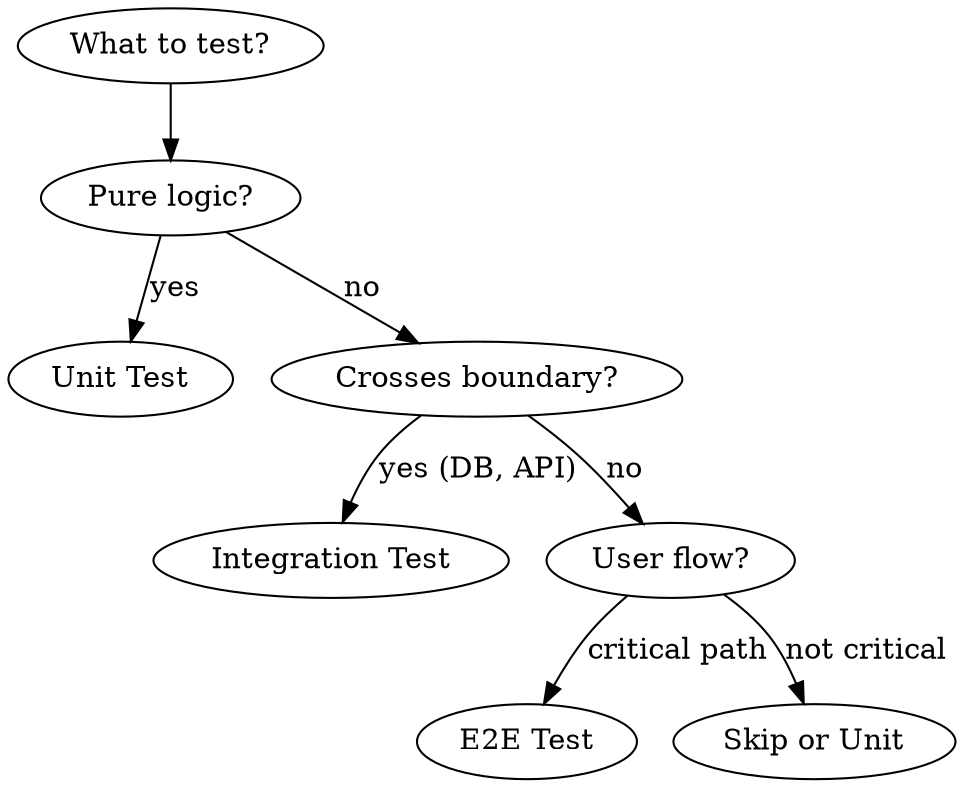
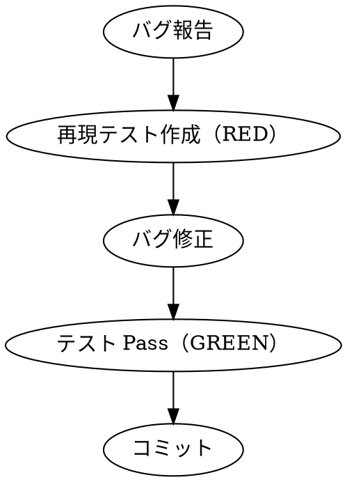
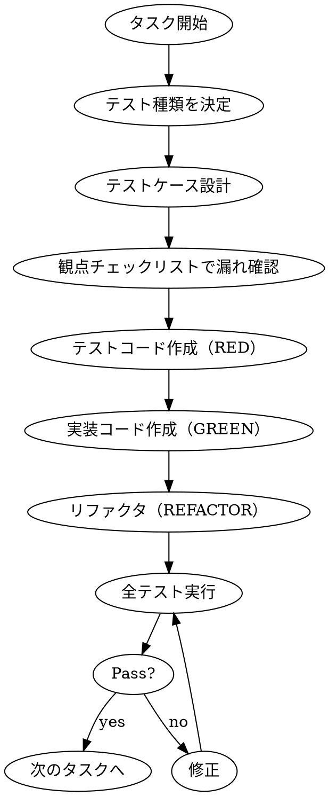

# Testing Phase

## Overview

効果的なテストを作成するための体系的なプロセス。
**テスト作成の優先順位はROI順。多ければ良いわけではない。**

**Core principle:** Test what matters. More tests ≠ better quality.

## The Iron Law

```
UNIT TESTS FIRST, ALWAYS
E2E TESTS LAST, SPARINGLY
NO IMPLEMENTATION WITHOUT CORRESPONDING TESTS
BUG FOUND → WRITE REGRESSION TEST → THEN FIX
```

## テスト作成の優先順位（ROI順）

```
優先度    種類              対象
───────────────────────────────────────────
  1      Unit            ドメインロジック、計算、バリデーション
  2      Integration     DB/外部API連携、Repository
  3      API Test        主要エンドポイント、認証認可
  4      Contract        フロント⇄バック、サービス間（分業時必須）
  5      E2E             主フローのSmokeのみ（3-10本）
  6      非機能          負荷、セキュリティ（要件時）
```

## Test Pyramid

```
          △
         /E\           E2E: 3-10本（主要導線のみ）
        /2E \          ─ 遅い・Flakyなので最小限
       /-----\
      / API + \        API/Contract: 主要エンドポイント
     / Contract\       ─ E2Eより軽く、Unitより現実的
    /-----------\
   / Integration \     Integration: DB/外部I/F
  /    (本物)     \    ─ "ここが動けば本番も動く確率高い"
 /-----------------\
/      Unit         \  Unit: 最優先・量産枠
/_____________________\ ─ 速い・壊れにくい・ドメイン中心
```

## Test Type Selection Flow



---

## 1. Unit Test（最優先・量産枠）

### 目的
- ロジックの正しさを証明
- 回帰防止（壊れたらすぐ気づく）
- **外部（DB/HTTP）に触れない** → 速い・安定

### 対象
| 対象 | 例 |
|------|-----|
| 純粋関数 | calculateTax, formatDate |
| ドメインルール | 状態遷移（注文が「支払い済み→発送済み」へ進める条件） |
| バリデーション | メールアドレス形式、必須チェック |
| 計算・変換 | 金額計算、単位変換 |
| 例外系 | 境界値、Null、空、最大長、重複、禁止状態 |

### 必須ケース

| カテゴリ | テストケース |
|---------|-------------|
| 正常系 | 代表的な入力で期待出力 |
| 境界値 | 0, 最大値, 空配列, null/undefined |
| 異常系 | 不正入力, 例外スロー |
| 状態遷移 | 許可/禁止される遷移 |

### モックの原則
- **モックは依存境界だけ**
- モック地獄 = 設計が悪いサイン
- DB/ネットワークは必ずモック

### 命名規則

```typescript
describe('[対象]', () => {
  describe('[メソッド/シナリオ]', () => {
    it('[条件]のとき[期待結果]', () => {
      // test
    });
  });
});
```

**例:**
```typescript
describe('calculateTax', () => {
  describe('標準税率', () => {
    it('100円の商品に10%の税が加算される', () => {
      expect(calculateTax(100, 0.1)).toBe(110);
    });
  });

  describe('境界値', () => {
    it('0円のとき0円を返す', () => {
      expect(calculateTax(0, 0.1)).toBe(0);
    });
  });

  describe('異常系', () => {
    it('負の金額でエラーをスローする', () => {
      expect(() => calculateTax(-1, 0.1)).toThrow('Invalid amount');
    });
  });
});
```

### ポイント
- DB/ネットワークは**必ずモック**
- 1テスト1アサーション（理想）
- テスト名は**仕様の文章**そのもの

---

## 2. Integration Test（"本物"を使って確かめる）

### 目的
- コンポーネント間が"本物同士"で繋がるか検証
- **"ここが動けば本番も動く確率が高い"を作る**

### 対象
| 対象 | テスト内容 |
|------|-----------|
| Repository/DAO | DB読み書き、制約、トランザクション |
| 外部APIアダプタ | HTTPクライアント、タイムアウト、リトライ |
| メッセージング | publish/consume、重複、順序、冪等性 |
| 認証認可 | ミドルウェア経由のアクセス |

### 必須ケース

| カテゴリ | テストケース |
|---------|-------------|
| CRUD | Create → Read → Update → Delete の一連の流れ |
| トランザクション | 途中失敗時にロールバックするか |
| N+1 | クエリ数が爆発しないか（基本チェック） |
| 権限 | 認証済み/未認証、権限あり/なし |
| タイムアウト | 外部API遅延時の挙動 |
| リトライ | 失敗時の再試行動作 |
| 冪等性 | 同一リクエスト2回で副作用なし |

### 特徴
- テスト用DB（Docker推奨）で**現実に寄せる**
- テスト用DB（SQLite）ではなく本番同等のDBを使う

### セットアップ

```typescript
// テスト用DB（Docker推奨）
beforeAll(async () => {
  await setupTestDatabase();
  await runMigrations();
});

afterEach(async () => {
  await cleanupTestData(); // トランザクションロールバック or truncate
});

afterAll(async () => {
  await teardownTestDatabase();
});
```

### 外部APIのモック戦略

| 戦略 | ツール | 用途 |
|------|--------|------|
| MSW | msw | REST/GraphQL のインターセプト |
| VCR | nock/polly | リクエスト録画・再生 |
| Stub Server | wiremock | 本番に近い挙動 |

**例:**
```typescript
// MSW でモック
const server = setupServer(
  rest.get('https://api.example.com/users/:id', (req, res, ctx) => {
    return res(ctx.json({ id: req.params.id, name: 'Test User' }));
  })
);

beforeAll(() => server.listen());
afterEach(() => server.resetHandlers());
afterAll(() => server.close());
```

---

## 3. API Test（コスパ最強）

### 目的
- HTTPレイヤの保証
- **E2Eより軽いが、Unitより現実に近い**

### 対象
| 対象 | テスト内容 |
|------|-----------|
| 入力/出力 | リクエスト形式、レスポンス形式 |
| 認証/認可 | 403/401の境界、権限チェック |
| エラー形式 | エラーレスポンスの統一 |
| ページング | オフセット、リミット |
| ソート/フィルタ | クエリパラメータ |

### 例
```typescript
test('POST /api/contacts - 未認証で401', async () => {
  const response = await fetch('/api/contacts', {
    method: 'POST',
    body: JSON.stringify({ name: 'Test' }),
  });
  expect(response.status).toBe(401);
});

test('POST /api/contacts - 他社データで403', async () => {
  const response = await fetch('/api/contacts', {
    method: 'POST',
    headers: { Authorization: 'Bearer user-a-token' },
    body: JSON.stringify({ organizationId: 'company-b-org' }),
  });
  expect(response.status).toBe(403);
});
```

---

## 4. E2E Test（少数精鋭）

### 目的
- ユーザー視点で主要導線が動くか確認

### 対象
**「金が動く」「ユーザーが離脱する」導線のみ**

| 優先度 | 導線 | 例 |
|--------|------|-----|
| 必須 | 売上直結 | サインアップ→ログイン→購入→領収書 |
| 必須 | 課金フロー | 決済完了まで |
| 推奨 | 即死フロー | 壊れたら即障害 |

### 原則
- **3〜10本だけ**（これ以上増やすな）
- Smoke（少数）＋重要回帰（少数）が現実解
- Flaky test は即削除

### セットアップ（Playwright例）

```typescript
import { test, expect } from '@playwright/test';

test.describe('購入フロー', () => {
  test('商品を選択して購入完了まで到達する', async ({ page }) => {
    // Arrange
    await page.goto('/products');

    // Act
    await page.click('[data-testid="product-1"]');
    await page.click('[data-testid="add-to-cart"]');
    await page.click('[data-testid="checkout"]');
    await page.fill('[data-testid="card-number"]', '4242424242424242');
    await page.click('[data-testid="pay"]');

    // Assert
    await expect(page.locator('[data-testid="success-message"]')).toBeVisible();
  });
});
```

### 警告
> ここを増やすとテストがあなたの人生を侵食する

---

## 5. Contract Test（サービス間の地雷除去）

### 目的
- API の「契約」が破られていないか検証
- **「仕様変えたの誰？」を減らす**（人間の連携ミス対策）

### いつ必要か
| 状況 | 必要度 |
|------|--------|
| フロント⇄バック分業 | 必須 |
| マイクロサービス | 必須 |
| 外部SaaS連携 | 推奨 |
| モノリス | 不要 |

### 実装方法

| 手法 | ツール | 説明 |
|------|--------|------|
| Schema検証 | Zod/Ajv | レスポンス形式の保証 |
| OpenAPI | prism | スキーマベースのテスト |
| CDC | Pact | Consumer-Driven Contract |

**例（Zod）:**
```typescript
const UserSchema = z.object({
  id: z.string(),
  name: z.string(),
  email: z.string().email(),
});

test('GET /users/:id がスキーマに準拠する', async () => {
  const response = await fetch('/users/123');
  const data = await response.json();
  expect(() => UserSchema.parse(data)).not.toThrow();
});
```

---

## 6. 回帰テスト（バグを二度と出さない）

### 鉄則

```
バグが出たら → 再現テストを書く → それから修正
```

**これを儀式化する。人間は忘れるので仕組みにする。**

### フロー



### 例

```typescript
// 再現テスト: Issue #123 - 空文字で500エラー
test('createContact: 空の名前で適切なエラーを返す（#123）', async () => {
  const result = await createContact({ name: '' });
  expect(result.error).toBe('INVALID_NAME');
  expect(result.status).toBe(400); // 500ではなく400
});
```

---

## 7. 非機能テスト（必要な時にだけやる、が必須領域もある）

### 性能/負荷テスト

| 項目 | 目標例 | ツール |
|------|--------|--------|
| レスポンス時間 (p50) | 200ms以下 | k6, Artillery |
| レスポンス時間 (p95) | 500ms以下 | k6, Artillery |
| スループット | 100 req/s | k6, Artillery |
| エラー率 | 0.1%以下 | k6, Artillery |

```typescript
test('API応答が200ms以内', async () => {
  const start = performance.now();
  await fetch('/api/heavy-endpoint');
  const duration = performance.now() - start;
  expect(duration).toBeLessThan(200);
});
```

### セキュリティテスト

| 種類 | タイミング | ツール |
|------|-----------|--------|
| SAST（静的解析） | 常時（CI） | ESLint security, Semgrep |
| 依存関係スキャン | 常時（CI） | npm audit, Dependabot |
| DAST | リリース前 | OWASP ZAP |

| 観点 | チェック |
|------|---------|
| 認証 | 未認証でアクセス拒否されるか |
| 認可 | 他ユーザーのリソースにアクセスできないか（水平・垂直） |
| インジェクション | SQLi/XSS/CSRF の基本防御 |

### 耐障害性テスト

| 対象 | テスト内容 |
|------|-----------|
| リトライ | 一時障害後の自動復旧 |
| タイムアウト | 長時間待ちの適切な切断 |
| サーキットブレーカ | 連続障害時の遮断動作 |

### アクセシビリティテスト

| レベル | 対象 | ツール |
|--------|------|--------|
| 最低限 | フォーカス順序、コントラスト | axe-core, Lighthouse |
| 推奨 | スクリーンリーダー対応 | NVDA, VoiceOver |

---

---

## 実務で効くテスト観点チェックリスト

| 観点 | チェック項目 |
|------|-------------|
| **入力** | 境界値、桁、形式、空、重複、文字種、時刻/タイムゾーン |
| **権限** | 誰が何をできるか（水平・垂直権限） |
| **例外** | 外部API落ちた/遅い/部分失敗 |
| **冪等性** | 二重送信、リトライ、重複メッセージ |
| **整合性** | トランザクション、並行更新、ユニーク制約 |
| **監査** | ログ、追跡ID、監査証跡（必要なら） |
| **互換性** | スキーマ変更の後方互換 |

---

## テスト作成フロー



### Step 1: テスト種類を決定

| 質問 | Yes → |
|------|-------|
| 純粋なロジック？ | Unit Test |
| DB/API境界をまたぐ？ | Integration Test |
| ユーザー導線の主要パス？ | E2E Test |
| API契約の検証？ | Contract Test |

### Step 2: テストケース設計

```markdown
## テストケース設計: [対象]

### Unit Tests
| ケース | 入力 | 期待出力 |
|--------|------|---------|
| 正常系 | ... | ... |
| 境界値（最小） | 0 | ... |
| 境界値（最大） | MAX_INT | ... |
| 異常系 | null | throw Error |

### Integration Tests
| ケース | 前提条件 | アクション | 検証 |
|--------|---------|----------|------|
| CRUD | DB空 | Create→Read | データ一致 |

### E2E Tests (if applicable)
| 導線 | 開始 | 終了 | 検証 |
|------|------|------|------|
| 購入 | 商品ページ | 完了画面 | 成功メッセージ |
```

### Step 3: TDD サイクル実行

1. **RED**: 失敗するテストを書く
2. **GREEN**: テストを通す最小限のコード
3. **REFACTOR**: コードを綺麗に

---

## モック戦略一覧

| 依存 | モック方法 | ライブラリ |
|------|-----------|-----------|
| DB | In-memory DB or Transaction rollback | Prisma mock / SQLite |
| REST API | Request interceptor | MSW |
| 時間 | 時計のモック | vi.useFakeTimers() |
| ランダム | シード固定 | Math.random mock |
| ファイルシステム | メモリFS | memfs |
| 外部サービス | Stub server | WireMock |

---

## 完了条件

- [ ] 各実装ファイルに対応するテストファイルが存在
- [ ] Unit Test で正常系・境界値・異常系がカバー
- [ ] Integration Test で DB/API 境界をカバー
- [ ] API Test で主要エンドポイントをカバー
- [ ] Contract Test（分業・分散時は必須）
- [ ] E2E Test（主フローのSmokeのみ、3-10本以内）
- [ ] 回帰テスト（バグ発生箇所に追加済み）
- [ ] **全テスト Pass**
- [ ] **CI に lint + unit + integration を必須化**

---

## Anti-patterns

| やりがち | なぜダメか | 代わりに |
|---------|----------|---------|
| E2E を大量に書く | 遅い・Flaky・メンテ地獄 | Unit/Integration を増やす |
| 実装の内部構造をテスト | リファクタで壊れる | 外部から見た振る舞いをテスト |
| モックだらけのテスト | 本番で動く保証がない | 適切な Integration Test |
| コメントアウトされたテスト | 意味がない | 削除する |
| `test.skip` の放置 | 技術的負債 | 直すか削除 |
| バグ修正→テストなし | また同じバグが出る | 再現テスト→修正の順 |
| "動いたからOK" | 本番で死ぬ | テストで逃げ道を塞ぐ |

---

## アクションプラン（最短で形にする手順）

1. 最重要ユースケース3本を選び、受け入れ条件を書き切る
2. そのユースケースの API/データ契約 を先に固定
3. 1本目を縦切りで実装しつつ、テストはこの順で作る
   - ドメインUnit → DB Integration → APIテスト → E2E Smoke
4. **CIに lint + unit + integration を必須化**（E2Eは夜間でも可）
5. バグが出たら **再現テスト → 修正** を儀式化
