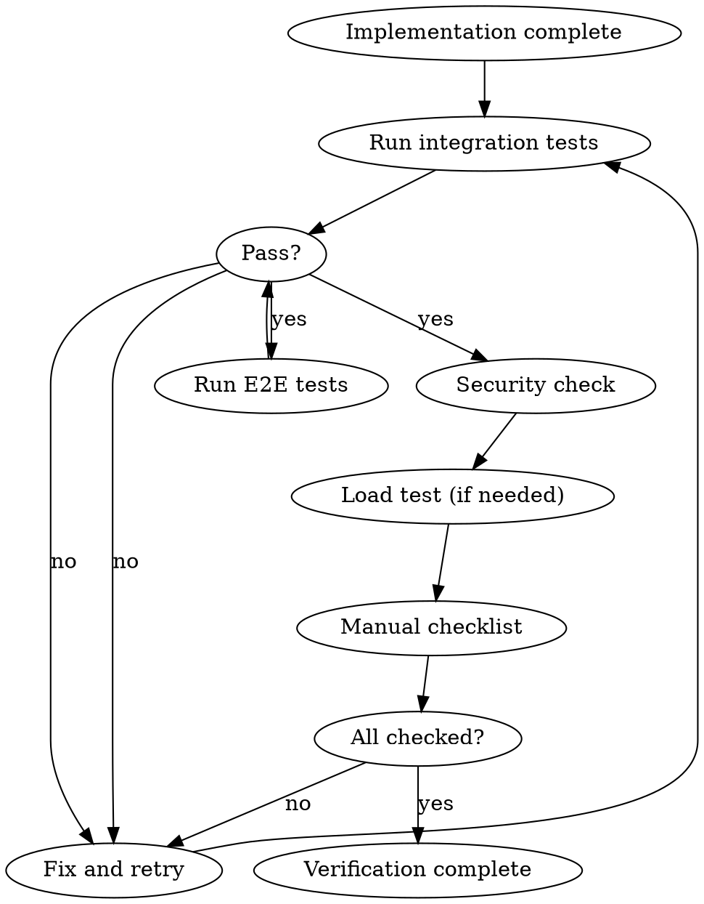

# Verification Phase

**必須: Phase Banner Protocol（dev-workflow/SKILL.md）に従い Phase 8 バナーを表示すること。**

## Overview

リリース前に自動化可能な検証を実施する。
手動確認は最小限に抑え、チェックリスト化する。

**Core principle:** 自動化できるものは自動化。手動は最小限。

## The Iron Law

```
NO RELEASE WITHOUT PASSING VERIFICATION
AUTOMATE WHAT CAN BE AUTOMATED
MANUAL CHECKS MUST BE CHECKLIST
```

## The Process



---

## 1. 統合テスト

### 目的
コンポーネント間が正しく連携するか検証する。

### 必須項目
| 項目 | 内容 |
|------|------|
| DB連携 | CRUD操作、トランザクション |
| API連携 | リクエスト/レスポンス |
| 外部サービス | モックではなくスタブサーバー（可能なら） |
| 認証認可 | ミドルウェア経由のアクセス |

### 実行
```bash
# 統合テスト実行
npm run test:integration

# カバレッジ付き
npm run test:integration -- --coverage
```

### 成功基準
- [ ] 全テスト Pass
- [ ] カバレッジ目標達成（設定があれば）
- [ ] N+1クエリなし（警告レベルでも確認）
- [ ] トランザクションロールバック動作

---

## 2. E2Eテスト

### 目的
主要導線がエンドユーザー視点で動作するか確認。

### 原則
- **3-10本だけ**（これ以上増やさない）
- **主要導線のみ**（金が動く、ユーザーが離脱する箇所）
- **Flaky test は即削除**

### 必須導線
| 導線 | 理由 |
|------|------|
| ログイン → 主要機能 → 完了 | コア体験 |
| エラー回復 | ユーザー離脱防止 |
| 課金フロー（該当時） | 収益に直結 |

### 実行
```bash
# Playwright で E2E 実行
npx playwright test

# ヘッドレスモード
npx playwright test --headed
```

### 成功基準
- [ ] 全E2Eテスト Pass
- [ ] レスポンス時間が許容範囲内
- [ ] スクリーンショット差分なし（設定時）

---

## 3. セキュリティチェック

### 目的
OWASP Top 10 を中心にセキュリティ脆弱性を確認。

### チェックリスト

#### A. 認証・認可
- [ ] 未認証でアクセス拒否される
- [ ] 他ユーザーのリソースにアクセスできない
- [ ] 権限昇格ができない
- [ ] セッション有効期限が適切

#### B. インジェクション
- [ ] SQLインジェクション対策（Prisma使用確認）
- [ ] XSS対策（React自動エスケープ確認）
- [ ] コマンドインジェクション対策

#### C. データ保護
- [ ] 機密データがログに出力されない
- [ ] 機密データがURLに含まれない
- [ ] 署名付きURLの有効期限が適切

#### D. API
- [ ] レート制限が設定されている
- [ ] 入力バリデーションがある
- [ ] エラーメッセージに内部情報が含まれない

### 自動チェック（推奨）
```bash
# 依存パッケージの脆弱性チェック
npm audit

# 静的解析
npx eslint --ext .ts,.tsx src/ --rule '@typescript-eslint/no-explicit-any: error'
```

---

## 4. 負荷テスト（必要時）

### 実施基準
| 条件 | 実施 |
|------|------|
| 新規API追加 | 推奨 |
| 性能要件あり | 必須 |
| 大量データ処理 | 必須 |
| 同時アクセス増加見込み | 必須 |

### 確認項目
| 項目 | 目標例 |
|------|--------|
| レスポンス時間 (p50) | 200ms以下 |
| レスポンス時間 (p95) | 500ms以下 |
| レスポンス時間 (p99) | 1000ms以下 |
| エラー率 | 0.1%以下 |
| スループット | 100 req/s |

### ツール例
```bash
# k6 で負荷テスト
k6 run load-test.js

# Artillery
artillery run load-test.yml
```

---

## 5. 手動確認チェックリスト

### 目的
自動化困難な項目を最小限でチェック。

### テンプレート
```markdown
## 手動確認チェックリスト

### 画面確認
- [ ] 主要画面が正しく表示される
- [ ] レスポンシブ対応（モバイル/タブレット/PC）
- [ ] ローディング状態が表示される
- [ ] エラー状態が適切に表示される

### フロー確認
- [ ] 新規登録フローが完了する
- [ ] 編集フローが完了する
- [ ] 削除フローが完了する（確認ダイアログあり）

### エッジケース
- [ ] 空データ時の表示
- [ ] 大量データ時の表示（100件以上）
- [ ] オフライン時の挙動

### 確認者
- 確認日: YYYY-MM-DD
- 確認者: [名前]
- 環境: [staging/production]
```

---

## 検証レポートテンプレート

```markdown
# 検証レポート: [タスク名]

## 実行日時
- 開始: YYYY-MM-DD HH:MM
- 終了: YYYY-MM-DD HH:MM

## 統合テスト
- 結果: PASS / FAIL
- テスト数: XX件
- 成功: XX件
- 失敗: XX件
- カバレッジ: XX%

## E2Eテスト
- 結果: PASS / FAIL
- テスト数: XX件
- 成功: XX件
- 失敗: XX件
- 平均実行時間: XX秒

## セキュリティチェック
- [ ] 認証・認可: PASS
- [ ] インジェクション: PASS
- [ ] データ保護: PASS
- [ ] API: PASS
- npm audit: 脆弱性 0件

## 負荷テスト（実施した場合）
- p50: XXms
- p95: XXms
- p99: XXms
- エラー率: X.XX%
- スループット: XX req/s

## 手動確認
- [ ] 画面確認: 完了
- [ ] フロー確認: 完了
- [ ] エッジケース: 完了

## 総合判定
- [ ] PASS - リリース可能
- [ ] FAIL - 要修正

## 備考
[特記事項があれば記載]
```

---

## Completion Criteria

- [ ] 統合テスト全件 Pass
- [ ] E2Eテスト全件 Pass
- [ ] セキュリティチェック完了
  - [ ] 認証・認可
  - [ ] インジェクション対策
  - [ ] データ保護
  - [ ] API保護
- [ ] 負荷テスト（必要な場合）Pass
- [ ] 手動確認チェックリスト完了
- [ ] 検証レポート作成

---

## Red Flags

| Thought | Reality |
|---------|---------|
| "テストは通ってるから大丈夫" | 通っていないケースがあるかも |
| "E2Eを増やせば安心" | 増やすとFlaky地獄 |
| "セキュリティは後で" | 後からの修正はコスト高 |
| "負荷テストは本番で" | 本番で初めて気づくのは最悪 |
| "手動確認は面倒" | チェックリスト化で効率化 |

---

## Related Skills

- `testing` - テスト作成ガイダンス
- `implementation` - テスト実装
- `completion` - リリース準備
